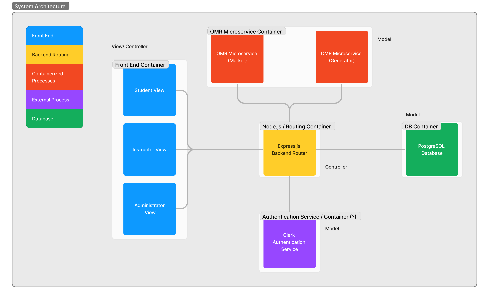
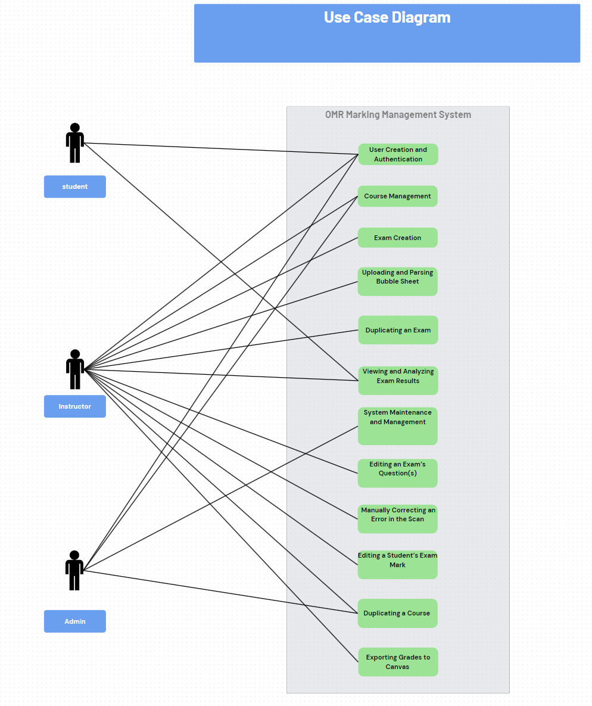
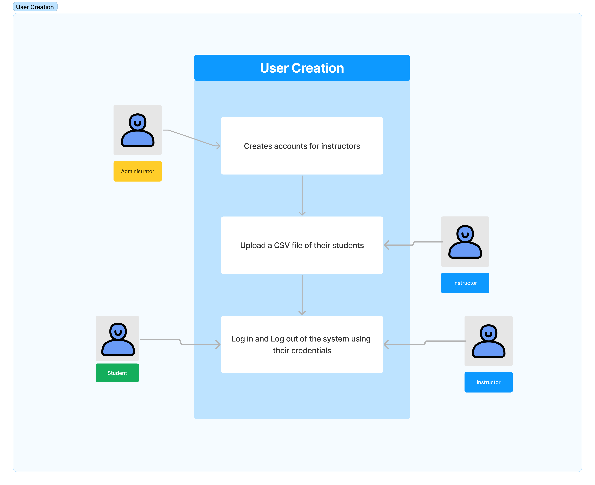
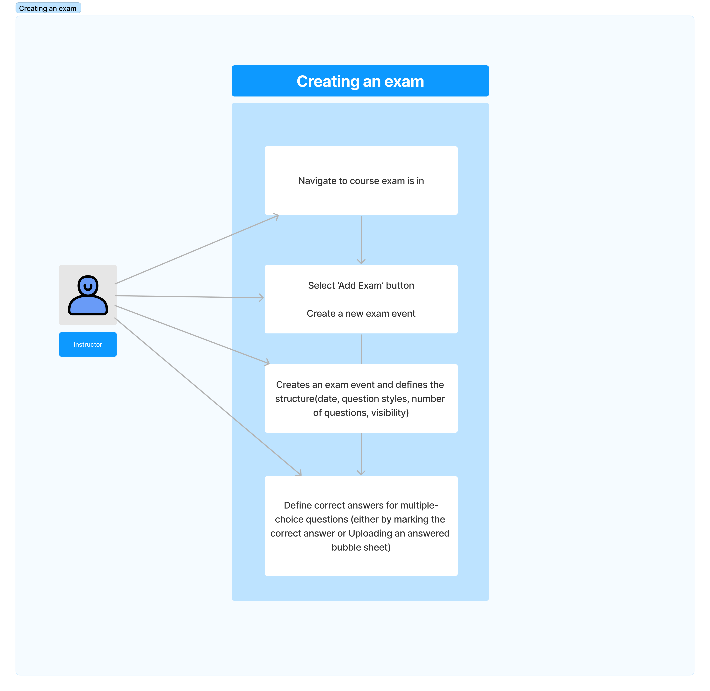
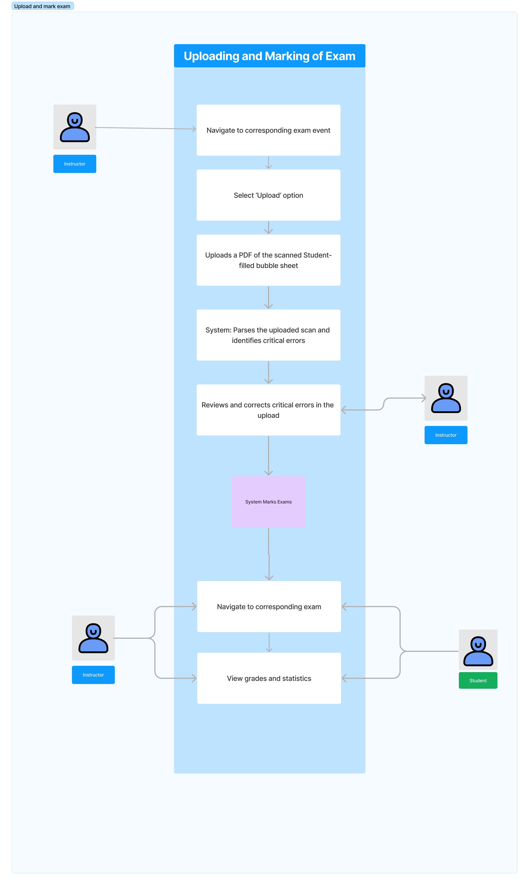
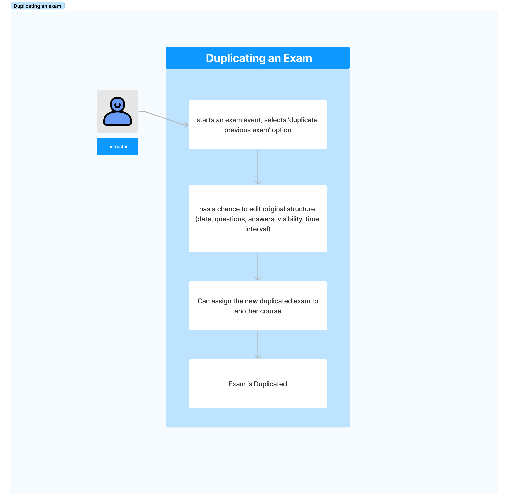
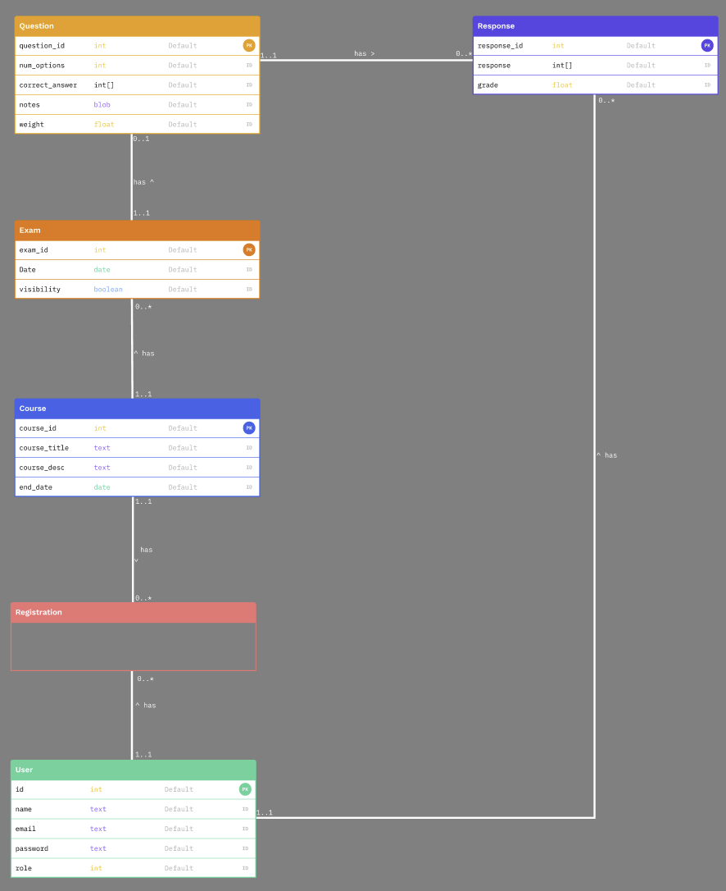

# Team Information
### Team #5 - GradeIT OMR Technologies
**Oakley Pankratz**
**Nicolaas Kouwenhoven**
**Nathan Jacinto**
**Jack Mathisen**
**Jay Bhullar**

# Introduction
The Optical Marking Management System (OMMS) is a responsive web application for managing optically marked exams. It automates exam creation, marking, and analysis to reduce instructor workload and ensure consistent assessments.

We are building a system that will allow instructors to upload PDFs of bubble sheets that have been scanned by a printer (or other scanner). The system will scan the bubble sheet with image processing techniques to automatically mark the bubble sheet against an answer key. The system will then automatically store the marks on our web app's database, allowing for students and instructors to see the marked exams (if students are allowed).

The app will then allow for exporting of CSV grade reports for the instructor to upload to a site like Canvas for the grades to be registered.

We are expecting to build features that allow instructors to create and mark exams with as much ease as possible. That means automating as much as possible, allowing for features like duplication of previous exams, and allowing the user to change grades for students should the need arise before they export the grades to Canvas (or a similar site)
# System Architecture Design
The OMMS (Optical Marking Management System) utilizes the MVC (Model-View-Controller) architecture to ensure modularity, scalability, and ease of maintenance by separating the application into three distinct layers: Model, View, and Controller.

Our system is split into sections to show containerization using Docker.
- The front end is in a Docker container that will interact with the backend container.
- The back end is in a Docker container that will interact with our external services and our Dockerized OMR microservices. These will be developed as REST APIs.
- Our authentication service is an external system that will be interacted with a REST API.
- Our PostgreSQL database will run in its own Docker container as well, and will be accessed through our Express.js backend.

### Model-View-Controller (MVC) design pattern
1. **View/Controller Layer (Front End)**
    * Front End Components: This includes three distinct views for different user roles:
        * Student View: Interface designed for students to view their exam results 
        * Instructor View: Interface for instructors to create, duplicate, mark, and manage exams.
        * Administrator View: Interface for administrators to manage system settings, users, and maintenance tasks.
    * Front End Controller: These components handle the interaction with the user and send requests to the back-end services. They are implemented using React.js.
2. **Controller Layer (Back End)**
    * Node.js / Express.js Backend Router: This is the central processing unit that handles HTTP requests, processes business logic, and coordinates actions between the front-end and the model (database). It serves as the controller in the MVC architecture.
    * Authentication Service: A dedicated module for user authentication and role-based access control, ensuring secure login and permissions for different user roles.
3. **Model Layer**
    * OMR Microservice Container: This container includes two microservices:
        * OMR Microservice (Marker): Handles the optical mark recognition grading process, processing scanned exam sheets to extract answers and compute scores.
        * OMR Microservice (Generator): Facilitates the creation and duplication of exams, allowing instructors to set up and reuse exams easily.
    * Database Container (PostgreSQL Database): The PostgreSQL database stores all the data, including user information, exam details, results, and historical performance data. It interacts with the model to perform CRUD operations.
    * Authentication Service (Clerk Authentication Service): This model component manages authentication-related data and processes.
4. **Data Flow**
    * View/Controller Interaction: The front-end interfaces (Student, Instructor, Administrator) built with React.js send requests to the back-end services.
    * Controller Processing: The Node.js/Express.js backend router processes these requests, performs necessary operations, and interacts with the database.
    * Model Interaction: The backend services (OMR Microservices and Authentication Service) interact with the PostgreSQL database to store and retrieve data as needed.

# Use Case Models
Use case scenarios illustrate the interaction between users (instructors, students, and Administrators) and the Optical Marking Management System, detailing the steps involved in common tasks to ensure smooth operation and user satisfaction.

## Main Use Cases
**Use Case 1: User Creation and Authentication**
1. Actors: Administrator, Instructor, Students
2. Preconditions: Users have access to the system
3. Assumptions:
4. Steps:
    1. Administrator: Creates accounts for instructors
    2. Instructors: Upload a CSV file of their students
    3. Instructors/ Students:  Log in and Log out of the system using their credentials
    4. System: Verifies credentials and grants access to the system
5. Extensions: User Forgets Password
    1. User: tries to Log in to the system too many times
    2. User: Requests reset from system admin
6. Post Conditions: The user is authenticated

**Use Case 2: Exam Creation**
1. Actors: Instructor
2. Precondition: The instructor is authenticated and has access to their course
3. Steps
    1. Instructor:  Creates an exam event and defines the structure(date, question styles, number of questions, visibility)
    2. Instructor: Sets Weights for the different questions
    3. Instructor: Define correct answers for multiple-choice questions (either by marking the correct answer or Uploading an answered bubble sheet)
4. Post Conditions: Exam is created and configured

**Use Case 3: Uploading and Parsing Bubble Sheet**
1. Actors: Instructor
2. Preconditions: The instructor has created an exam and scanned the bubble sheet
3. Assumptions: 100 MB PDF file, black and white paper
4. Steps
    1. Instructor: Upload a PDF scan of the bubble sheet
    2. System: Parses the uploaded scan and identifies critical errors
    3. Instructor: Reviews and corrects critical errors in the upload
5. Extensions: A page can be disoriented and be able to be parsed still
6. Post Conditions: Bubble Sheets are uploaded, parsed and critical errors are corrected

**Use Case 4: Duplicating an Exam**
1. Actors: Instructors
2. Preconditions: A test has been created previously
3. Assumptions: There were no problems with the original exam
4. Steps:
    1. Instructor: starts an exam event ,and  selects the ‘duplicate previous exam’ option
    2. Instructor: has a chance to edit original structure (date, questions, answers, visibility, time interval)
5. Post Conditions: Exam is created and configured

# Database Design / ER Diagram

## User (General Entity) {#user-general-entity}

* **Attributes:**
    * `User_ID`: Primary key, a unique identifier for each user.
    * `Name`: The name of the user.
    * `Email`: The email address of the user.
    * `Password`: The password for user authentication.
    * Role: The Role of the User, has to be only administrator, student or instructor
* **Relationships:**
    * **User-Course:**
        * Instructor-creates-Course: An instructor can create multiple courses. Each course is created by one instructor.
        * Student-enrolls-in-Course: A student can enroll in multiple courses. Each course can have many students enrolled.
    * **User-Exam:**
        * Instructor-creates-Exam: An instructor can create multiple exams. Each exam is created by one instructor.
        * Student-Takes-Exam: A student can take multiple exams. Each exam can be taken by many students.
    * **User-Response:**
        * User-submits-Response: A user can submit multiple responses. Each response is submitted by one user.

## Course 

* **Attributes:**
    * `Course_id`: Primary key, a unique identifier for each Course
    * `Course_title`: the title of the course, can be broken down further for identifiers
    * `Course_desc`: the description of the course,
    * `End_date`: The ending date of the course
* **Relationships:**
    * **Course-Exam:**
        * Course-has-Exams: A course can have multiple exams. Each exam belongs to one course.
    * **Course-User:**
        * Instructor-creates-Course: Each course is created by one instructor. A course can have multiple instructors.
        * Student-enrolls-in-Course: Each course can have many students enrolled.

## Exam 

* **Attributes:**
    * `Exam_id`: Primary key, a unique identifier for each Exam
    * `Date:` The date of the exam
    * `Visibility`: A boolean deciding if or not the exam is visible to the student 
* **Relationships:**
    * **Exam-Question:**
        * **Exam-has-Questions:** An exam can contain multiple questions. Each question belongs to one exam.
    * **Exam-Course:**
        * **Exam-belongs-to-Course:** Each exam belongs to one course.
    * **Exam-User:**
        * **Instructor-creates-Exam:** Each exam is created by one instructor.
        * **Student-Takes-Exam:** Each exam can be taken by many students. A student can only take one instance of that exam.

## Question 

* **Attributes:**
    * `Question_id`: Primary key, a unique identifier for each question.
    * `Num_options`: The possible options of the question
    * `Correct_answer: `an int array,  so that we can select a multitude of possible answers
    * `Notes`: A blob on which either the student or instructor can put notes on
    * Weight: a floating point number in which the weight of a question 
* **Relationships:**
    * **Question-Exam:**
        * Question-belongs-to-Exam: Each question belongs to one exam.
    * **Question-Response:**
        * Question-has-Responses: A question can have multiple responses. Each response is related to one question.

## Responses 

* **Attributes:**
    * `Response_id`: Primary key, a unique identifier for each response
    * `Response`: the number in which the user responded
    * `Grade`: the grade of the response
* **Relationships:**
    * **Response-Question:**
        * Response-belongs-to-Question: Each response belongs to one question.
    * **Response-User:**
        * Response-belongs-to-User: Each response is submitted by one user.

# Data Flow Diagrams
## Level 0
Level 0 is the highest-level Data Flow Diagram (DFD), which provides an overview of the entire system. It shows the major processes, data flows, and data stores in the system.

## Level 1
Level 1 Data Flow Diagram (DFD). Each sub-process is depicted as a separate process on the level 1 Data Flow Diagram (DFD). The data flows and data stores associated with each sub-process are also shown.

#### **External Entities** 

1. **Instructor**
 Instructors are the primary users responsible for managing and overseeing courses, tests, and student performance. Their responsibilities include creating and administering examinations, grading, and analyzing student performance data. Instructors use the system to facilitate these tasks efficiently, allowing them to focus more on teaching and less on administrative work.

* **Examples**: Professors, Teaching Assistants
* **View Class Statistics**: Instructors can view class performance statistics.
* **Export Grades**: Instructors can export grades for students. \

2. **Student**
Students are users who interact with the system primarily to view their academic progress and test performance. Their role is more focused on accessing information rather than managing or inputting data.
* **Examples**: Undergraduate and Graduate Students
* **View Course**: Students can view course details.
* **View Exam**: Students can view exam details.

3. **Administrator**
Administrators are responsible for the overall management and operation of the educational institution’s systems and processes.
* **Examples**: IT Support
* **Register Accounts**: Administrators manage the registration of user accounts.
* **Manage Accounts**: Administrators handle account management.

#### **Processes** 

1. **Create Course**: This process involves creating new courses within the system.
2. **Manage**: This involves the ongoing management and updating of course details.
3. **Manage Exam**: Exams are created, updated, and managed through this process.
4. **Upload Students**: Students are uploaded into the system for course enrollment.
5. **Manage Students**: This involves managing student information and their course enrollments.

#### **Data Stores** 

1. **Database**
    * **User Data**: Stores information about users including students, instructors, and administrators.
    * **Course Data**: Contains details about courses offered.
    * **Exam Data**: Stores information related to exams.
    * **Question Data**: Contains questions for exams.

#### **Specialized Processes** 

1. **OMR Generator**: Generates Optical Mark Recognition (OMR) sheets for exams.
    * **Create Exam**: The instructor can create or duplicate an exam that can either go directly to the database or through the OMR Generator service.
2. **OMR Marker**: Marks the OMR sheets and submits the grades to the database.
    * **Upload Answer Key Bubble Sheet**: Answers are uploaded by instructors 
    * **Upload Student-Filled Bubble Sheet**: Students’ completed OMR sheets are uploaded for grading.

# User Interface Design 

[UI design Figma](https://www.figma.com/design/DJhTmGIrBQyYJCpbkCIhKU/UI-Brainstorming?node-id=0-1&t=GJObwQAol4qcn0Zc-1)

#### **Aesthetics & Design Philosophy** 

1. **Dark Theme**

We chose to go with a dark theme because it is indicative of modern web design. It is easier on the eyes than a light theme and has the added benefit of being better on modern tech devices.

2. **Coloured Buttons**

We chose to use coloured buttons for all of the major interactions to indicate to the user that these are the main interactive functions in our web app.

3. **Sidebar vs. Header**

We took inspiration from Canvas to create a side bar for site navigation instead of a header. In our opinion, it was just an elegant way to show a list of courses without overwhelming the user inside of a header.

4. **Test-first system**

Our system is designed to be focused around the creation, marking and viewing of exams above all else. This is because our UVP is to create an efficient and robust OMR system for instructors. That is why our base views are test-based, and our sidebar contains our courses (opposite of how Canvas would work with a course-first approach).

5. **Iconography**

Our icons are chosen from a standard Google ‘Material Symbols’ plugin to allow for consistency in our design

#### **Instructor View** 

1. **Sidebar (course selection)**

All of the courses an instructor is currently teaching in will appear on the left sidebar. When an instructor selects a course, it will show the default ‘Tests’ view to them, allowing them to see their tests in order of most recent.

An instructor can select the ‘+’ button to add a course. This will allow them to input the course information, then will support either a CSV upload of a student information sheet or manual student input.

2. **Tests View**

The instructor is able to interact with each test to upload the bubble sheets, edit parts of the exam, or delete the exam entirely.

The instructor can also create a new exam event by uploading or manually entering information via two buttons on the pop-up

3. **Students View**

The instructor is able to view the list of students as a spreadsheet. The instructor will be able to interact with the table much like they would in typical spreadsheet software (minus the advanced features). This means double-clicking on a cell to edit it immediately, and vertical and horizontal scrolling to allow the instructor to view all of the information.

Searching and filtering is available to narrow the grade search to a specific student, and a ‘+’ button in the top right will allow the instructor to manually enter rows of student information in case they don’t want to utilize the CSV uploading.

#### **Student View** 

1. **Sidebar (course selection)**

Students will be able to select different courses from the sidebar in order to filter out the exams they’re looking for, or they can interact with the ‘Recent’ tests tab which is expected to handle most viewing use cases.

2. **Dashboard / recent tests**

The recent tests tab will be the default view of the system for a student, allowing them to quickly access their most recently graded exams. These exams will be displayed as buttons to the user, and when the user clicks on them it will open a view of all of the exam questions.

3. **Specific courses**

Specific courses selected in the sidebar will narrow the tests to tests taken in that specific course. Just as in the main view, students can interact with the tests as a button that will allow them to view all of the exam questions

4. **Test view**

Each test will have basic information at a glance. This information includes the test grade, the median, mean, min, and max scores on the exam.

When a student interacts with a test object, it will display all of the questions related to the exam and. if the instructor has enabled it, the answers will be shown so the students can see where they went wrong on the exam.

#### **Admin View** 

The admin view contains 3 main pages:

1. **The Dashboard**

Contains usage statistics for site monitoring

2. **User Management**

Allows filtering and searching of users to manage all user information (name, ID, test scores, courses). Includes deletion

3. **Course Management**

Allows filtering and searching of courses to manage all course information (visibility, time intervals, students, instructors). Includes deletion
