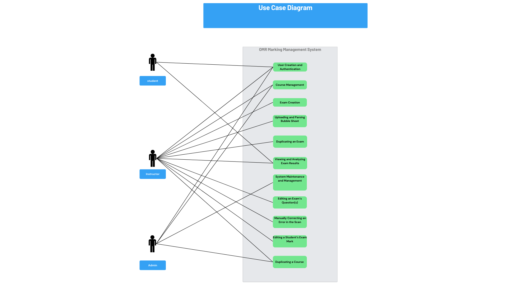

# Cosc 499: Use Cases Scenarios  Optical Marking Management System
***
Date: May 29, 2024
##### Team 5
Team Members: Nathan Jacinto, Oakley Pankratz, Nic Kouwenhoven, Jay Bhullar, Jack Mathisen

Description: Use case scenarios illustrate the interaction between users (instructors, students, and Administrators) and the Optical Marking Management System, detailing the steps involved in common tasks to ensure smooth operation and user satisfaction.
***

## Target Users
***
##### Instructors:
 Instructors are the primary users responsible for managing and overseeing courses, tests, and student performance. Their responsibilities include creating and administering examinations, grading, and analyzing student performance data. Instructors use the system to facilitate these tasks efficiently, allowing them to focus more on teaching and less on administrative work. 

Examples: Professors, Teaching Assistants

##### Students:
Students are users who interact with the system primarily to view their academic progress and test performance. Their role is more focused on accessing information rather than managing or inputting data.

Examples: Undergraduate and Graduate Students

##### Administrators:
Administrators are responsible for the overall management and operation of the educational institution’s systems and processes.

Examples: Department Heads, It Support

## Use Case Diagram
***

## Use Case Scenarios
***
### Use Case 1: User Creation and Authentication
Actors: Administrator, Instructor, Students
Preconditions: Users have access to the system

Steps: 
Administrator: Creates accounts for instructors
Instructors: Upload a CSV file of their students
Instructors/ Students:  Log in and Log out of the system using their credentials
System: Verifies credentials and grants access to the system
Extensions: User Forgets Password
User: tries to Log in to the system too many times
User: Requests reset from system admin

Post Conditions: The user is authenticated

### Use Case 2: Course Management:
Actors: Administrator, Instructor,
Preconditions: User is Authenticated:

Steps:
Administrator/ Instructor: Creates, Edits and Deletes a Course
Administrator: Assign Instructor to a Course
Instructors: View the Dashboard of all the courses that they are teaching
Instructor: Uploads a Student CSV file of the Student Roster of a course

Assumptions: The student CSV  file is correct
Post Conditions: The administrator/Instructor has Created a Course

### Use Case 3: Exam Creation
Actors: Instructor
Precondition: The instructor is authenticated and has access to their course

Steps:
Instructor:  Creates an exam event and defines the structure(date, question styles, number of questions, visibility)
Instructor: Sets Weights for the different questions
Instructor: Define correct answers for multiple-choice questions (either by marking the correct answer or Uploading an answered bubble sheet)

Post Conditions: Exam is created and configured

### Use Case 4: Uploading and Parsing Bubble Sheet
Actors: Instructor
Preconditions: The instructor has created an exam and scanned the bubble sheet
Assumptions: 100 MB PDF file, black and white paper

Steps:
Instructor: Upload a PDF scan of the bubble sheet
System: Parses the uploaded scan and identifies critical errors
Instructor: Reviews and corrects critical errors in the upload

Extensions: A page can be disoriented and be able to be parsed still
Post Conditions: Bubble Sheets are uploaded, parsed and critical errors are corrected

### Use Case 5: Duplicating an Exam
Actors: Instructors
Preconditions: A test has been created previously
Assumptions: There were no problems with original exam
Steps:
Instructor: starts an exam event, selects ‘duplicate previous exam’ option
Instructor:has a chance to edit original structure (date, questions, answers, visibility, time interval)
Post Conditions: Exam is created and configured

### Use Case 6: Viewing and Analyzing Exam Results
Actors: Instructors, Students
Preconditions: Exams are Marked

Steps(Instructors)
 Instructors: View test statistics and breakdown of the grades
Instructors: Edits specific student responses or grades if needed
instructors: Runs year-over-year analysis of the course’
Instructors: Can download the report

Steps(Students):
Students: View their individual exam results within the allowed time interval
See the comparison of the exam between other students ( 5 stats summary )
Students: Compare their responses with correct answers 

Extensions: Instructors can view historical analysis of each question (if duplicated), students can view each response to see if it is correct, or where they were wrong.
Post Conditions: Instructors can analyze results, edit grades if necessary and download the reports, Students can view their grades and flag if they want the exam/question to be corrected

### Use Case 7: System Maintenance and Management
Actors: Administrator,
Preconditions: System or Data requires updates or maintenance

Steps: 
Administrator: able to see system metrics
Administrator: Able to perform corrective measures 
Administrator: able to manage users' accounts and system configurations

Post Conditions: the system is updated

### Use Case 8: Editing an Exam’s Question(s)
Actors: Instructors
Preconditions: An exam has been created

Steps:
Instructor accesses a test they have created
Instructor accesses the edit screen of the test
Instructor finds the question(s) they want to change and edits one of its attributes

Assumptions: The time interval for the term / class is still active
Post Conditions: An exam’s question weight / answer will be changed in the system

### Use Case 9: Manually Correcting an Error in the Scan
Actors: System, Instructors
Precondition: An exam’s scan has experienced an error in a single page (it cannot correct itself)

Steps:
The system will input all of the grades that it managed to scan properly
The system will flag the scan that it cannot understand
The instructor will find the faulty page
The instructor will re-scan only that page and upload it to the corresponding student’s test section on the web app

### Use Case 10: Editing a Student’s Exam Mark
Actors: Instructors
Preconditions: An exam has been marked by the system

Steps:
Instructor: accesses a course student list
Instructor: accesses the student view they are editing
Instructor: accesses the student’s test view to see all questions
Instructor:changes the student’s recorded response

Assumptions: There was an error in the exam or the marking
Post Conditions: The student’s grades will change

### Use Case 11: Duplicating a Course:

Actors: Instructors, Administrator
Preconditions: A course has already been created

Steps
Instructor/Administrator: goes to create a new course and is prompted with a ‘duplicate course’ button
Instructor/Administrator: can edit the original structure of the course (section, time interval, term, course code)
Administrator: can assign instructors to the new course

Assumptions: Next year’s course or multiple sections in a year
Post Conditions: A new course is created with the duplicated structure.
