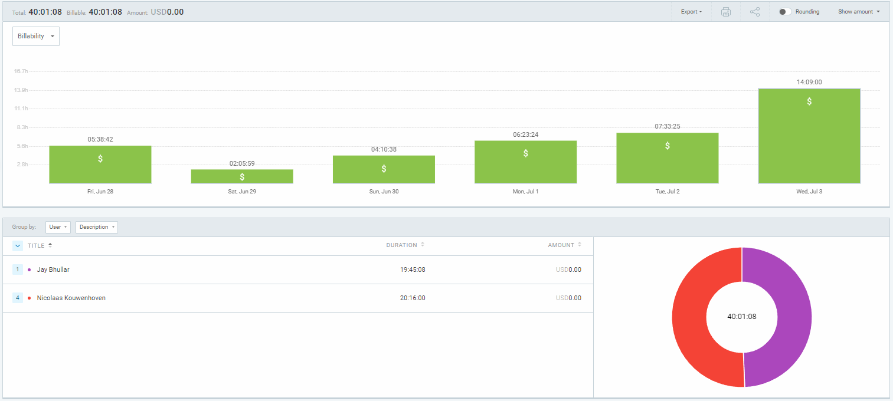
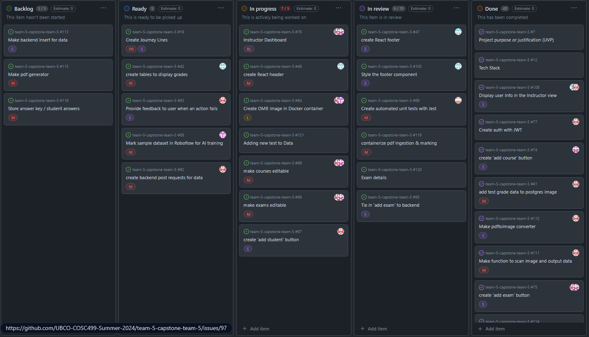
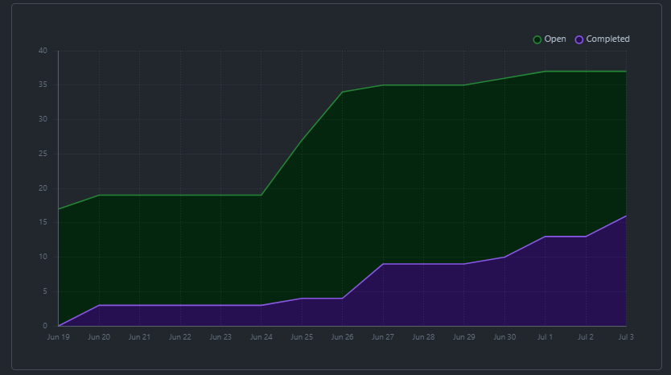
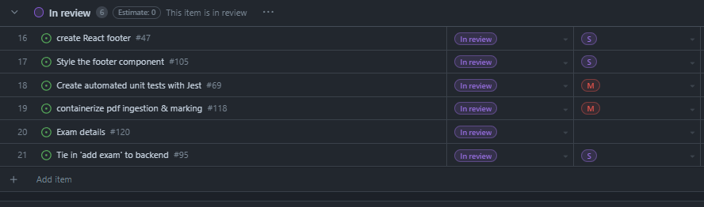
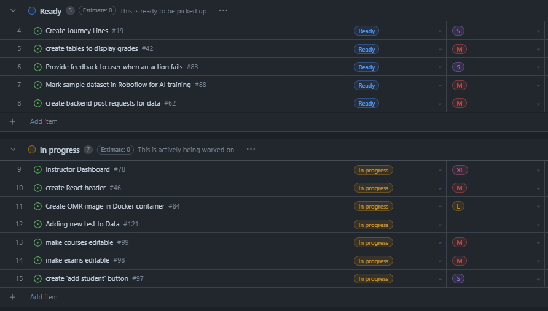

# Dashboard for July 3 Logs
##### Team 5:
Nathan Jacinto,
Oakley Pankratz, 
Nic Kouwenhoven, 
Jay Bhullar, 
Jack Mathisen

# Cycle Plan Summary
## Reflection
We did not get as much done as we had planned for these cycles. We hit a lot of our minor tasks and made good progress towards the major tasks, but we were ultimately unable to fully check off any items on this list. The instructor dashboard is not complete, the student dashboard lacks a flagging system. We are unsure if the re-work of the database will be required, but Nic did change the way the user IDs are assigned.

We are still missing a lot of the flexibility for our instructor dashboard that is required for it to be functional (add, edit, delete). This will require more work to tie into the database properly, but it should be ready for the MVP presentations Friday.

## Tasks
Overall tasks we planned to have done by the end of the cycle:
- [ ] Instructor Dashboard (add, edit, delete)
- [ ] Automated testing up-to-date
- [x] OMR image running with API endpoint, doing some analysis and returning data
- [ ] Student dashboard and flagging system fully implemented
- [ ] Database re-worked

#### Friday, June 21
Tasks to be completed:
- [x] Automated Testing Framework Setup (DroneCI)
- [x] Unit tests for code already written (follow TDD in future)
- [x] Instructor dashboard 'Add Exam' form and 'Add Test' form frontend done
- [x] 'Add course' and 'Add exam' buttons tied into the backend (data is input into db correctly)
- [x] OMR Image / learning YOLO

#### Wednesday, June 26
Tasks to be completed:
- [x] Automated tests written for backend code
- [ ] Instructor dashboard fully finished with mock data
- [x] Student view fully finished with db tie-in (minus styling)
- [x] Docker image running for OMR

#### Friday, June 28
Tasks to be completed:
- [ ] Automated tests written for student view components
- [ ] Instructor dashboard tied into the backend (viewing)
- [x] OMR can take image in, spit some data back out (no accuracy required)

#### Wednesday, July 3
- [ ] Front end finished (minus styling). All major use cases hit using test DB data
- [x] OMR is doing some real analysis and spitting out mostly correct data (let's say 50% accuracy)

# Times for Team/Individual 

# Project Board Tasks

# Burn-Up

# Table of Completed Tasks:

# Table of WIP Tasks

