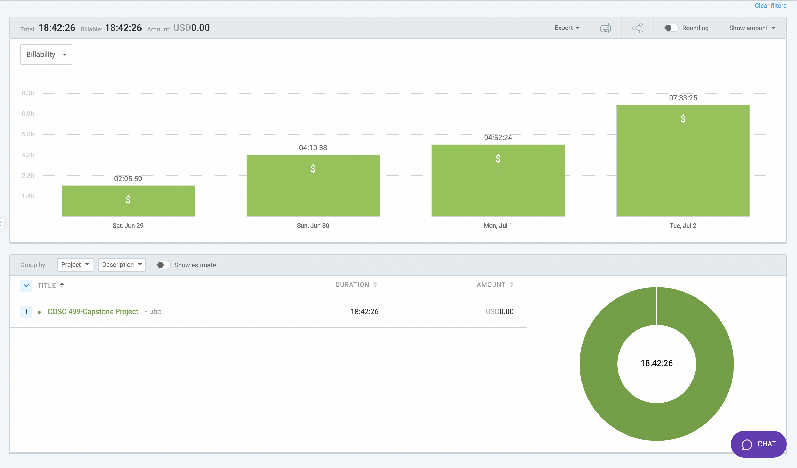

# Week 7: June 29 - July 2

### Date: July 2
### Author: Jay Bhullar

## Breakdown

**Approximate Hours: 18.71**

### Things worked on: ###

- **Test Description Page (4 hours):** 
  - Developed the Test Description page to display detailed information about tests.

- **Correct Answers (3 hours):** 
  - Implemented functionality to manage and display correct answers for tests.

- **Edit Test (4 hours):** 
  - Created the feature to allow editing of tests, ensuring all changes are saved and reflected correctly.

- **Delete Test (3 hours):** 
  - Added functionality to delete tests, with necessary checks and confirmations.

- **Fixing Profile Email Display (2 hours):** 
  - Fixed issues related to the display of email addresses in the profile section.

- **Minor Improvements to UI (2.71 hours):** 
  - Made several minor improvements to the UI to enhance user experience and overall appearance.

### Comments ###

This week, I focused on multiple aspects of the Instructor Dashboard, including the Test Description page, correct answers management, and editing and deleting tests. I also made minor improvements to the UI and fixed the profile email display issue. 

## Timesheet

### Clockify report

### Current Tasks (Provide sufficient detail)
  * #1: Test Description Page
  * #2: Correct Answers
  * #3: Edit Test
  * #4: Delete Test
  * #5: Fixing Profile Email Display
  * #6: Minor Improvements to UI

### Progress Update (since 6/29/2024) 
<table>
    <tr>
        <td><strong>TASK/ISSUE #</strong>
        </td>
        <td><strong>STATUS</strong>
        </td>
    </tr>
    <tr>
        <!-- Task/Issue # -->
        <td>Test Description Page
        </td>
        <!-- Status -->
        <td>Complete
        </td>
    </tr>
    <tr>
        <!-- Task/Issue # -->
        <td>Correct Answers
        </td>
        <!-- Status -->
        <td>Complete
        </td>
    </tr>
    <tr>
        <!-- Task/Issue # -->
        <td>Edit Test
        </td>
        <!-- Status -->
        <td>Complete
        </td>
    </tr>
    <tr>
        <!-- Task/Issue # -->
        <td>Delete Test
        </td>
        <!-- Status -->
        <td>Complete
        </td>
    </tr>
    <tr>
        <!-- Task/Issue # -->
        <td>Fixing Profile Email Display
        </td>
        <!-- Status -->
        <td>Complete
        </td>
    </tr>
    <tr>
        <!-- Task/Issue # -->
        <td>Minor Improvements to UI
        </td>
        <!-- Status -->
        <td>Complete
        </td>
    </tr>
</table>

### Cycle Goal Review 
Reflection: This cycle involved extensive work on the Instructor Dashboard's test management features. I also made various UI improvements and addressed profile email display issues. 

Retrospective: I took some time to check with the backend stuff, which is still a learning process and consuming a significant amount of my time.

### Next Cycle Goals
  * Finish all UI elements for the Instructor before MVP submission on Friday, July 4.
