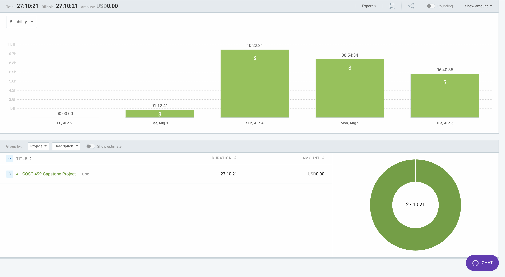

# Week 11: August 2 - 6

### Date: August 6
### Author: Jay Bhullar

## Breakdown

**Approximate Hours: 27:10:21**

### Things worked on: ###

- **Peer Testing Feedback Fixes (10 hours, large):**
  - Addressed and fixed numerous issues identified during the peer testing round.

- **Testing (15 hours, large):**
  - Conducted extensive testing to ensure all functionalities are working as expected.

- **Report Writing (2 hours, medium):**
  - Started writing the report, documenting the project progress and outcomes.

### Comments ###

This week, I focused heavily on fixing issues that came up during the peer testing round. I dedicated a significant amount of time to testing to ensure that all functionalities were working correctly. Additionally, I began writing the project report. Moving forward, my goal is to prepare for Thursday's report submission and Friday's final presentation.

## Timesheet

### Clockify report

### Current Tasks (Provide sufficient detail)
  * #1: Peer Testing Feedback Fixes
  * #2: Testing
  * #3: Report Writing

### Progress Update (since 8/2/2024) 
<table>
    <tr>
        <td><strong>TASK/ISSUE #</strong>
        </td>
        <td><strong>STATUS</strong>
        </td>
    </tr>
    <tr>
        <!-- Task/Issue # -->
        <td>Peer Testing Feedback Fixes
        </td>
        <!-- Status -->
        <td>Complete
        </td>
    </tr>
    <tr>
        <!-- Task/Issue # -->
        <td>Testing
        </td>
        <!-- Status -->
        <td>Complete
        </td>
    </tr>
    <tr>
        <!-- Task/Issue # -->
        <td>Report Writing
        </td>
        <!-- Status -->
        <td>In Progress
        </td>
    </tr>
</table>

### Cycle Goal Review 
Reflection: This week was intense with a lot of focus on fixing peer testing feedback and extensive testing. The work was crucial to ensure the quality of our project.

Retrospective: The process of addressing feedback and thorough testing has improved the overall stability and functionality of our project.

### Next Cycle Goals
  * Prepare for Thursday's report submission.
  * Finalize preparations for Friday's final presentation.
