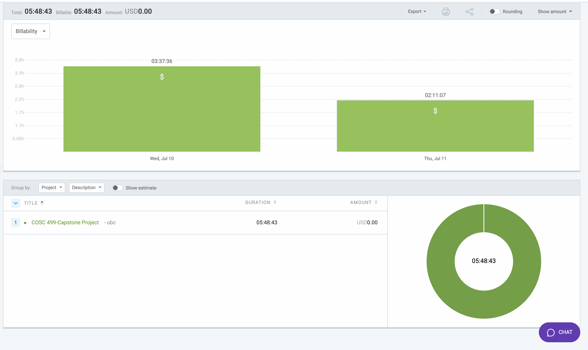

# Week 7: July 10 - July 11

### Date: July 11
### Author: Jay Bhullar

## Breakdown

**Approximate Hours: 16.72**

### Things worked on: ###

- **Frontend Fixing (6 hours):**
  - Focused on resolving various frontend issues to improve the user interface and functionality.

- **Correct Answers (5 hours):**
  - Worked on ensuring the correct answers functionality displays accurate data on the frontend.
  - Addressed issues with displaying and managing correct answers in tests.

- **Making Test Work (5.72 hours):**
  - Debugged and fixed issues related to test functionality, ensuring tests work correctly.

### Comments ###

This week, I concentrated on frontend fixing, making the correct answers work, and resolving issues with test functionality. Despite the progress, some tasks took longer than expected, especially with the correct answers and test functionality.

## Timesheet

### Clockify report

### Current Tasks (Provide sufficient detail)
  * #1: Frontend Fixing
  * #2: Correct Answers
  * #3: Making Test Work

### Progress Update (since 7/10/2024) 
<table>
    <tr>
        <td><strong>TASK/ISSUE #</strong>
        </td>
        <td><strong>STATUS</strong>
        </td>
    </tr>
    <tr>
        <!-- Task/Issue # -->
        <td>Frontend Fixing
        </td>
        <!-- Status -->
        <td>In Progress
        </td>
    </tr>
    <tr>
        <!-- Task/Issue # -->
        <td>Correct Answers
        </td>
        <!-- Status -->
        <td>In Progress
        </td>
    </tr>
    <tr>
        <!-- Task/Issue # -->
        <td>Making Test Work
        </td>
        <!-- Status -->
        <td>Complete
        </td>
    </tr>
</table>

### Cycle Goal Review 
Reflection: This cycle involved significant work on frontend fixes and ensuring the correct answers feature functions properly. While progress was made, some tasks took longer than anticipated due to their complexity.

Retrospective: The focus on fixing existing issues was necessary to ensure a stable application. Moving forward, balancing between new development and fixing existing issues will be key.

### Next Cycle Goals
  * Develop PDF converter.
  * Move forward with developing the app and the rest of the use cases as initially planned.
