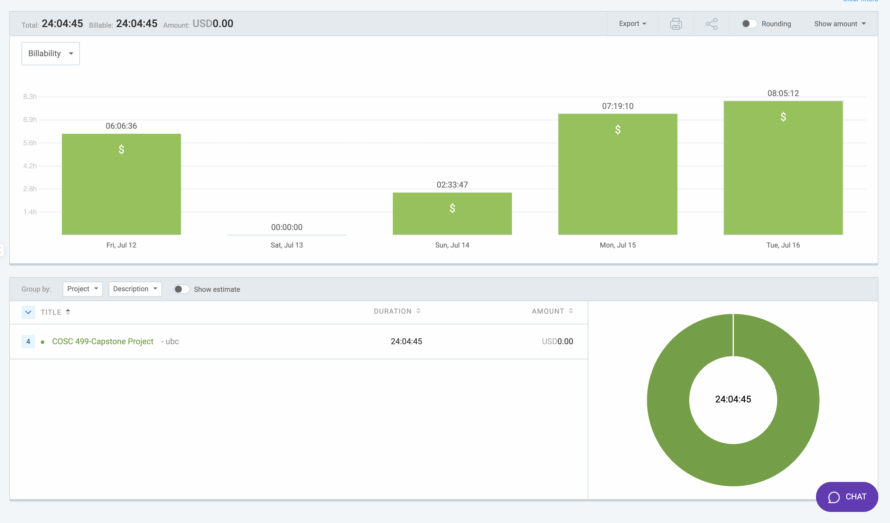

# Week 8: July 12 - July 16

### Date: July 16
### Author: Jay Bhullar

## Breakdown

**Approximate Hours: 24.08**

### Things worked on: ###

- **OMR Sheet Generator (8 hours):**
  - Developed and debugged the OMR Sheet Generator, which took significant time due to multiple code breaks.

- **PDF Viewer (8 hours):**
  - Implemented and fixed issues related to the PDF Viewer, which also caused several breaks in the code.

- **Fixing Frontend (6.58 hours):**
  - Focused on resolving various frontend issues to improve the user interface and functionality.

- **Code Reviewing on GitHub (1.5 hours):**
  - Conducted thorough code reviews of other team members' work on GitHub to ensure code quality and consistency.

### Comments ###

This week, significant time was spent on developing and fixing the OMR Sheet Generator and PDF Viewer, both of which encountered multiple issues that required extensive debugging. Additionally, I worked on fixing frontend issues and reviewing code on GitHub.

## Timesheet

### Clockify report

### Current Tasks (Provide sufficient detail)
  * #1: OMR Sheet Generator
  * #2: PDF Viewer
  * #3: Fixing Frontend
  * #4: Code Reviewing on GitHub

### Progress Update (since 7/12/2024) 
<table>
    <tr>
        <td><strong>TASK/ISSUE #</strong>
        </td>
        <td><strong>STATUS</strong>
        </td>
    </tr>
    <tr>
        <!-- Task/Issue # -->
        <td>OMR Sheet Generator
        </td>
        <!-- Status -->
        <td>Complete
        </td>
    </tr>
    <tr>
        <!-- Task/Issue # -->
        <td>PDF Viewer
        </td>
        <!-- Status -->
        <td>Complete
        </td>
    </tr>
    <tr>
        <!-- Task/Issue # -->
        <td>Fixing Frontend
        </td>
        <!-- Status -->
        <td>In Progress
        </td>
    </tr>
    <tr>
        <!-- Task/Issue # -->
        <td>Code Reviewing on GitHub
        </td>
        <!-- Status -->
        <td>Complete
        </td>
    </tr>
</table>

### Cycle Goal Review 
Reflection: This cycle required extensive debugging and fixing for the OMR Sheet Generator and PDF Viewer, both of which were critical but challenging tasks. Code reviews also helped in maintaining code quality.

Retrospective: Focusing on resolving these significant issues was necessary for the stability of the project. Moving forward, balancing new development and maintaining existing code will be crucial.

### Next Cycle Goals
  * Keep working on other functionalities as per our use cases.
