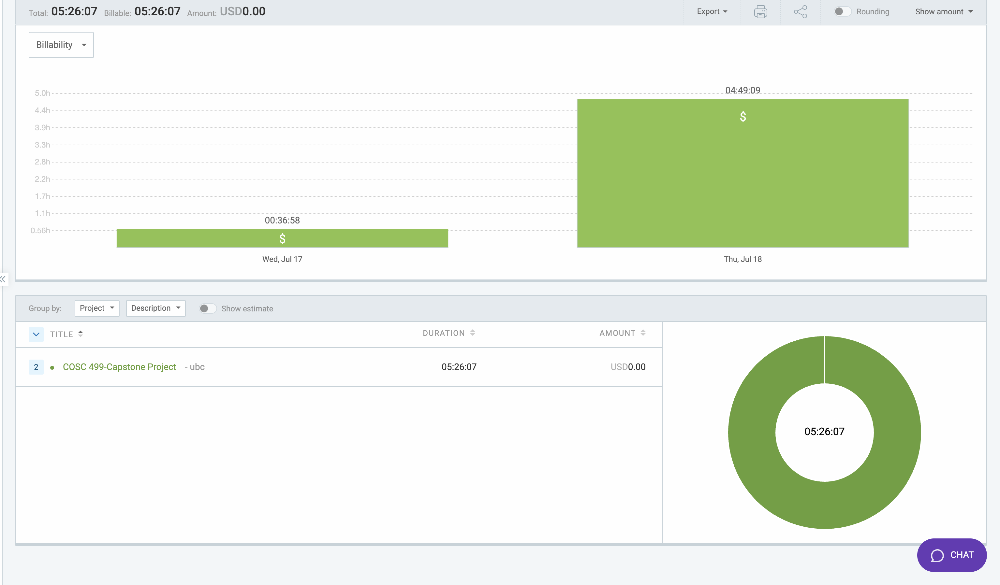

# Week 8: July 17 - July 18

### Date: July 18
### Author: Jay Bhullar

## Breakdown

**Approximate Hours: 5.43**

### Things worked on: ###

- **OMR Sheet Generator (1.5 hours):**
  - Continued development and debugging of the OMR Sheet Generator.

- **Login and Auth User Feedback (1.5 hours):**
  - Addressed user feedback related to login and authentication features.

- **Walkthrough Report (0.5 hours):**
  - Prepared a walkthrough report to document current progress and features.

- **Fixing Frontend (1.43 hours):**
  - Focused on resolving various frontend issues to improve the user interface and functionality.

- **Code Reviewing on GitHub (0.5 hours):**
  - Conducted code reviews of other team members' work on GitHub to ensure code quality and consistency.

### Comments ###

This week, my efforts were divided among continuing the development of the OMR Sheet Generator, addressing user feedback on login and authentication, preparing a walkthrough report, fixing frontend issues, and reviewing code on GitHub.

## Timesheet

### Clockify report

### Current Tasks (Provide sufficient detail)
  * #1: OMR Sheet Generator
  * #2: Login and Auth User Feedback
  * #3: Walkthrough Report
  * #4: Fixing Frontend
  * #5: Code Reviewing on GitHub

### Progress Update (since 7/17/2024) 
<table>
    <tr>
        <td><strong>TASK/ISSUE #</strong>
        </td>
        <td><strong>STATUS</strong>
        </td>
    </tr>
    <tr>
        <!-- Task/Issue # -->
        <td>OMR Sheet Generator
        </td>
        <!-- Status -->
        <td>In Progress
        </td>
    </tr>
    <tr>
        <!-- Task/Issue # -->
        <td>Login and Auth User Feedback
        </td>
        <!-- Status -->
        <td>Complete
        </td>
    </tr>
    <tr>
        <!-- Task/Issue # -->
        <td>Walkthrough Report
        </td>
        <!-- Status -->
        <td>Complete
        </td>
    </tr>
    <tr>
        <!-- Task/Issue # -->
        <td>Fixing Frontend
        </td>
        <!-- Status -->
        <td>In Progress
        </td>
    </tr>
    <tr>
        <!-- Task/Issue # -->
        <td>Code Reviewing on GitHub
        </td>
        <!-- Status -->
        <td>Complete
        </td>
    </tr>
</table>

### Cycle Goal Review 
Reflection: This cycle focused on multiple tasks, including further development of the OMR Sheet Generator, addressing user feedback, and fixing frontend issues. Despite the short timeframe, substantial progress was made.

Retrospective: Addressing user feedback promptly was crucial for improving the login and authentication experience. Continued focus on fixing frontend issues and code reviews is essential for maintaining project quality.

### Next Cycle Goals
  * Keep working on other functionalities as per our use cases.
