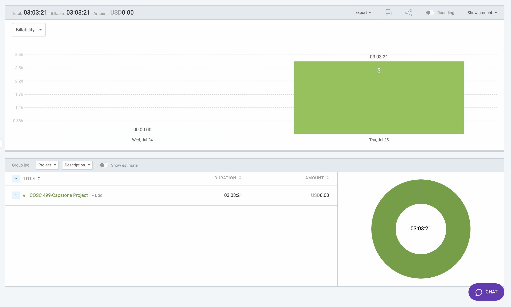

# Week 9: July 24 - July 26

### Date: July 26
### Author: Jay Bhullar

## Breakdown

**Approximate Hours: 3.05**

### Things worked on: ###

- **Fixing Errors (1 hour):**
  - Spent significant time debugging and fixing various errors in the application.

- **Research on Password Reset and SignUp Page (1.05 hours):**
  - Conducted research on implementing password reset functionality and creating a signup page.

- **Navbars Fixing (1 hour):**
  - Worked on fixing and improving both the Navbar and the Instructor Navbar for better navigation and user experience.

### Comments ###

This week was primarily focused on fixing existing errors, researching how to implement password reset and signup functionalities, and improving the navigation bars for both instructors and general users.

## Timesheet

### Clockify report

### Current Tasks (Provide sufficient detail)
  * #1: Fixing Errors
  * #2: Research on Password Reset and SignUp Page
  * #3: Navbars Fixing

### Progress Update (since 7/24/2024) 
<table>
    <tr>
        <td><strong>TASK/ISSUE #</strong>
        </td>
        <td><strong>STATUS</strong>
        </td>
    </tr>
    <tr>
        <!-- Task/Issue # -->
        <td>Fixing Errors
        </td>
        <!-- Status -->
        <td>Complete
        </td>
    </tr>
    <tr>
        <!-- Task/Issue # -->
        <td>Research on Password Reset and SignUp Page
        </td>
        <!-- Status -->
        <td>Complete
        </td>
    </tr>
    <tr>
        <!-- Task/Issue # -->
        <td>Navbars Fixing
        </td>
        <!-- Status -->
        <td>Complete
        </td>
    </tr>
</table>

### Cycle Goal Review 
Reflection: This cycle was less productive due to a focus on fixing persistent errors and conducting necessary research. However, it set the stage for upcoming development tasks. The improvements to the navigation bars were essential for enhancing user experience.

Retrospective: Addressing errors and researching critical features was necessary to ensure stability and plan for upcoming implementations.

### Next Cycle Goals
  * Work on the signup page and invitation features.
  * Prepare for the final coding phase, aiming to complete coding by August 2nd.
