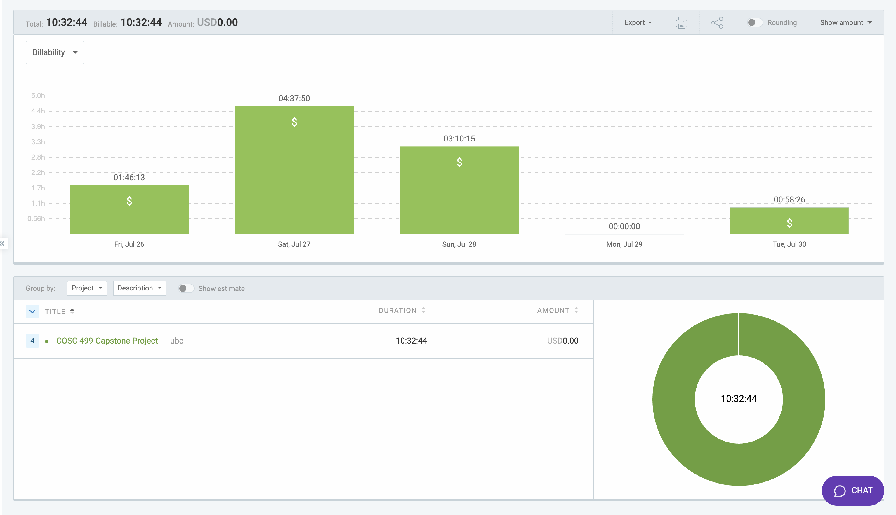

# Week 10: July 26 - July 29

### Date: July 29
### Author: Jay Bhullar

## Breakdown

**Approximate Hours: 10.5**

### Things worked on: ###

- **Frontend Errors Fixing (1.75 hours):**
  - Focused on resolving errors in the frontend to ensure the application runs smoothly.

- **Inviting Students (4.5 hours):**
  - Worked on the functionality for inviting students. Although it wasn't working as expected, I collaborated with Nic to plan the next steps, and he is now implementing it with Node Mailer.

- **Error Fixing/Planning (3 hours):**
  - Spent time fixing various errors and planning the next steps for the project to meet deadlines.

- **Error Fixing (1 hour):**
  - Continued efforts in debugging and fixing errors to stabilize the application.

### Comments ###

This week, I focused mainly on fixing errors and implementing the student invitation functionality. Unfortunately, I was very ill with a high fever since Friday, which significantly limited my productivity. I apologize to my team for not being able to contribute as much as I would have liked. Despite this, I collaborated with Nic on planning the implementation of the student invitation feature using Node Mailer.

## Timesheet

### Clockify report

### Current Tasks (Provide sufficient detail)
  * #1: Frontend Errors Fixing
  * #2: Inviting Students
  * #3: Error Fixing/Planning

### Progress Update (since 7/26/2024) 
<table>
    <tr>
        <td><strong>TASK/ISSUE #</strong>
        </td>
        <td><strong>STATUS</strong>
        </td>
    </tr>
    <tr>
        <!-- Task/Issue # -->
        <td>Frontend Errors Fixing
        </td>
        <!-- Status -->
        <td>Complete
        </td>
    </tr>
    <tr>
        <!-- Task/Issue # -->
        <td>Inviting Students
        </td>
        <!-- Status -->
        <td>In Progress
        </td>
    </tr>
    <tr>
        <!-- Task/Issue # -->
        <td>Error Fixing/Planning
        </td>
        <!-- Status -->
        <td>Complete
        </td>
    </tr>
</table>

### Cycle Goal Review 
Reflection: This cycle was challenging due to my illness, which hindered my ability to contribute fully. However, I managed to make some progress in fixing errors and planning the implementation of key features.

Retrospective: The illness was an unforeseen setback, but I am committed to making up for the lost time in the coming weeks.

### Next Cycle Goals
  * Work on the signup page and invitation features.
  * Complete all pending tasks before August 2nd.
