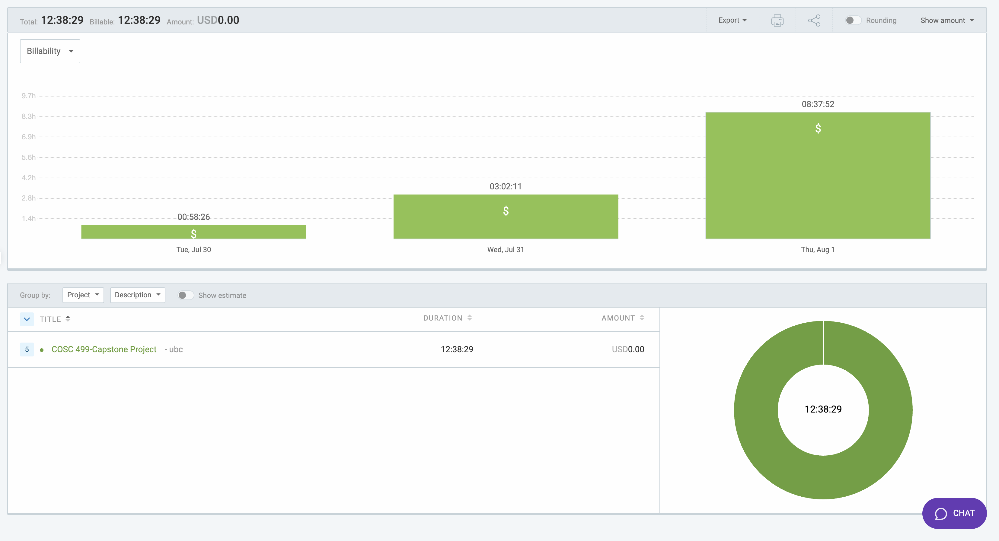

# Week 10: July 30 - August 1

### Date: August 1
### Author: Jay Bhullar

## Breakdown

**Approximate Hours: 12:38:29**

### Things worked on: ###

- **Error fixing/Styling (5 hours, large):**
  - Fixed various errors in the frontend.
  - Improved styling in the navbar for both student and instructor views.

- **Styling Navbar (1 hour, small):**
  - Focused on styling improvements for the navbar to enhance user experience.

- **General Styling Fixes in Student and Instructor Navbar (2 hours, medium):**
  - Made comprehensive styling adjustments to ensure consistency and usability across different user roles.

- **Questionnaire and Peer Review Preparation (1 hour, small):**
  - Prepared the questionnaire for peer reviews and ensured all necessary documents were ready.

### Comments ###

This week, I dedicated a significant amount of time to fixing errors and improving the styling of various components, especially the navbar. These improvements are critical for ensuring a seamless user experience. Additionally, I prepared the necessary materials for our questionnaire and peer reviews. Moving forward, I will focus on the final presentation preparation and report writing.

## Timesheet

### Clockify report

### Current Tasks (Provide sufficient detail)
  * #1: Error fixing/Styling
  * #2: Styling Navbar
  * #3: General Styling Fixes in Student and Instructor Navbar
  * #4: Questionnaire and Peer Review Preparation

### Progress Update (since 7/30/2024) 
<table>
    <tr>
        <td><strong>TASK/ISSUE #</strong>
        </td>
        <td><strong>STATUS</strong>
        </td>
    </tr>
    <tr>
        <!-- Task/Issue # -->
        <td>Error fixing/Styling
        </td>
        <!-- Status -->
        <td>Complete
        </td>
    </tr>
    <tr>
        <!-- Task/Issue # -->
        <td>Styling Navbar
        </td>
        <!-- Status -->
        <td>Complete
        </td>
    </tr>
    <tr>
        <!-- Task/Issue # -->
        <td>General Styling Fixes in Student and Instructor Navbar
        </td>
        <!-- Status -->
        <td>Complete
        </td>
    </tr>
    <tr>
        <!-- Task/Issue # -->
        <td>Questionnaire and Peer Review Preparation
        </td>
        <!-- Status -->
        <td>Complete
        </td>
    </tr>
</table>

### Cycle Goal Review 
Reflection: This week was productive in terms of fixing errors and making necessary styling improvements. These changes were essential for enhancing the overall user experience.

Retrospective: The process went smoothly, and the improvements have made a noticeable difference. Allocating time for error fixing and styling was crucial.

### Next Cycle Goals
  * Continue working on improving the UI.
  * Collaborate on OMR functionalities.
  * Final presentation preparation.
  * Report writing.
