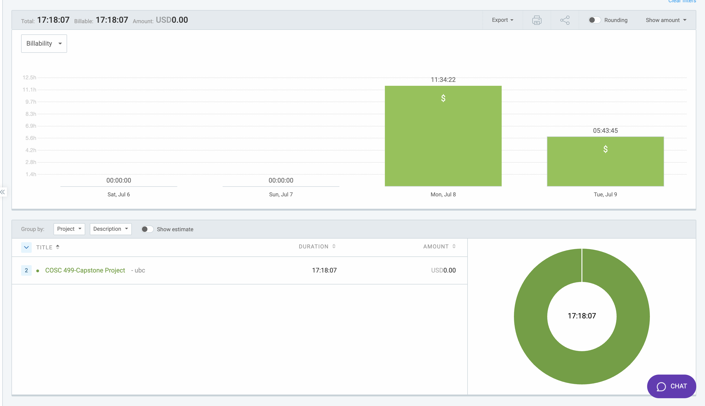

# Week 7: July 6 - July 9

### Date: July 9
### Author: Jay Bhullar

## Breakdown

**Approximate Hours: 17.3**

### Things worked on: ###

- **Frontend Testing and Fixing (17.3 hours, large):** 
  - Conducted extensive frontend testing to ensure the application meets the required standards.
  - Fixed various issues identified during testing.
  - Results of the new tests:
    - Test Suites: 2 failed, 31 passed, 33 total.
    - Tests: 92 passed, 92 total.

### Comments ###

This week, my primary focus was on frontend testing and fixing issues. Due to a period of illness, I concentrated on catching up with the necessary testing work. The testing results show significant progress, although there are still some failing test suites that need attention.

## Timesheet

### Clockify report

### Current Tasks (Provide sufficient detail)
  * #1: Frontend Testing and Fixing

### Progress Update (since 7/6/2024)  
<table>
    <tr>
        <td><strong>TASK/ISSUE #</strong>
        </td>
        <td><strong>STATUS</strong>
        </td>
    </tr>
    <tr>
        <!-- Task/Issue # -->
        <td>Frontend Testing and Fixing
        </td>
        <!-- Status -->
        <td>In Progress
        </td>
    </tr>
</table>

### Cycle Goal Review 
Reflection: This cycle involved a heavy focus on frontend testing and fixing due to the backlog in testing and my recent illness. The efforts have resulted in many passed tests, though some areas still require work.

Retrospective: The concentrated effort on testing was necessary to ensure the stability and quality of the frontend. Moving forward, maintaining a balance between development and testing will be crucial.

### Next Cycle Goals
  * Move forward with developing the app and the rest of the use cases as initially planned.
