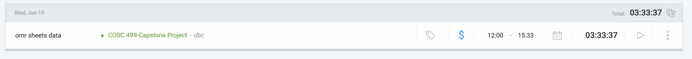

# Week 5: June 19 - June 20

### Date: June 20
### Author: Jay Bhullar

## Breakdown

**Approximate Hours: 3.5**

### Things worked on: ###

- **OMR Sheets Data (3.5 hours, medium):**
  - Manually marked OMR sheets to train Roboflow, an important step in ensuring accurate data recognition and processing for our project.

### Comments ###

This week was shorter due to illness on June 20. However, I managed to make progress on handling OMR sheets data, which is crucial for our project. I will resume work on June 21 and continue with my planned tasks.

## Timesheet

### Clockify report

### Current Tasks (Provide sufficient detail)
  * #1: OMR Sheets Data

### Progress Update (since 6/19/2024) 
<table>
    <tr>
        <td><strong>TASK/ISSUE #</strong>
        </td>
        <td><strong>STATUS</strong>
        </td>
    </tr>
    <tr>
        <!-- Task/Issue # -->
        <td>OMR Sheets Data
        </td>
        <!-- Status -->
        <td>Complete
        </td>
    </tr>
</table>

### Cycle Goal Review 
Reflection: Managed to complete the task of processing OMR sheets data despite being sick on June 20. The work done will help streamline the handling of exam data.

Retrospective: The process is on track, and I will need to catch up on missed work from June 20.

### Next Cycle Goals
  * Make Instructor Dashboard fully functional
  * Add course, tests, edit, remove and view student lists functionalities
