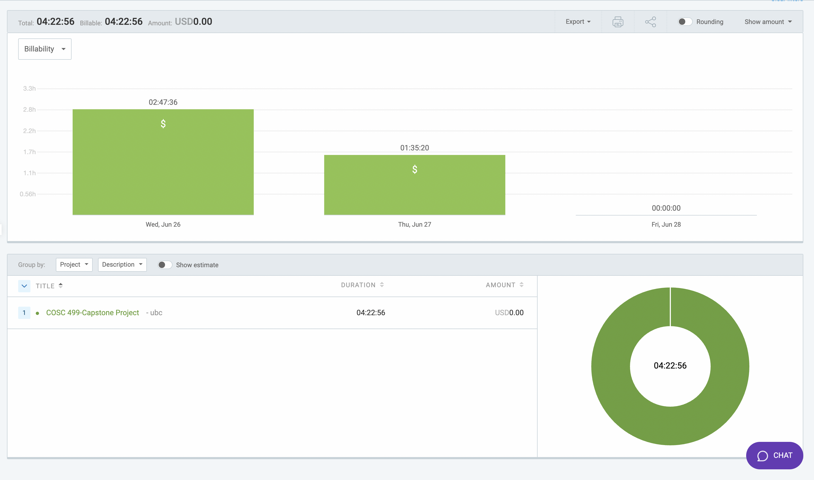

# Week 5: June 26 - June 28

### Date: June 28
### Author: Jay Bhullar

## Breakdown

**Approximate Hours: 4.38**

### Things worked on: ###

- **Student Upload Feature (4.38 hours, medium):**
  - Implemented functionality to allow instructors to upload a CSV file containing student data.
  - Developed backend logic to enroll students in the course based on the uploaded CSV file.
  - Integrated this feature into the students' view section on the instructor side.

### Comments ###

This week, I focused on creating the student upload feature, which allows instructors to easily enroll multiple students by uploading a CSV file. This functionality is integrated into the students' view section on the instructor side, streamlining the enrollment process.

## Timesheet

### Clockify report

### Current Tasks (Provide sufficient detail)
  * #1: Student Upload Feature

### Progress Update (since 6/26/2024) 
<table>
    <tr>
        <td><strong>TASK/ISSUE #</strong>
        </td>
        <td><strong>STATUS</strong>
        </td>
    </tr>
    <tr>
        <!-- Task/Issue # -->
        <td>Student Upload Feature
        </td>
        <!-- Status -->
        <td>Complete
        </td>
    </tr>
</table>

### Cycle Goal Review 
Reflection: Implemented a key feature for student enrollment which will simplify the process for instructors. The integration went smoothly, and the backend logic is working as expected.

Retrospective: The focused approach on a single feature worked well and allowed for thorough development and testing.

### Next Cycle Goals
  * Complete the frontend part with test data.
  * Start assisting the team with OMR-related tasks.
