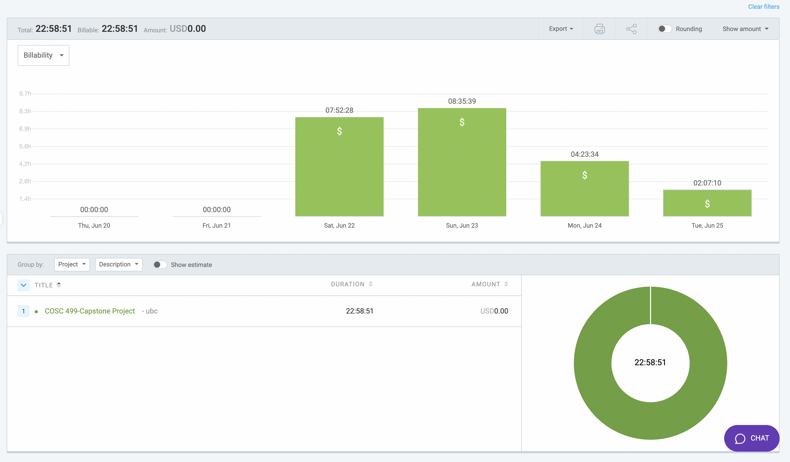

# Week 5: June 20 - June 25

### Date: June 25
### Author: Jay Bhullar

## Breakdown

**Approximate Hours: 22.98**

### Things worked on: ###

- **Instructor Dashboard UI (22.98 hours, large):**
  - **Add Course (5 hours):** Implemented functionality to add new courses.
  - **Add Test (4 hours):** Developed the feature to create and manage tests.
  - **Improved Overall Appearance (6 hours):** Enhanced the visual aesthetics of the dashboard.
  - **Light Theme (3 hours):** Designed and integrated a light theme for better user experience.
  - **Exam Details (3 hours):** Added detailed view and management options for exams.
  - **Profile Modal (2 hours):** Created a profile modal for user account management.

### Comments ###

This week, I focused entirely on enhancing the Instructor Dashboard UI, adding several key functionalities, and improving the overall user interface. These updates are crucial for making the dashboard more functional and user-friendly.

## Timesheet

### Clockify report

### Current Tasks (Provide sufficient detail)
  * #1: Add Course
  * #2: Add Test
  * #3: Improved Overall Appearance
  * #4: Light Theme
  * #5: Exam Details
  * #6: Profile Modal

### Progress Update (since 6/20/2024) 
<table>
    <tr>
        <td><strong>TASK/ISSUE #</strong>
        </td>
        <td><strong>STATUS</strong>
        </td>
    </tr>
    <tr>
        <!-- Task/Issue # -->
        <td>Add Course
        </td>
        <!-- Status -->
        <td>Complete
        </td>
    </tr>
    <tr>
        <!-- Task/Issue # -->
        <td>Add Test
        </td>
        <!-- Status -->
        <td>Complete
        </td>
    </tr>
    <tr>
        <!-- Task/Issue # -->
        <td>Improved Overall Appearance
        </td>
        <!-- Status -->
        <td>Complete
        </td>
    </tr>
    <tr>
        <!-- Task/Issue # -->
        <td>Light Theme
        </td>
        <!-- Status -->
        <td>Complete
        </td>
    </tr>
    <tr>
        <!-- Task/Issue # -->
        <td>Exam Details
        </td>
        <!-- Status -->
        <td>Complete
        </td>
    </tr>
    <tr>
        <!-- Task/Issue # -->
        <td>Profile Modal
        </td>
        <!-- Status -->
        <td>Complete
        </td>
    </tr>
</table>

### Cycle Goal Review 
Reflection: This cycle was productive with the completion of multiple critical features for the Instructor Dashboard. The dashboard's functionality and user experience have significantly improved.

Retrospective: To fast-forward the building process, more focused sessions and minimizing distractions worked well. Moving forward, maintaining this momentum will be key.

### Next Cycle Goals
  * Complete the frontend part with test data.
  * Start assisting the team with OMR-related tasks.
