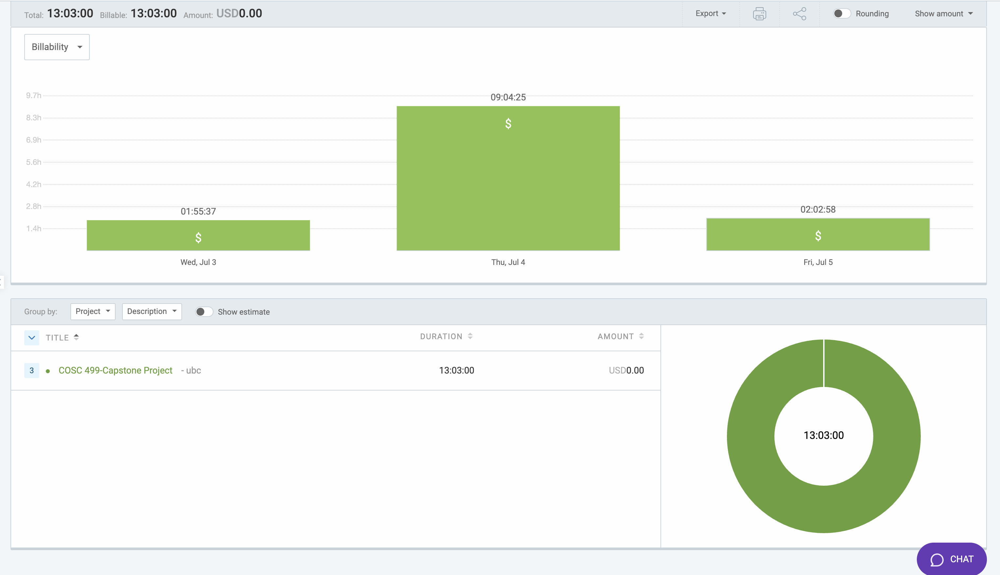

# Week 6: July 3 - July 5

### Date: July 5
### Author: Jay Bhullar

## Breakdown

**Approximate Hours: 13.05**

### Things worked on: ###

- **Instructor Dashboard (4 hours):** 
  - Focused on fixing the UI elements to ensure better usability and visual consistency.

- **Presentation/Testing/Meeting (7 hours):** 
  - Worked on preparing and presenting the project progress.
  - Conducted testing of the developed features.
  - Participated in multiple meetings to discuss progress, issues, and next steps.

- **Meeting/Fixing Stuff (2 hours):** 
  - Addressed various minor issues and bugs.
  - Participated in meetings to coordinate with team members and discuss fixes.

### Comments ###

This week was largely dedicated to refining the Instructor Dashboard UI, ensuring it is ready for presentation and testing. Significant time was also spent on preparing for and participating in meetings to coordinate efforts and ensure the project's progress.

## Timesheet

### Clockify report

### Current Tasks (Provide sufficient detail)
  * #1: Instructor Dashboard
  * #2: Presentation/Testing/Meeting
  * #3: Meeting/Fixing Stuff

### Progress Update (since 7/3/2024) 
<table>
    <tr>
        <td><strong>TASK/ISSUE #</strong>
        </td>
        <td><strong>STATUS</strong>
        </td>
    </tr>
    <tr>
        <!-- Task/Issue # -->
        <td>Instructor Dashboard
        </td>
        <!-- Status -->
        <td>In Progress
        </td>
    </tr>
    <tr>
        <!-- Task/Issue # -->
        <td>Presentation/Testing/Meeting
        </td>
        <!-- Status -->
        <td>Complete
        </td>
    </tr>
    <tr>
        <!-- Task/Issue # -->
        <td>Meeting/Fixing Stuff
        </td>
        <!-- Status -->
        <td>Complete
        </td>
    </tr>
</table>

### Cycle Goal Review 
Reflection: The focus this week was on finalizing the UI elements of the Instructor Dashboard and ensuring all features were ready for presentation and testing. Participation in meetings helped align the team’s efforts and address any outstanding issues promptly.

Retrospective: Taking the time to review and fix minor issues before the presentation was crucial in ensuring a smooth demonstration. Coordination with the team through meetings also proved to be very effective.

### Next Cycle Goals
  * Improve the UI.
  * Work on OMR-related tasks.
