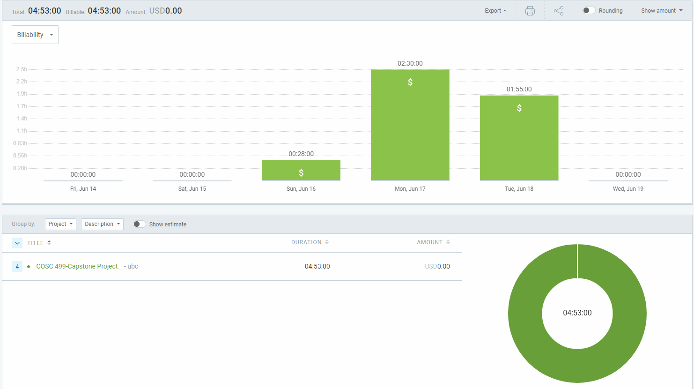

# Wednesday (6/14 - 6/19)
## Date: June 18, 5:00PM

### Timesheet
Clockify Report

### Task tldr:
I implemented auth last week. This week I made it so that the frontend will grab the user's ID and role from the JWT and will use that information for routing and course views in the front end. Everything works in the student view.
I was unable to add the instructor view stuff due to being out of my house and away from internet for the weekend, but I will get it finished in the next cycle.

### Current Tasks:
  * #1: Fetching course data using authentication information
  * #2: Creating 'add course' button and tying it into the db
  * #3: Creating 'add test' button and tying it into the db

### Progress Update (since 6/14/2024) 
<table>
    <tr>
        <td><strong>TASK/ISSUE #</strong>
        </td>
        <td><strong>STATUS</strong>
        </td>
    </tr>
    <tr>
        <!-- Task/Issue # -->
        <td>Task 1: Fetching course data using auth information
        </td>
        <!-- Status -->
        <td>Complete
        </td>
    </tr>
    <tr>
        <!-- Task/Issue # -->
        <td>Task 2: Creating 'add course' button for instructors
        </td>
        <!-- Status -->
        <td>In Progress
        </td>
    </tr>
    <tr>
        <!-- Task/Issue # -->
        <td>Task 3: Creating 'add test' button for instructors
        </td>
        <!-- Status -->
        <td>In Progress
        </td>
    </tr>
</table>

### Cycle Goal Review (Reflection: what went well, what was done, what didn't; Retrospective: how is the process going and why?)
I completed task 1, but I was busy with my mother's birthday celebrations and didn't get task 2 or 3 finished. They will be completed in the next cycle

### Next Cycle Goals (What are you going to accomplish during the next cycle)
  * Complete instructor 'Add Test' button and make it add a test in the DB
  * Complete instructor 'Add Course' button and make it add a course in the DB
  * Complete student test view so a student can see their questions

# June 12 - June 14
## Date: June 14, 3:51 AM

## Hours: 25.25hrs

## Tasks:

tldr; I wrote our authentication from 'scratch' using jwt because Scott mentioned we should have authentication running locally on our backend. I created a pgadmin Docker image for postgres database management and analysis / query building. I added backend routing with Express and tied it into the React components through a users API gateway in our Express.js server. I modified our Express backend to use a routes / controllers scheme for ease of understanding. Got student view working alright, but it is not tied into authentication yet.

### Express.js and React.js authentication and session token storage (12.5hrs) (Large):
- Created a login page and authentication service with jwt
- Added session logic to boot the user out of any pages unless they are logged in (navigates them to the login page)

### pgadmin Docker image setup (3hrs) (Med):
- Added pgadmin to our Docker image and spent a while troubleshooting connection issues until it worked.
- Helped the team get their Docker stuff running and understand the pgadmin stuff.

### Backend Routing
- Added various postgres queries on our backend and tied them into an api gateway that allows the user to pass in various details to retrieve course, exam, question, and response data (not finished)
- Added authentication routing
- Created a routes / controllers scheme for ease of understanding and maintenance

## Work in Progress

### Tying in auth to database with correct course identifications

## Goal Recap

My goals for the last cycle were to get authentication working and put test data into Postgres, then set up UI modules in React if the other two were successful. Overall, I think I completed my goals. The only thing I was unable to touch was a teacher view. The authentication and Postgres sample data is added, and React now shows the sample data from Postgres dynamically.

My goals for this week are to finish the session handling with user verification and authentication, then to move onto adding all of the instructor features like adding exams, courses, student rosters, etc.

# June 7 - June 11
## Date: June 11, 6:07 PM

## Hours: 20hrs

## Tasks:

tldr; I recorded audio with Jay for the design video and recorded the video. Then edited the video and submitted it via Canvas. I got the Docker images up and running using awesome-compose and merged Jay's work into the frontend image. I then got Clerk authentication working, but realized that the free tier is too prohibitive for our use case, so we are now switching to Supabase (tentatively)

### React.js login, authentication and session logic (12.5hrs) (Large):
- Got a login going in React, then decided our auth service (Clerk) wasn't going to work.
- Moved Jay's UI mockup React code into the Docker images

### Awesome-compose docker setup and changing mySQL to Postgres (4.5hrs) (Med):
- Cloned awesome-compose react-express-mysql docker image
- Changed mysql image to postgres image
- Lots of troubleshooting
- Helped the rest of the team get the Docker image going

### Design Presentation Video (3hrs) (Med):
- Recorded audio for design video
- Added clips to Google slides
- Recorded design video and submitted it via Canva

## Work in Progress

### Supabase Auth service

## Goal Recap

My goals for last week were to complete the design video and setup the Docker images, get some code written for routing and get a general database design created in the Postgres image. I was able to complete the video and setup Docker. Jay set up some basic routing for React, and I was unable to get around to creating a test database for Postgres because Auth has taken a lot of time to understand and setup.

My goals for this week are to get authentication working. Once that is done I will be working on putting test data into Postgres so we can make a dynamic UI with React. If I manage to complete both of those tasks, I will be setting up UI modules in React to get the teacher and student view modules working correctly.

# June 5 - June 6
## Date: June 6, 8:13 PM

## Hours: 9.75

## Tasks:

### Design Document & Meetup (2hrs) (Med):
- Converted design document from Google Docs to Markdown on Github while in a Discord group call to discuss requirements

### Figma UI Mocking (6hrs) (Large):
- Worked with Oakley on a general UI page layout
- Worked as a team on the student mobile view

### Diagramming (1.75hrs) (Med)
- Finished ER Diagram with Oakley's input
- Re-worked DFDs 0/1
- Re-worked system architecture
- Created user scenarios

## Work in Progress

### Docker images for backend and database

## Goal Recap

My goals for this week were to get the UI pages at least all in a prototype, complete our design document and diagrams, and set up Docker images for our backend and database.
We managed to get the UI finished and complete the design document requirements, but we were not able to get all of the Docker images up.

My goals for next week are to create our design video and setup Docker images for the backend and database, and start getting some code written for routing and React, with a general database design created in our Docker image with PostgreSQL

# May 31 - June 5
## Date: June 5, 11:19 PM

## Hours: 10.5

## Tasks:

### Team Meeting (2hrs) (Med):
- Attended class meetings
- Met after class to discuss breakdown of requirements

### Figma UI Mocking (7hrs) (Large):
- Worked with Oakley on a general UI page layout
- Worked on theming and styling for UI

### Diagramming (1.5hrs) (Med)
- Worked on the ER diagram

## Work in Progress

### UI Mockups in Figma (Med)
### UML Diagrams (Small)
### ER Diagram (Med)

## Goal Recap

My goals for this week were to get the UI mocked up and get a basic outline in Docker for our microservices as well as finishing the ER diagram
I managed to get some UI work done and got the ER diagram mostly finished, but I was unable to get the Docker containers running for our microservice architecture

My goals for the next phase is to finish off the UI flows, complete our design doc and associated diagrams, complete our design video, and set up Docker images for our different services

# May 29 - May 31
## Date: May 31, 8:11 PM

## Hours: 4.5

## Tasks:

### Team Meeting (2hrs) (Med):
- Met with Dr. Lawrence, our client, regarding the project proposal - Took notes on the project and got a refined direction to move into
- Discussed matters after the meeting regarding Dr. Lawrence's feedback - Planned tasks for the upcoming weekend

### Figma UI Mocking (1hr) (Small):
- Worked with Oakley on a general UI page layout

### Set up outlines for team Github logging (1hr) (Small)

## Work in Progress

### UI Mockups in Figma (Med)
### UML Diagrams (Small)
### ER Diagram (Med)

## Goal Recap

My goals for next week are to get the UI mocked up in Figma and to get a basic outline in Docker going for our React.js front-end and Node.js backend
Also creating the ER Diagram in Figma with Nathan

# May 22 - May 29
## Date: May 29, 8:11 PM

## Hours: 10.5

## Tasks:

### Team Meeting (3hrs) (Med):
- Attended the initial team meeting to hash out ideas about the requirements of the project before the proposal began

### Project Proposal (7.5hrs) (Large):

- Conducted requirements elicitation and created the functional, technical, and user requirements with Oakley
- Created use cases from user requirements
- Formatting and elaboration in the proposal document

### Project Video (1hr) (Small):

- Created slides for the video and a voice over of 1/4 of the video

## Work in Progress

### UI Mockups in Figma (Med)
### UML Diagrams (Small)

## Goal Recap

My goals for this week were to get situated with the team dynamic and complete the weekly submission requirement of the project proposal and the proposal video. I think that the goals were adequately completed.

My goals for next week are to get the UI mocked up in Figma and to get a basic outline in Docker going for our React.js front-end and Node.js backend

