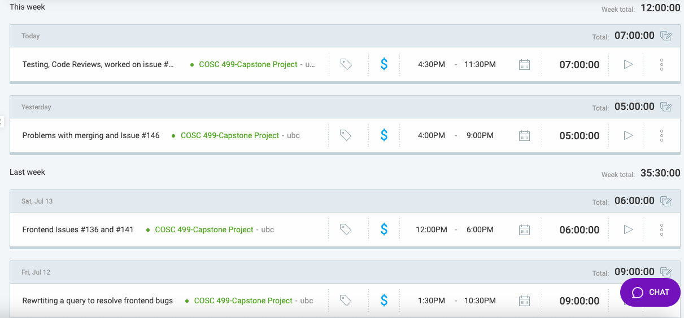

## Friday (7/31 - 8/1) Oakley Pankratz
Total Hours: 6

Update clockify log

## Current Tasks:
* Reviewing Code and discussing the completion of ou project with teammates.
* Implementing a modal view to display year-by-year statistics for an assessment to the instructor. 

### Progress Update (since 8/1/2024) 
<table>
    <tr>
        <td><strong>TASK/ISSUE #</strong>
        </td>
        <td><strong>STATUS</strong>
        </td>
    </tr>
    <td> Create Add Student button
        </td>
        <!-- Status -->
        <td> Will not complete (the related requirement has been met by another feature) (Issue #97)
        </td>
    </tr>
    <td> Display Year By Year statistics for an assessment to the instructor
        </td>
        <!-- Status -->
        <td> In progress (Issue #245)
        </td>
    </tr>
    <td> Create an option for instructors to give part marks or not, towards multi-responses questions
        </td>
        <!-- Status -->
        <td> Will not complete (this feature is not a requirement) (Issue #147)
        </td>
    </tr>
</table>

### Cycle Goal Review:
 * This cycles I did not have enough time to work on the project as I had to prioritize another course. I did my best to stay involved in the development process and communicate wth teammates. I was able to do a few code reviews and discuss our plans for project completion with teammates. I began working on a final issue. 
 
### Next Cycle Goals:
* I would really like to implement the feature in which we display year-by-year statistics for a particular assessment to the instructore as this feature seems to be esspecially important. I will be wokring on this feature ober the weekend.

## Wednesday (7/26 - 7/31) Oakley Pankratz
Total Hours: 20

Update clockify log

## Current Tasks:
* Adding the ability for instructors to register students should they have exams in a course for which they aren't registered. Instructors will also have the ability to delete these tests. (needs styling)
* Displaying an individual students scan in the modal view returned from the spreadhseet (needs styling)
* Allowing instructors to add/edit/delete resposnes for students. I've been working on this for a number of cycles, but its finally complete, and doesn't seem to have any bugs!
* Displaying statstics for exams to the instructor (Issue #155)
* Displaying grades as percents or raw scores. This is togglabe and complete.

### Progress Update (since 7/31/2024) 
<table>
    <tr>
        <td><strong>TASK/ISSUE #</strong>
        </td>
        <td><strong>STATUS</strong>
        </td>
    </tr>
        <td> Display grades as percents
        </td>
        <!-- Status -->
        <td>Complete (Issue #145)
        </td>
    </tr>
        <td> Calculate statstics for exams
        </td>
        <!-- Status -->
        <td>Complete (Issue #155)
        </td>
    </tr>
        <td> Create an add student button
        </td>
        <!-- Status -->
        <td>In Progress (Issue #97)
        </td>
    </tr>
        <td> Add a way for instuctors to scan an exam for a single student.
        </td>
        <!-- Status -->
        <td>Complete (Issue #148)
        </td>
    </tr>
    </tr>
        <td> Handling students which are unregistered in a course, but have exams in it. 
        </td>
        <!-- Status -->
        <td> Complete (Issue #176)
        </td>
    </tr>
        <td> Add a way for instuctors to add resposnes for students
        </td>
        <!-- Status -->
        <td>Complete (Issue #165)
        </td>
    </tr>
    <td> Add a way for instuctors to delete resposnes for students
        </td>
        <!-- Status -->
        <td>Complete (Issue #166)
        </td>
    </tr>
    <td> Add a way for instuctors to edit resposnes for students
        </td>
        <!-- Status -->
        <td>Complete (Issue #167)
        </td>
    </tr>
</table>

### Cycle Goal Review:
 * This cycles I made the final touches on a large number of issues/goals which I've been working on for a long time. It feels really good to close 9 issues all in once cycle! 
 
### Next Cycle Goals:
* Create an "Add Student" button (Issue#97). This should be fairly quick and straightforward. I can re-use the code which I used to register students. I may need to move this code to a seperate file to be accessible. 
* Many of the features I implemented in this cycle I've only given functionality to, but haven't spent a lot of time styling. As such, A goal for this upcoming cycle is for me to re-style some of these components. I will need to create an issue for this on the KanBan board. A teammate has expressed they would like to help me with this.
* I also need to check the test coverage for features I implemetned this cycles. I will likely need to write some tests in this cycle.
* Provided I have the time, I would also like to write some documentation for the features I've worked on throughout the last few cycles.

## Friday (7/24 - 7/26) Oakley Pankratz
Total Hours: 11

Update clockify log

## Current Tasks:
* Adding the ability for instructors to register students should they have exams in a course for which they aren't registered. Instructors will also have the ability to delete these tests. (needs styling)
* Displaying an individual students scan in the modal view returned from the spreadhseet (needs styling)
* Fixing an issue with Docker where after merging, it was having issues with the "RUN NPM CI" line. 
* Statistics functions to support the completion of (Issue #155)

### Progress Update (since 7/26/2024) 
<table>
    <tr>
        <td><strong>TASK/ISSUE #</strong>
        </td>
        <td><strong>STATUS</strong>
        </td>
    </tr>
        <td> Display grades as percents
        </td>
        <!-- Status -->
        <td>In Progress (Issue #145)
        </td>
    </tr>
        <td> Calculate statstics for exams
        </td>
        <!-- Status -->
        <td>In Progress, closer to completion than wednesday (Issue #155)
        </td>
    </tr>
        <td> Create an add student button
        </td>
        <!-- Status -->
        <td>In Progress (Issue #97)
        </td>
    </tr>
        <td> Add a way for instuctors to scan an exam for a single student. (Issue#148)
        </td>
        <!-- Status -->
        <td>In Progress
        </td>
    </tr>
    </tr>
        <td> Handling students which are unregistered in a course, but have exams in it. (I will be creating an issue for this.)
        </td>
        <!-- Status -->
        <td> Near complete, just needs some final touches. (Issue #97)
        </td>
    </tr>
</table>

### Cycle Goal Review:
 * Issue #146 has finally been completed, which is very rewarding. I was able to make progress on some of the other issues to whcih I have been assigned quite quickly having 146 out of the way. I feel good about my progress this cycle. 
 
### Next Cycle Goals:
* Display grades in the spreadhseet as percents, I may possibly make this toggle-able for the instructor (Issue #145).
* Adding a way for instructors to add a test for a single student (Issue #148) 
* Create an "Add Student" button (Issue#97). This should be fairly quick and straightforward. I can re-use the code which I used to register students. I may need to move this code to a seperate file to be accessible. 
* Cacluate statistics for exams. I have the stats functions written up, I just need to tie them into the front-end. (Issue#155)

## Wednesday (7/19 - 7/24) Oakley Pankratz
Total Hours: 20.5

Update clockify log

## Current Tasks:
* Working on the modal view which displays a student's response to the instructor and allows them to be editted. Mainly, I spent time getting these editted resposnes to be pushed to the database. I also added implementation for flagging questions that have been modified, so the instructor knows if any grades have changed since the initial scan. 
* Modify the database to support storing a column which flags responses as having been modified.

### Progress Update (since 7/24/2024) 
<table>
    <tr>
        <td><strong>TASK/ISSUE #</strong>
        </td>
        <td><strong>STATUS</strong>
        </td>
    </tr>
        <!-- Task/Issue # -->
        <td>Making the spreadsheet component clickable
        </td>
        <!-- Status -->
        <td>Complete (making a PR to close this issue soon, hopefully today) (Issue #146)
        </td>
    </tr>
        <td> Display grades as percents
        </td>
        <!-- Status -->
        <td>In Progress (Issue #145)
        </td>
    </tr>
        <td> Calculate statstics for exams
        </td>
        <!-- Status -->
        <td>In Progress (Issue #155)
        </td>
    </tr>
        <td> Create an add student button
        </td>
        <!-- Status -->
        <td>In Progress (Issue #97)
        </td>
    </tr>
        <td> Add a way for instuctors scan an exam for a single student. (Issue#148)
        </td>
        <!-- Status -->
        <td>In Progress (Issue #97)
        </td>
    </tr>
</table>

### Cycle Goal Review:
 * Issue #146 has proven to be much larger than anticipated. I ran into a lot of bugs when trying to get the responses edited by the instructor to push to the backend. I'm still trying to get a pdf viewer in this modal view, but I have a lot of other issues. I felt a little discouraged as I genuinely thought I would be able to accomplish more this cycle, I'm not happy that I've been working on the same thing for so long. This just goes to show how difficult it can be to estimate task difficulty somtimes. 
 
### Next Cycle Goals:
* Display grades in the spreadhseet as percents, I may possibly make this toggle-able for the instructor (Issue #145).
* Adding a way for instructors to add a test for a single student (Issue #148) would be complete-able once Issue #146 is complete. 
* Create an "Add Student" button (Issue#97). This should be fairly quick and straightforward.
* Cacluate statistics for exams (Issue#155)

## Friday (7/17 - 7/19) Oakley Pankratz
Total Hours: 8.5
* Wokring on the modal view which displays the scan and responses for a student to the instructor, and allows the insstructor to edit the respective respoenses. 

Update clockify log

### Progress Update (since 7/12/2024) 
<table>
    <tr>
        <td><strong>TASK/ISSUE #</strong>
        </td>
        <td><strong>STATUS</strong>
        </td>
    </tr>
        <!-- Task/Issue # -->
        <td>Making the spreadsheet component clickable
        </td>
        <!-- Status -->
        <td>In Progress (but mostly complete) (Issue #146)
        </td>
    </tr>
        <td> Display grades as percents
        </td>
        <!-- Status -->
        <td>In Progress (Issue #145)
        </td>
    </tr>
        <td> Calculate statstics for exams
        </td>
        <!-- Status -->
        <td>In Progress (Issue #155)
        </td>
    </tr>
        <td> Create an add student button
        </td>
        <!-- Status -->
        <td>In Progress (Issue #97)
        </td>
    </tr>
        <td> Add a way for insttuctors scan an exam for a single student. (Issue#148)
        </td>
        <!-- Status -->
        <td>In Progress (Issue #97)
        </td>
    </tr>
</table>

### Cycle Goal Review:
 * I didn't have quite enough time this cycle to complete all the goals that I wanted to complete. I also got stuck working on issue #146. However, I'm excited to tackle my goals in the upcoming cycle.
 
### Next Cycle Goals:
* Finish Resolving Issue #146. (Modal for instructors to edit student's respoenses.)
* Display grades in the spreadhseet as percents, I may possibly make this toggle-able for the instructor (Issue #145).
* Adding a way for instructors to add a test for a single student (Issue #148) would be complete-able once Issue #146 is complete. 
* Create an "Add Student" button (Issue#97). This should be fairly quick and straightforward.
* Cacluate statistics for exams (Issue#155)

## Wednesday (7/12 - 7/17) Oakley Pankratz
Total Hours: 27

Update clockify log

## Current Tasks
 * Added a button to the spreadsheet and a cooresponding modal view. For now, it simply identifies the student information for the cell that was clicked. This is the first step in resolving Issue#146.
 * Fixed a bug in the backend in which the query to fetch grades for a course was not returning a row for students that haven't written any tests, even though they are registered. This resolves Issue$146 and allowed me to begin working on Issue#136.
 * Fixed a bug in the front end by refactoring and correting some code, so that grades now appear in the correct column for each student, resolving Issue#136.
 * Highliught rows in the spreadsheet view which flags students that have written a test for a course they are not registered in. This closes Issue#191.
 * Met with Nic to discuss our testing. 
 * Code Review for PR #180, merge testing into development.

### Progress Update (since 7/12/2024) 
<table>
    <tr>
        <td><strong>TASK/ISSUE #</strong>
        </td>
        <td><strong>STATUS</strong>
        </td>
    </tr>
        <!-- Task/Issue # -->
        <td>Making the spreadsheet component clickable
        </td>
        <!-- Status -->
        <td>In Progress (Issue #146)
        </td>
    </tr>
        <tr>
        <!-- Task/Issue # -->
        <td>Working on a bug on the front end, which results from null/missing data
        </td>
        <!-- Status -->
        <td>Completed (Issue #141)
        </td>
    </tr>
        <tr>
        <!-- Task/Issue # -->
        <td>Fix Grades-Spreadsheet bugs (not showing some grades in the correct column)
        </td>
        <!-- Status -->
        <td>Completed (Issue #136)
        </td>
    </tr>
        <tr>
        <!-- Task/Issue # -->
        <td>Flag students which have tests for a course they aren;'t registered in.
        </td>
        <!-- Status -->
        <td>Completed (Issue #191)
        </td>
    </tr>
</table>

### Cycle Goal Review:
 * I feel quite happy with the amount I was able to complete this cycle. I'm looking forward to the nect cycle. 
 * My overall understanding of our project is improving continuously, which is good to see!
 
### Next Cycle Goals:
* Finish Resolving Issue #146. I believe I'm fairly close to getting this one finnished, I just need to quickly meet with my team-mates.
* Display grades in the spreadhseet as percents, I may possibly make this toggle-able for the instructor (Issue #145).
* Adding a way for instructors to add a test for a single student (Issue #148) would be complete-able once Issue #146 is complete. 
* Create an "Add Student" button (Issue#97). This should be fairly quick and straightforward. (Hopefully)

## Friday (7/10 - 7/12) Oakley Pankratz
Total Hours: 9

Update clockify log

## Current Tasks
 * Creating a class to parse the data returned from a query of student's grades for a particular course.
 * Discovering a bug in the OMR component in which we currently do not check to see if all students are registered in the course to which their exams are being uploaded.
 * Working on a bug in the query which fetches student's grades.

### Progress Update (since 7/12/2024) 
<table>
    <tr>
        <td><strong>TASK/ISSUE #</strong>
        </td>
        <td><strong>STATUS</strong>
        </td>
    </tr>
        <tr>
        <!-- Task/Issue # -->
        <td>Add Dark Mode to the About and Contact Pages (Issue #46)
        </td>
        <!-- Status -->
        <td>Completed by another teammate 
        </td>
    </tr>
        <tr>
        <!-- Task/Issue # -->
        <td>Create a Header for the dashboard view (Issue #46)
        </td>
        <!-- Status -->
        <td>Discussing with Teamates
        </td>
        </tr>
    <tr>
        <!-- Task/Issue # -->
        <td>Making the spreadsheet component clickable
        </td>
        <!-- Status -->
        <td>In progress (Issue #146)
        </td>
    </tr>
        <tr>
        <!-- Task/Issue # -->
        <td>Working on a bug on the front end, which results from null/missing data
        </td>
        <!-- Status -->
        <td>In progress (Issue #141)
        </td>
    </tr>
</table>
Add more to this table

### Cycle Goal Review:
I was working on the frontend when I ran into a bug. I traced although back to our databse and have now identified the source last night: When exams are being marked, if a student is not registered for a course, their exams are maarked anyways. Tracing this bug was time consuming, and got in the way of me complting my goals. Now that I've traced it however, I can quickly solve it nd get bck to work on the frontend.
 
### Next Cycle Goals:
* Resolve the bugs I identified/located
* Make the spread sheet clickable
* Display statistical sumarry of grades for a test.

## Wednesday (7/5 - 7/10) Oakley Pankratz
Total Hours: 11.5

## Current Tasks
 * Making the greades spreadsheet component "clickable" so that it displays a student's scan. 
 * Resolving bugs on the spreadhseet component related to the edge case where a student is missing an exam for an assessment.

### Progress Update (since 6/19/2024) 
<table>
    <tr>
        <td><strong>TASK/ISSUE #</strong>
        </td>
        <td><strong>STATUS</strong>
        </td>
    </tr>
        <tr>
        <!-- Task/Issue # -->
        <td>Add Dark Mode to the About and Contact Pages (Issue #46)
        </td>
        <!-- Status -->
        <td>Discussing with Teamates
        </td>
    </tr>
        <tr>
        <!-- Task/Issue # -->
        <td>Create a Header for the dashboard view (Issue #46)
        </td>
        <!-- Status -->
        <td>Discussing with Teamates
        </td>
    </tr>
        <tr>
        <!-- Task/Issue # -->
        <td>Create a cpreadsheet component to display grades (Issue #42)
        </td>
        <!-- Status -->
        <td>Complete
        </td>
    </tr>
        </tr>
        <tr>
        <!-- Task/Issue # -->
        <td>Making the spreadsheet component clickable
        </td>
        <!-- Status -->
        <td>In progress (Isse #141)
        </td>
    </tr>
</table>

### Cycle Goal Review:

I'm happy with my work this cycle. I ran into some unexepected bugs on the spreadhseet component, which was a little discouraging. However, working through these bugs has helped improve my overall understanding of our project works. 

### Next Cycle Goals:
* Discuss of the front end with teammates as it seems we are getting clocse to compleeting it. We need to determine what is still missing, and finnih it.
* The list of tests in the instructor views needs to have the mean score for each test. I have yet to create an issue on gitHub for it, but I'm planning on doing making one this afternoon after a brief discussion with the team.

## Friday (7/3 - 7/5) Oakley Pankratz
Total Hours: 22

## Current Tasks
 * Created a spreadsheet view so instructors can view student's grades.
 * Write a query and route it to support the spreadheet for the instructor's view.
 * Meeet with team mates to prepare for our MVP presentation.

### Progress Update (since 6/19/2024) 
<table>
    <tr>
        <td><strong>TASK/ISSUE #</strong>
        </td>
        <td><strong>STATUS</strong>
        </td>
    </tr>
        <tr>
        <!-- Task/Issue # -->
        <td>Add Dark Mode to the About and Contact Pages (Issue #46)
        </td>
        <!-- Status -->
        <td>Discussing with Teamates
        </td>
    </tr>
        <tr>
        <!-- Task/Issue # -->
        <td>Create a Header for the dashboard view (Issue #46)
        </td>
        <!-- Status -->
        <td>Discussing with Teamates
        </td>
    </tr>
        <tr>
        <!-- Task/Issue # -->
        <td>Create a cpreadsheet component to display grades (Issue #42)
        </td>
        <!-- Status -->
        <td>Complete
        </td>
    </tr>
        </tr>
        <tr>
        <!-- Task/Issue # -->
        <td>Write and route a query for the spreadhseet component
        </td>
        <!-- Status -->
        <td>Complete
        </td>
    </tr>
</table>

### Cycle Goal Review:

I felt very productive over the last couple days. My main task of creating a spreadsheet had me working on the database, backend, and front end. I feel like I have a much better understandning of our software after this cycle's work.

### Next Cycle Goals:
* The spreadhseet still requires a few edits.
* Discuss the header component with teammates as it seems we already have one.
* The list of tests in the instructor views needs to have the mean score for each test. I have yet to create an issue on gitHub for it, but I'm planning on doing making one this afternoon after a brief discussion with the team.

## Wednesday (6/28 - 7/3) Oakley Pankratz
Total Hours: 6

## Current Tasks
 * Work on the Spreadsheet component so instructors may view and edit student grades

### Progress Update (since 6/19/2024) 
<table>
    <tr>
        <td><strong>TASK/ISSUE #</strong>
        </td>
        <td><strong>STATUS</strong>
        </td>
    </tr>
        <tr>
        <!-- Task/Issue # -->
        <td>Add Dark Mode to the About and Contact Pages (Issue #46)
        </td>
        <!-- Status -->
        <td>In Progress
        </td>
    </tr>
        <tr>
        <!-- Task/Issue # -->
        <td>Create a Header for the dashboard view (Issue #46)
        </td>
        <!-- Status -->
        <td>In Progress
        </td>
    </tr>
        <tr>
        <!-- Task/Issue # -->
        <td>Create a table to display grades (Issue #42)
        </td>
        <!-- Status -->
        <td>In Progress
        </td>
    </tr>
</table>

### Cycle Goal Review:

This cycle I had some interuptions from my personal life (I had to rush to Vancouver to meet my newborn niece for the first time! I was also moving, as my lease in Kelowna expired.) This made it difficult for me to complete my goals.

### Next Cycle Goals:
* Finish the spreadsheet view so instructors can view and edit student's grades. 
* Complete the implementation for our dark mode. 
* Further discuss the plan for our header component with team mates, as I have become unclear what our goal is there.

## Wednesday (6/21 - 6/26) Oakley Pankratz
Total Hours: 11

## Current Tasks
* Completed writing a footing component, which is now both styled and functional. Moreover, this component supports both a light and a dark mode.
* Displaying data to the user. Previously, we were using mock data to display a username and email to the user in the instructor view. This has now been replaced with data from the backend.
* Reviewing code. Now that I have a more firm grasp on the differerent languages in our tech stack, I've been able to look through my peer's code to unerstand it better, and ultimately contriubte more.
* Resolved issues on my local machine. My laptop has been having a hard time running our docker and development environment, since it doesn't have enough RAM or hard drive space. I spent some time goin through my background processes and terminating any that were not in use, and consuming a high volume of RAM.

### Progress Update (since 6/19/2024) 
<table>
    <tr>
        <td><strong>TASK/ISSUE #</strong>
        </td>
        <td><strong>STATUS</strong>
        </td>
    </tr>
        <tr>
        <!-- Task/Issue # -->
        <td>Stlye the footer component (Issue #105)
        </td>
        <!-- Status -->
        <td> Complete
        </td>
    </tr>
        <tr>
        <!-- Task/Issue # -->
        <td> Display which user is signed in, using data from the backend (Issue #108)
        </td>
        <!-- Status -->
        <td>Complete
        </td>
    </tr>
    </tr>
        <tr>
        <!-- Task/Issue # -->
        <td>Create a Header for the dashboard view (Issue #46)
        </td>
        <!-- Status -->
        <td>In Progress
        </td>
    </tr>
        <tr>
        <!-- Task/Issue # -->
        <td>Create a table to display grades (Issue #42)
        </td>
        <!-- Status -->
        <td>In Progress
        </td>
    </tr>
</table>

### Cycle Goal Review:

I styled the footer component as planned. This took more time than I anticiped, as I'm still geting the hang of Tailwind and React. I was also able to complete an issue that we hadn't planned on earlier. It was a good exercise for me to fetch some data from our backend, and get it properly displayed on the front end. I had planned on doing more this cycle, but I had unexpected and foreseeable issues with my local machine which. I'm a little discouraged not having done as much as I had hoped, but I'm glad that I'm beginning to see how our project is working as a whole. I'm confident that my speed of development will increase as I continue to practice with React and Tailwind. 

### Next Cycle Goals:
* #1: Create a header for the dashboard view which shows which pages the user is actively viewing, and provides them with an option to logout/signout. <Note:> Before I may work on this issue, I need to discuss the details with my teamates. Our front end has strayed a small ammount from our prototypes, some unclear what the goal is for this issue. (Issue #46)
* #2: Create a table to display student's grade to an instructor. Populate the table with mock data and make it editable. (Issue #42)
* #3 Work on fully implementing our dark mode/light mode feature. (Issue #101) This issue has mostly been copleted, but I believe Jay forgot to style two components, namely the "Contact" and "About" components. 

## Friday (6/19 - 6/21) Oakley Pankratz
Total Hours: 7

## Current Tasks
* Completed learning the tech stack. I finished off by learning CSS followed by tailwind. Previously I've learnt HTML, Javascript, and React.
* Filled out a high volume of bubble sheets by hand to creteated sample data to train the OMR component. I worked together within Nathan and Jay to complete this task. (Issue #87)

### Progress Update (since 6/19/2024) 
<table>
    <tr>
        <td><strong>TASK/ISSUE #</strong>
        </td>
        <td><strong>STATUS</strong>
        </td>
    </tr>
    <tr>
        <!-- Task/Issue # -->
        <td>Learning CSS and Tailwind
        </td>
        <!-- Status -->
        <td> Complete
        </td>
    </tr>
        <tr>
        <!-- Task/Issue # -->
        <td>Create sample data to train the OMR component.
        </td>
        <!-- Status -->
        <td> Complete
        </td>
    </tr>
    </tr>
        </tr>
        <tr>
        <!-- Task/Issue # -->
        <td>Stlye the footer which was created in the last cycle (Issue #47)
        </td>
        <!-- Status -->
        <td> In progress
        </td>
    </tr>
        </tr>
        <tr>
        <!-- Task/Issue # -->
        <td>Creating a Header for the dashboard view (Issue #46)
        </td>
        <!-- Status -->
        <td>In Progress
        </td>
    </tr>
        </tr>
        <tr>
        <!-- Task/Issue # -->
        <td>Create a table to display grades (Issue #42)
        </td>
        <!-- Status -->
        <td>In Progress
        </td>
    </tr>
</table>

### Cycle Goal Review:

I completed learning CSS and Tailwind, as planned. I still need more practice with the tech stack, but I'm strong enough that I can begin to work with the team to write some code. This will provide me the extra practice I need. I created the following page to demonstrate that I have learnt CSS and Tailwind.

Filling out sample bubble sheets took some time I had budgeted for other issues. This contributed to me not being able to complete all of the tasks which I had planned on completing.

### Next Cycle Goals:
* #1: finnish the footer component by styling it with Tailwind.
* #2: Create a header for the dashboard view which shows which pages the user is actively viewing, and provides them with an option to logout/signout. (Issue #46)
* #3: Create a table to display student's grade to an instructor. Populate the table with mock data and make it editable. (Issue #42)

## Wednesday (6/14 - 6/19) Oakley Pankratz

### Timesheet:
Total Hours: 10

Clockify report:

### Current Tasks
* #1: Finish learning HTML, Javascript, CSS, Tailwind, and React.
* #2: Create a footer for the dashboard view which shows which displays whihc user is currently signed in, and provides some navigation options. (Issue #47)

### Progress Update (since 6/14/2024) 
<table>
    <tr>
        <td><strong>TASK/ISSUE #</strong>
        </td>
        <td><strong>STATUS</strong>
        </td>
    </tr>
    <tr>
        <!-- Task/Issue # -->
        <td>Learning Javascript
        </td>
        <!-- Status -->
        <td>Complete
        </td>
    </tr>
    <tr>
        <!-- Task/Issue # -->
        <td>Learning HTML
        </td>
        <!-- Status -->
        <td>Complete
        </td>
    </tr>
    <tr>
        <!-- Task/Issue # -->
        <td>Learning CSS and Tailwind
        </td>
        <!-- Status -->
        <td>In Progress
        </td>
    </tr>
        <tr>
        <!-- Task/Issue # -->
        <td>Learning React
        </td>
        <!-- Status -->
        <td>In Progress
        </td>
    </tr>
        </tr>
        <tr>
        <!-- Task/Issue # -->
        <td>Creating a Footer for the dashboard view (Issue #47)
        </td>
        <!-- Status -->
        <td> Almost Complete
        </td>
    </tr>
        </tr>
        <tr>
        <!-- Task/Issue # -->
        <td>Creating a Header for the dashboard view (Issue #46)
        </td>
        <!-- Status -->
        <td>In Progress
        </td>
    </tr>
        </tr>
        <tr>
        <!-- Task/Issue # -->
        <td>Create a table to display grades (Issue #42)
        </td>
        <!-- Status -->
        <td>In Progress
        </td>
    </tr>
</table>

### Cycle Goal Review:

I learnt HTML and Javascript, as planned. I'm feeling much more confident with our tech stack having learnt these languages. I feel much better about CSS, but I still need to learn how it works with Tailwind. I feel mostly comfortable with React, but I still need more practice. To demonstrate that I have actively been working on learning these technologies, I created the following page in React. It's fairly basic, but does use some CSS styling. The CSS however is in a seperate file, and doesn't using Tailwind.

Although it's fairly simple, being able to write some basic code in React gave me a lot of confidence. As for writing code which is directly realted to our project, I'm very happy that I was able to create atleast a footer, but I need to work on styling it. I was planning on creating a header as well. I will be eager to finish this task on our next cycle.

### Next Cycle Goals:
* #1: Finish learning the tech stack, I'm very close to meeting this goal, but a little more time is needed.
* #2: finnish the footer component by styling it with Tailwind.
* #3: Create a header for the dashboard view which shows which pages the user is actively viewing, and provides them with an option to logout/signout. (Issue #46)
* #4: Create a table to display student's grade to an instructor. Populate the table with mock data and make it editable. (Issue #42)

# June 12 - 13
### Oakley Pankratz
## Hours: 7.5
### Worked on: ###

 - Team meeting (sm, 1 hour) discussed some planning with team mates.
 - Learning our tech stack (med, 5 hours) since I haven't taken COSC 360, I've had to teach myself web development through youtube, since it is essential for our prject. I've spent most of my time watching through the playlists found on an educational youtube vhannel called ["Bro Code"](https://www.youtube.com/@BroCodez/playlists).
 - Team meeting and presentation creation (sm, 1.5 hours) Met with team mates to discuss our presentation for Friday, June 14th. 

### Work in Progress ###

 - I'm still working on the Header and Footer (issues 46 & 47 on the Kanban board)

### Comments ###

I'm feeling a little better after having reviewed some videos explaining the technology used in our tech stack. I'm more confortable with the different libraries and languages involed.

# June 7 - June 11
### Oakley Pankratz
## Hours: 15 ##
### Worked on: ###

- Reviewing code (sm, 2 hours) I reviewed the design Docs, to make sure there weren't any typos, as well as Jay's code to try and understand it. Reviewing Jay's code took the bulk of this time.

- Resolving a bug on my local machine to get Docker working (sm, 2 hours) My local machine was having a problem with running the backend. Nick and I worked to resolve this bug. 

- Reviewing Tech (med, 3 hours) Since I have never taken a web development course, I have minimal understanding of the languages and frameworks in out tech stak. I reviewed HTML (3 hours), Javascript (3 hours) and React (4 hours.) 

- Meeting (very small, 1 hour) met with teamates to discuss our branching and logging.

 ### Work in Progress ###

 - Front End Devlopment: Speciffically, I plan to work on the Header and Footer (issues 46 & 47 on the Kanban board)

### Comments ###

This week felt a bit frustrating. As I reviewed teammates code, I realized my understanding of our tech stack wasn't good enough. Having to spend hours watching tutorials on youtube felt like "busy work" as I wasn't actually writing code. However, I believe this is an investment of time, as it should make development smoother for the rest of the term.

# June 5 - June 6
### Author: Oakley Pankratz
## Hours: 13
### Worked on: ###

- UI (large, 8) Completed UI design in FIGMA longside Nick.

- ER Diagram (small, 2 hours) Further dicscussed our ER diagram with teammates. 

- Meeting (very small, 1 hour) met with teamates to decide who would work on what aspects of the deliverable we submitted om June 5. 

- Design Docs (very small, 1 hour) Further review and discussion of our design docs with teamates.

- presentation review (very small, 1 hour) Reviwed the presentations form other teams that are also working on an OMR we application.

 ### Work in Progress ###

 - TBA: My team will discuss our upcoming working after our meeting with Scott at 10:30 on June 7. 

### Comments ###

None

# June 1 - June 4
### Oakley Pankratz
## Approximate Hours: 22
### Worked on: ###

- UI design in FIGMA (Very large, 18 hours) spent about 4-5 hours a day dedicated to our UI mockups. I worked closely with Nic. Togetehr, we refind the appearance a number of times, and simulated the majority of major functionality. 

- ER Diagram (small, 3 hours) Discussed the design of our ER Diagram with teammates (Mostly Nick, and a bit with Nathan as well in a team meeting). We revisted some notes from COSC 304 to ensure our diagram made sense.

- Design Docs (very small 1 hour) breifly reviewd the design docs to ensure everything that I didn't work on makes sense.

 ### Work in Progress ###

 - Further review our design docs, so we can be successful once we get to coding.

 - UI video presentation. Since I was heavily involved in the UI design, I may have a larger role to play in the video recording for the UI design.

### Comments ###

Nicholas and I worked very hard to get a very good looking UI mock-up. I need to spend more time studying the rest of our design planning such as the data flow diagrams, use cases, and ER diagram.

# May 19 - May 25
### Oakley Pankratz
## Hours: 10 ##
### Worked on: ###

- Team Meeting (4 hours, medium). This was a brainstorming session to imporve our overall understanding of the project.

- User groups and requirements (2.5 hours, small). Met with a team member to work on making our requirements SMART.

 - Learnt How to use FIGMA (1.5 hours, small). FIGMA will be used for our UI Prototyping, seeing as I have never used it before, it was nessecary for me to leearn how to use it.

 - Team Meeting (1 hour, small). Attended a team meeting to discuss the project proposal.

 - Project video (1 hour, small). Met with team members to discuss and film our project video.

 ### Work in Progress ###

 - UI Mockups with FIGMA (Medium)
 - ER Model (Medium)

### Comments ###

This week I got sick and that made it fairly difficult for me to contribute as much as I would've liked to. I plan to make up for this in the following weeks. 
