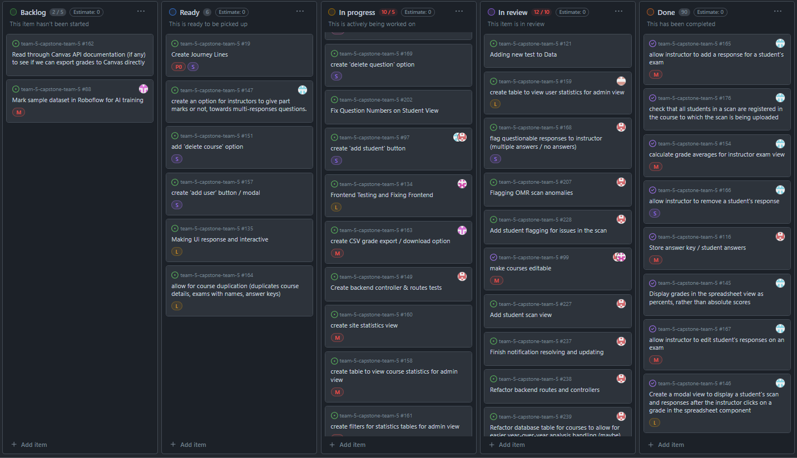
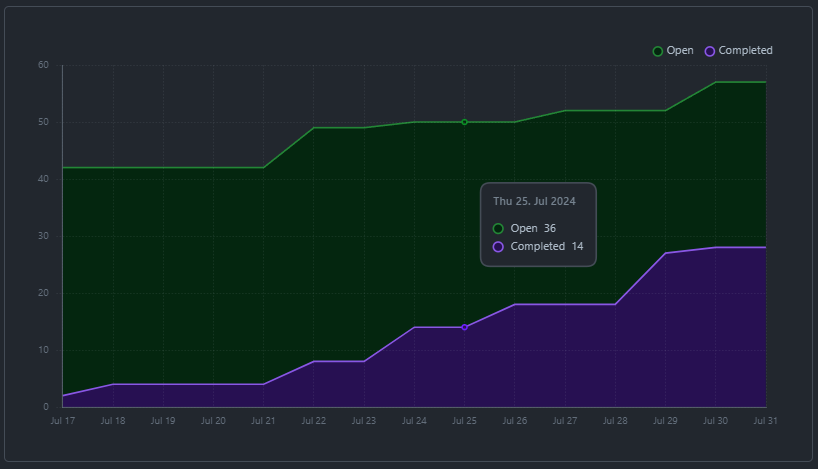
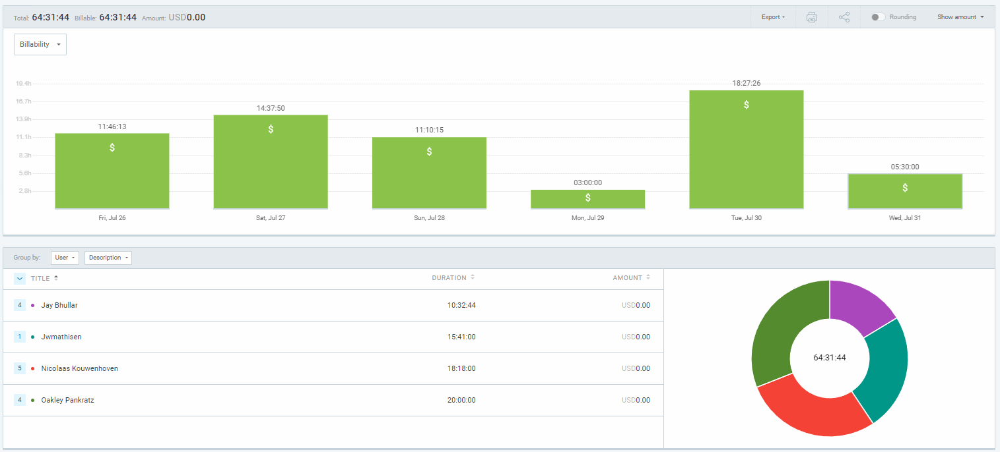
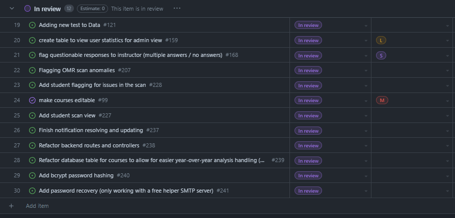
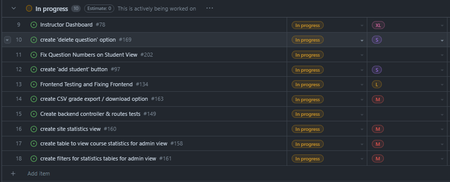

# Weekly Team Log

## Date Range:

- July 26 - July 31

## Features in the Project Plan Cycle:

- Grades table finished
- Statistics implemented
- Admin view finished
- Create 'add student' button
- Make exams editable (questions are, but not weights or exam info)
- Make notification section for instructors
- Make courses editable
- Implement password recovery

## Associated Tasks from Project Board:

## Tasks for Next Cycle:

- Testing
- Styling
- Documentation and test-o-rama questionnaire completed

## Burn-up Chart (Velocity):

## Times for Team/Individual:

| Team Member | Logged Hours |
| ----------- | ------------ |
| Nicolaas      |  18.25    |
| Oakley      | 20 |
| Nathan      | ?? |
| Jay         | 10.5 |
| Jack | 15.75 |

## Completed Tasks:

- 

| Task ID | Description        | Completed By |
| ------- | ------------------ | ------------ |

## In Progress Tasks/ To do:

## Test Report / Testing Status:

## Overview:

Since the last cycle,
- Oakley worked on showing statistics to instructors and tied that into the student and test views in the instructor side
- Jay worked on a lot of frontend UI, getting progress towards student inviting, and met with Nic to discuss how to handle users
- Nic worked on showing scans to the students, completing the notification bell, refactoring the backend and the course table in the database, implementing password recovery with nodemailer, hashing passwords, and tying in course editing to the backend
- Jack worked on testing frontend components and Posthog integration for site usage statistics in the admin view
- Nathan worked on exporting grades to a CSV file, and looked into exporting grades via the Canvas API for ease of use
