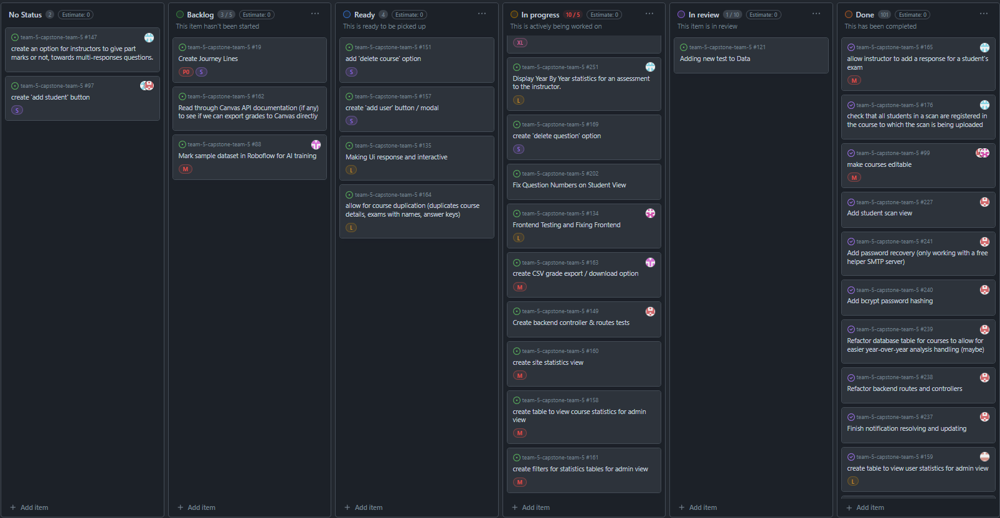
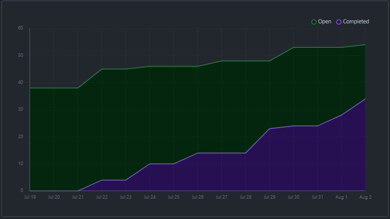
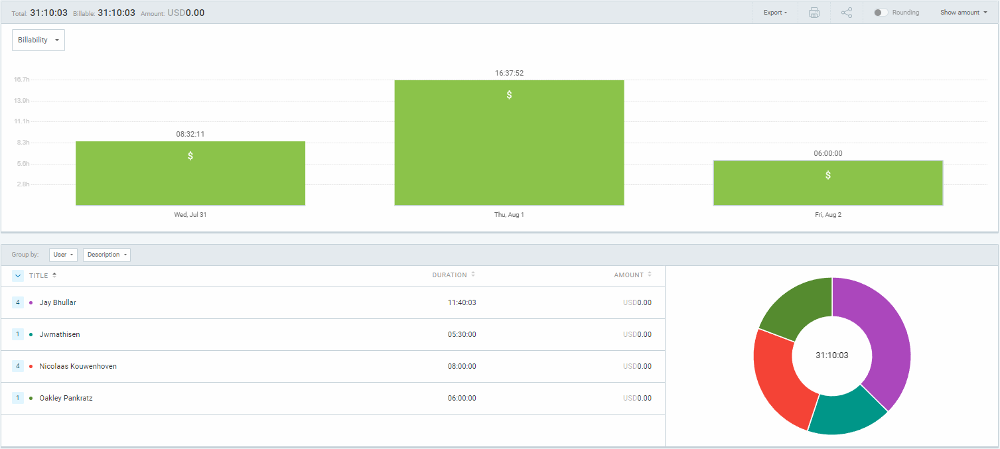
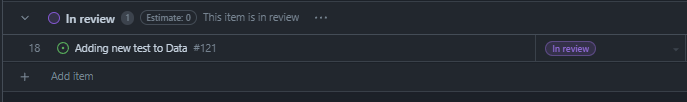
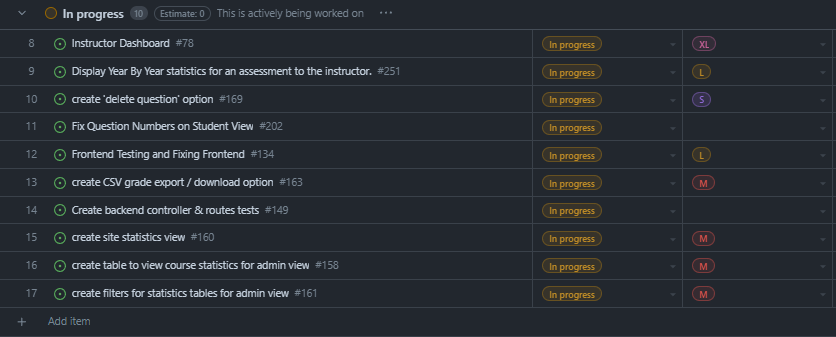

# Weekly Team Log

## Date Range:

- July 31 - Aug 2

## Features in the Project Plan Cycle:

- Testing
- Styling
- Documentation and test-o-rama questionnaire completed

## Associated Tasks from Project Board:

## Tasks for Next Cycle:

- Documentation
- Touch ups

## Burn-up Chart (Velocity):

## Times for Team/Individual:

| Team Member | Logged Hours |
| ----------- | ------------ |
| Nicolaas      |  8    |
| Oakley      | 6 |
| Nathan      | ?? |
| Jay         | 11.5 |
| Jack | 5.5 |

## Completed Tasks:

- 

| Task ID | Description        | Completed By |
| ------- | ------------------ | ------------ |

## In Progress Tasks/ To do:

## Test Report / Testing Status:

## Overview:

Since the last cycle,
- Oakley worked on showing year-over-year analysis, and met with Nic for how to implement this comparison feature, as well as going over some styling.
- Nic worked on making the exam visibility check work, did some styling with Jay and Oakley, and made Oakley's statistics work on the student exam view
- Jay worked on fixing styling bugs and making the generate sheet button generate a UBCO standard sheet, as well as creating the questionnaire to hand out for the test-o-rama
- Jack worked on testing and getting site usage statistics working
- Nathan worked on grade exporting and documentation
