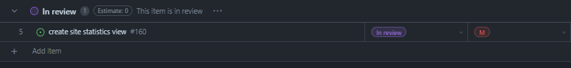

# Weekly Team Log

## Date Range:

- Aug 2 - 6

## Features in the Project Plan Cycle:

- Documentation
- Touch ups

## Associated Tasks from Project Board:

## Tasks for Next Cycle:

- Testing
- Presentation prep
- Client & Scott meetings

## Burn-up Chart (Velocity):

## Times for Team/Individual:

| Team Member | Logged Hours |
| ----------- | ------------ |
| Nicolaas      |  10    |
| Oakley      | 33 |
| Nathan      | ?? |
| Jay         | 10.5 |
| Jack | ?? |

## Completed Tasks:

- 

| Task ID | Description        | Completed By |
| ------- | ------------------ | ------------ |

## In Progress Tasks/ To do:

## Test Report / Testing Status:

## Overview:

Since the last cycle,
- Oakley worked on implementing historical comparison and statistics, and styling changes.
- Nic worked on adding users via Admin, editing questions, deleting questions, minor styling and bug fixes, and merge handling, and creating a grade export button
- Jay worked on frontend testing and UI fixes regarding test-o-rama feedback
- Jack worked on admin statistics and frontend testing
- Nathan worked on documentation
