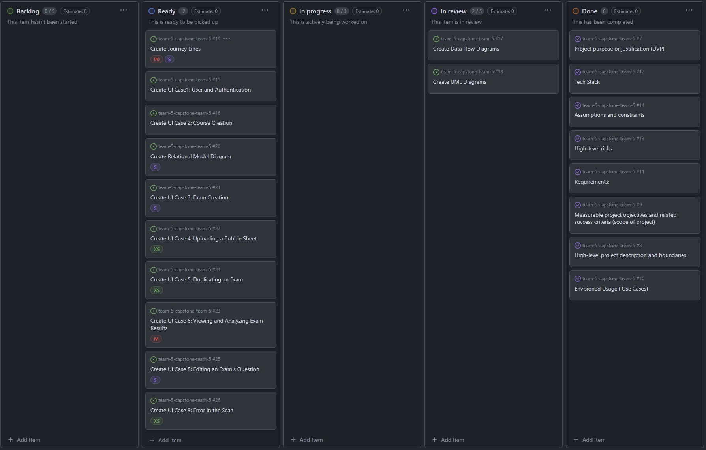
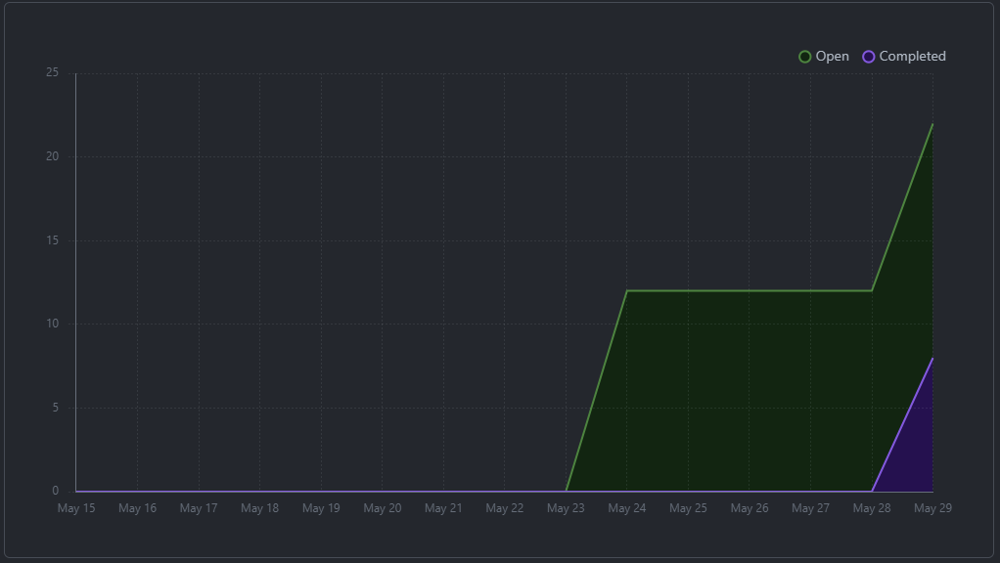
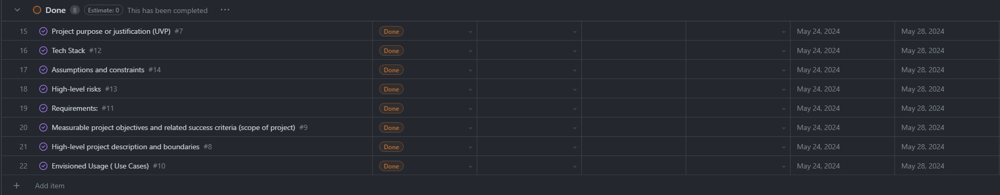
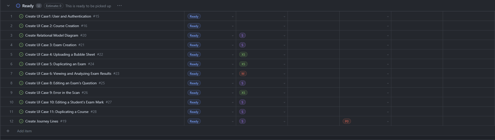

# May 22 - May 29
##### Team 5:
Nathan Jacinto,
Oakley Pankratz, 
Nic Kouwenhoven, 
Jay Bhullar, 
Jack Mathisen

# Features of the Plan Cycle
- ### Use Cases
- ### Use Case Diagram
- ### Data Flow Diagrams (Level 0 & Level 1)
- ### Project Proposal Document
- ### Project Proposal Video

# Project Board Tasks

# Next Cycle's Target
- ### Create Figma UI Mockups Following Use Cases
- ### Review Data Flow Diagrams
- ### Create UML Diagram (Relational Model)
- ### Create Journey Lines

# Burn-Up

# Times for Team/Individual

## Team: 70.5hrs *Approximately

### Nathan: 25hrs

### Nicolaas: 4.5hrs

### Jay: 15hrs

### Oakley: 10hrs

### Jack: 10hrs

# Table of Completed Tasks:

# Table of WIP Tasks

# Test report / status
### N/A