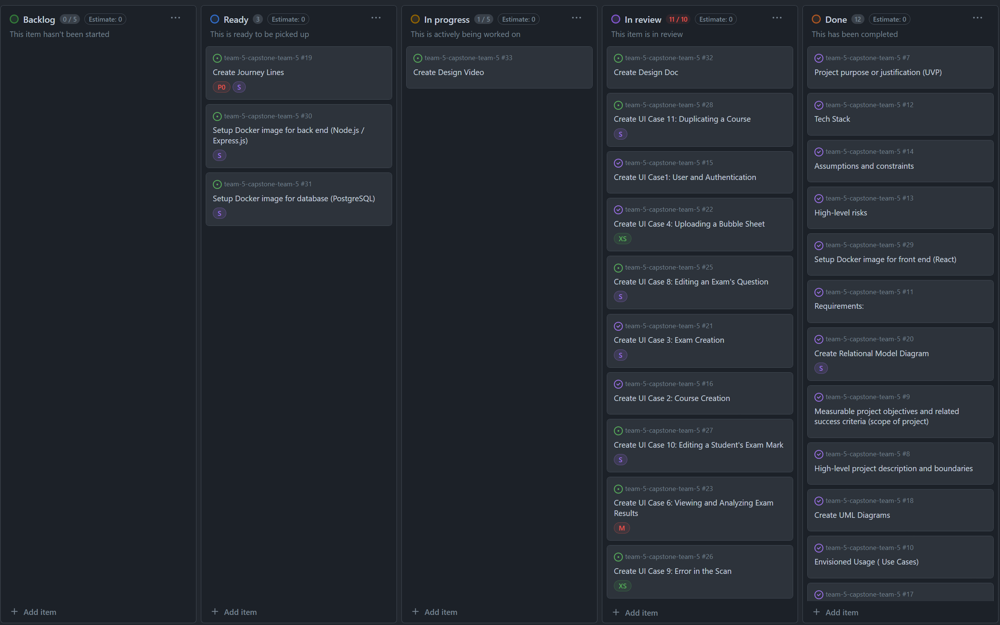
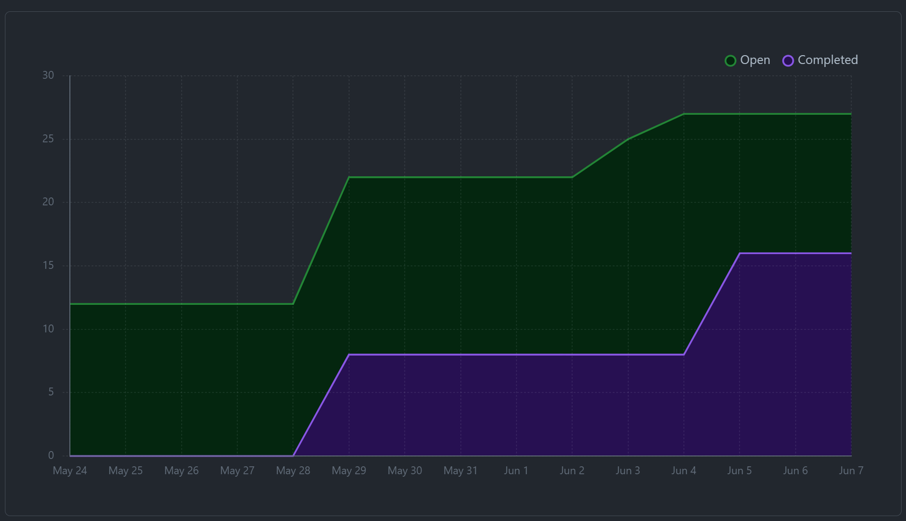
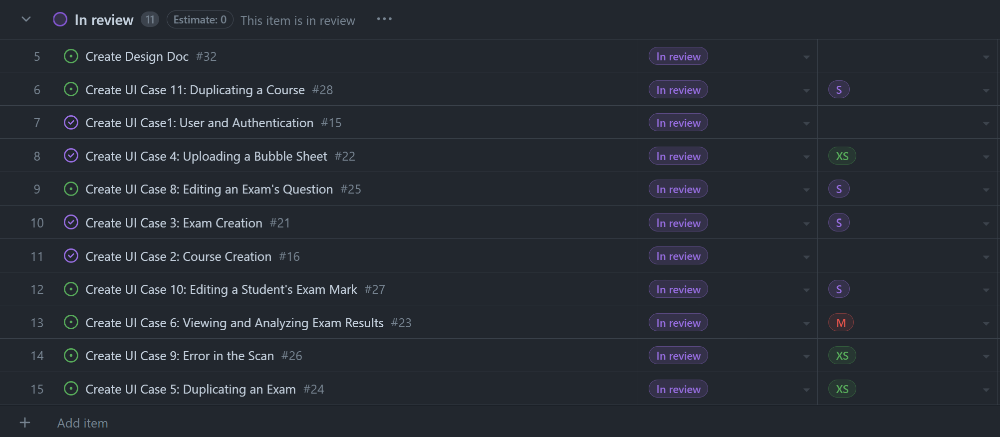
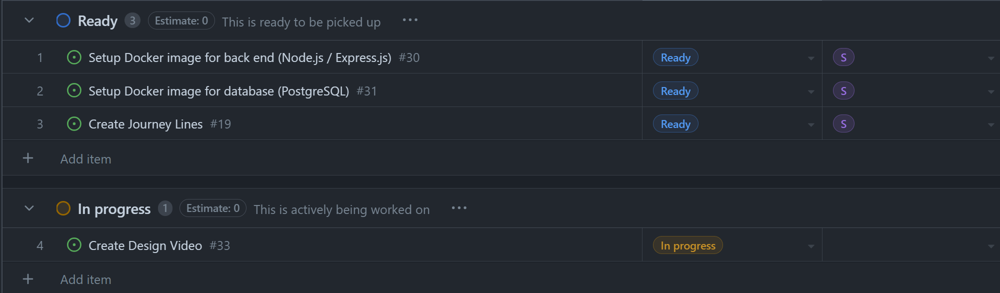

# June 5 - June 7
##### Team 5:
Nathan Jacinto,
Oakley Pankratz, 
Nic Kouwenhoven, 
Jay Bhullar, 
Jack Mathisen

# Features of the Plan Cycle
- ### Create Design Video
We need to create a Google Slides presentation and record a video to show to the client talking about the design choices for our system

# Project Board Tasks

# Next Cycle's Target
- ### Docker images up and running
We need to get our Node/Express container and our PostgreSQL container up
- ### Create Journey Lines
Basic journey line to outline the pain points that a user might experience with our system. This will allow us to more effectively narrow our focus to key components of the system
- ### Get all services connected basically
OMR service container should be started with a basic Clerk auth connected to a React front-end by Wednesday

# Burn-Up

# Times for Team/Individual

## Team: 35.75hrs approx.

### Nathan: 6.5hrs

### Nicolaas: 9.75hrs

### Jay: 6.5hrs

### Oakley: 13hrs

### Jack: ??hrs

# Table of Completed Tasks:

### Tasks Completed This Cycle:
1. Design Document Finished and Submitted
# Table of WIP Tasks

### Tasks still WIP This Cycle:
1. Some UI mockup still needs to be completed (core features completed)
2. Docker images need to be started

# Task Write-Up
We did a fair amount of work on Wednesday night to get our design document submitted on time. This left no time to work on getting the core Docker components for our system up, but we plan to have that done early in this upcoming cycle.

As well as that, we are in the process of making our design presentation in order to get our video submitted for Friday

# Test report / status
### N/A
