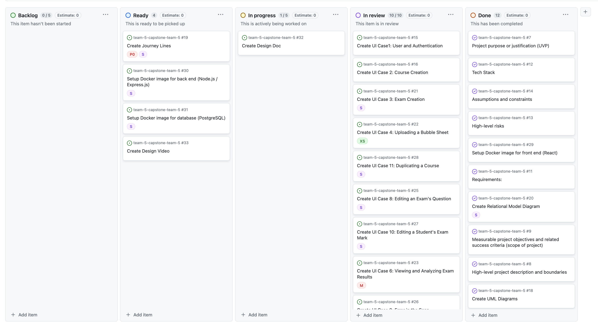
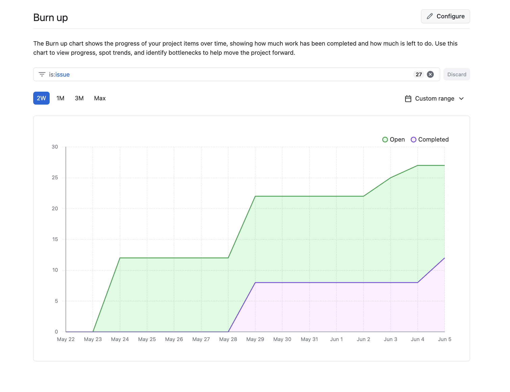
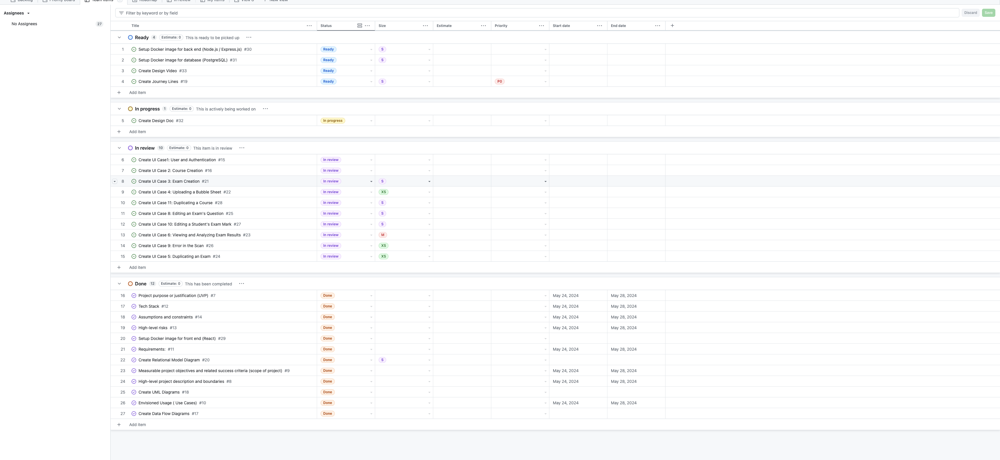
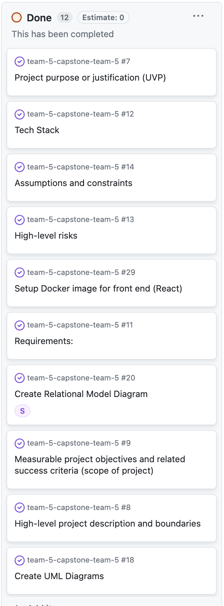
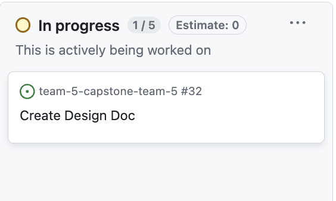

# May 29 - June 5
##### Team 5:
Nathan Jacinto,
Oakley Pankratz, 
Nic Kouwenhoven, 
Jay Bhullar, 
Jack Mathisen

# Features of the Plan Cycle
- ### Refine Data Flow Diagrams (Level 0 & Level 1)
- ### Create ER Diagram
- ### Design Document
- ### Create System Architecture Diagram

# Project Board Tasks

# Next Cycle's Target
- ### Create Design Video
- ### Docker images up and running
- ### Create Journey Lines

# Burn-Up

# Times for Team/Individual

## Team: 59hrs

### Nathan: 10.5hrs

### Nicolaas: 10.5hrs

### Jay: 12hrs

### Oakley: 24hrs

### Jack: 2hrs

# Table of All Tasks:

# Table of Completed Tasks:

### Tasks Completed This Week:
1. Use Cases
2. React Docker Image
3. Use Case Diagrams
4. System Architecture
5. UI Mockup based off use cases (we finished some of them)
# Table of WIP Tasks

### Tasks still WIP This Week:
1. ER Diagram
2. DFD Level 0/1
3. UI Mockup based off use cases (we finished some)
# Test report / status
### N/A
