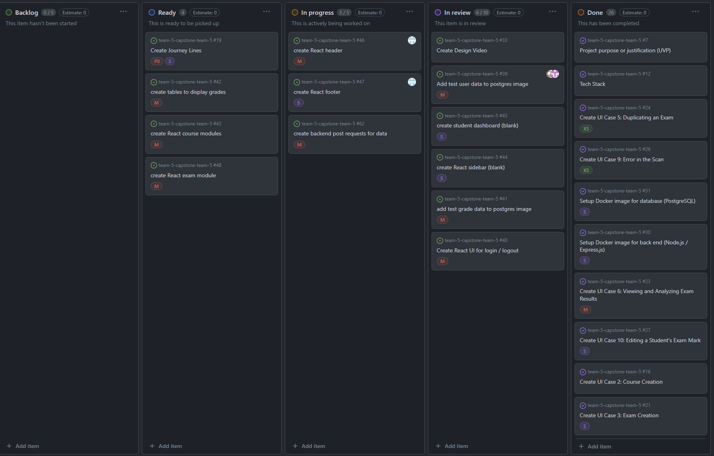
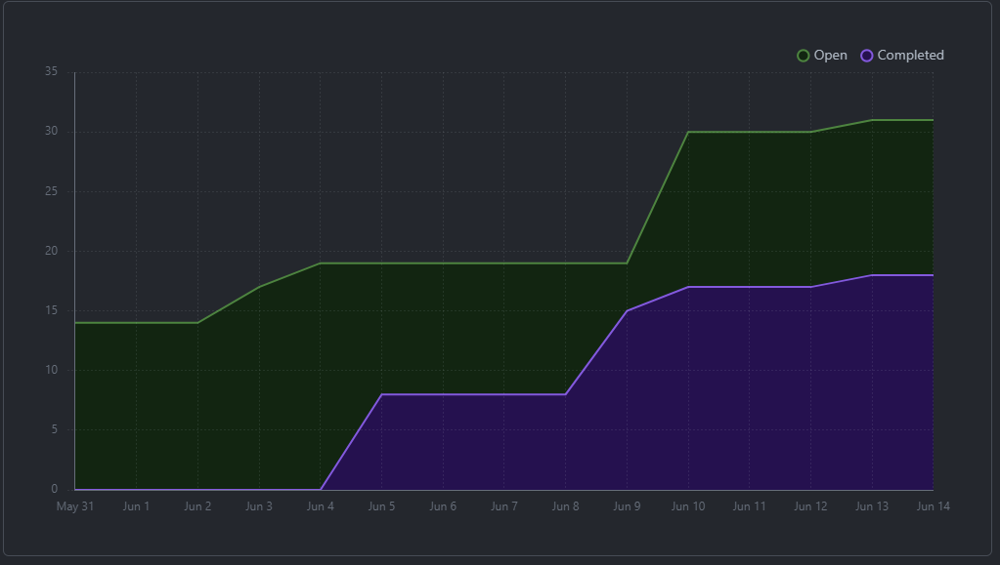
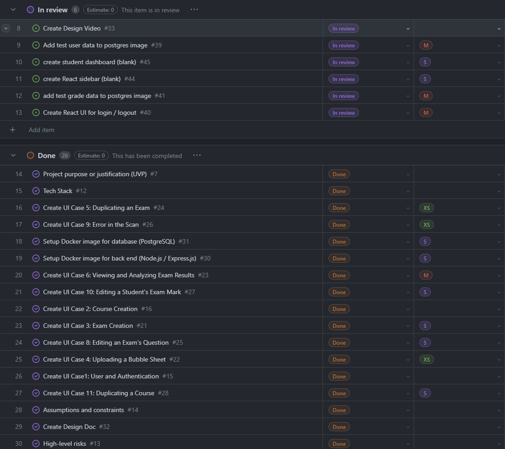
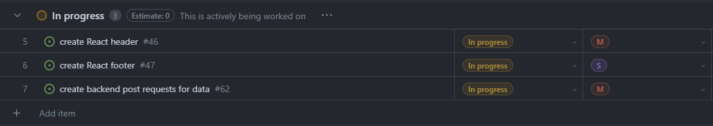

# June 7 - June 12
##### Team 5:
Nathan Jacinto,
Oakley Pankratz, 
Nic Kouwenhoven, 
Jay Bhullar, 
Jack Mathisen

# Features of the Plan Cycle
- ### Generate Postgres test data
We finished this task by making an init.sql file that sets up mock data for our frontend and backend to work with
- ### Create React course / exam modules
We finished this task for the student view using the mock data from our init.sql file
- ### Create dashboard for student / instructor
We have a student dashboard but did not complete an instructor dashboard
- ### Create sidebar / navbar
We have a sidebar / navbar fully functional for the student dashboard using mock data from the init.sql file
- ### Profile page
We do not have even the startings of a profile page

# Project Board Tasks

# Next Cycle's Target
- Finish authentication tie-in
- Create instructor buttons to add courses, exams, and students
- Create instructor student view
- Create instructor exam view

# Burn-Up

# Times for Team/Individual

## Team: 56.25hrs approx.

### Nathan: 7hrs

### Nicolaas: 25.25hrs

### Jay: 16.5hrs

### Oakley: 7.5hrs

### Jack: ??hrs

# Table of Completed Tasks:

### Tasks Completed This Cycle:
1. Postgres sample data
2. pgadmin Docker image for management of database
3. Team has their environements all setup from last week's Docker images
4. React frontend dynamic course sidebar and tests
5. Basic login page with jwt token storage in localStorage
6. Backend routing for api/users and api/auth services
# Table of WIP Tasks

### Tasks still WIP This Cycle:
1. Tie in auth with course loading
2. Instructor view (basic)
3. Backend routing still needs some routes as we go. Won't be done for a while

# Task Write-Up
We completed a student React view, some backend routing, an init.sql file for sample data, got pgadmin running on Docker, and wrote our own super basic auth service.

# Test report / status
### N/A
