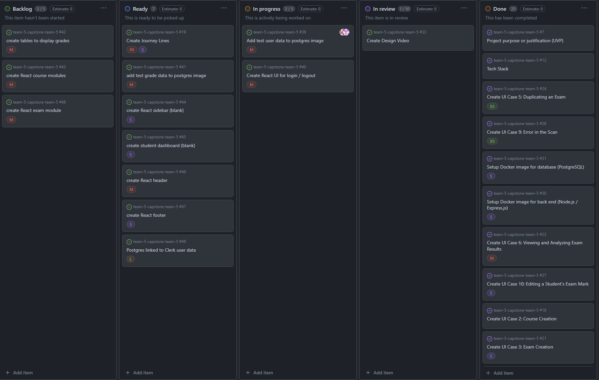
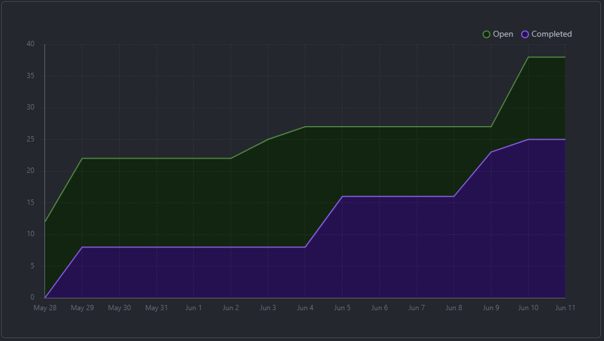
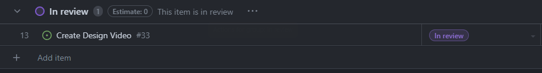
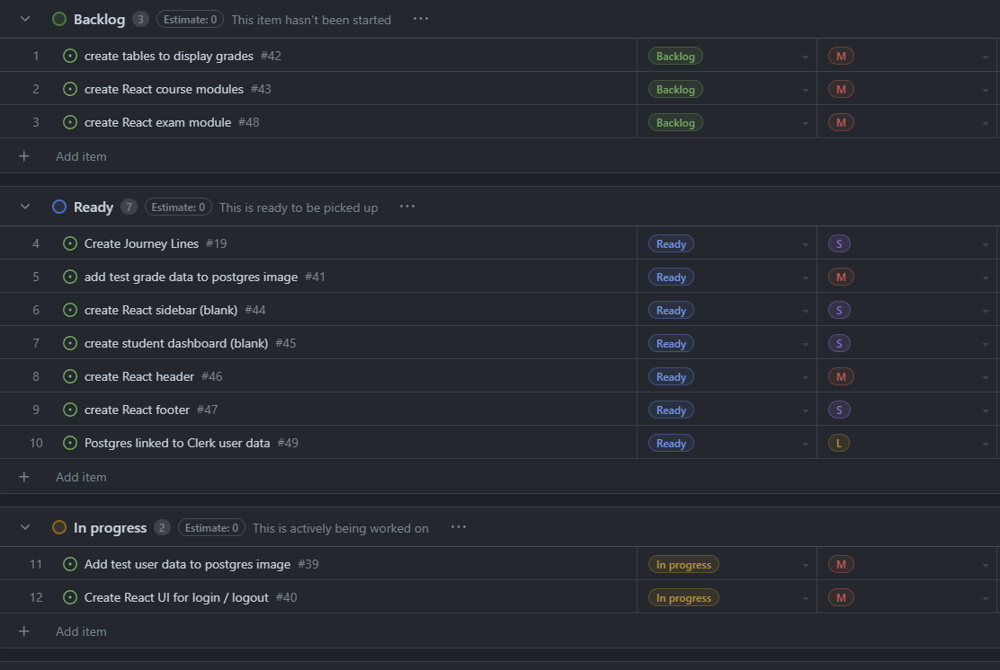

# June 7 - June 12
### Team 5:
- **Nathan Jacinto**,
- **Oakley Pankratz**, 
- **Nic Kouwenhoven**, 
- **Jay Bhullar**, 
- **Jack Mathisen**

# Features of the Plan Cycle
- ### Docker images up and running 
We need to get our Node/Express container and our PostgreSQL container up
- ### Create Journey Lines
Basic journey line to outline the pain points that a user might experience with our system. This will allow us to more effectively narrow our focus to key components of the system
- ### Get all services connected basically
OMR service container should be started with a basic Clerk auth connected to a React front-end by Wednesday

# Project Board Tasks

# Next Cycle's Target
- ### Generate Postgres test data
- ### Create React course / exam modules
- ### Create dashboard for student / instructor
- ### Create sidebar / navbar
- ### Profile page

# Burn-Up

# Team: 54.5hrs approx.

## Nathan: 16hrs
### Hour Breakdown
-Registered with Clerk Authentication but wasnt working(6hrs)
-Set Up My Docker Compose (3hrs)
-Look into admirer (2hrs) (dont know how to use it)
- Look into PostgreSQL database and trying to incomporate into the database (3hrs)
- Hit A Roadblock, my docker compose wasn't working with the ports and the front end

### Work in Progress
Trying to fix our environment
docker-compose

### Tasks: 

docker-compose
try to get the database working and user authentication

## Nicolaas: 20hrs
### Tasks Completed / Worked On:
### React.js login, authentication and session logic (12.5hrs) (Large):
- Got a login going in React, then decided our auth service (Clerk) wasn't going to work.
- Moved Jay's UI mockup React code into the Docker images

### Awesome-compose docker setup and changing mySQL to Postgres (4.5hrs) (Med):
- Cloned awesome-compose react-express-mysql docker image
- Changed mysql image to postgres image
- Lots of troubleshooting
- Helped the rest of the team get the Docker image going

### Design Presentation Video (3hrs) (Med):
- Recorded audio for design video
- Added clips to Google slides
- Recorded design video and submitted it via Canva

### Work in Progress:

### Supabase Auth service
## Jay Bhullar: 20hrs

### Tasks Completed / Worked On:

### Docker Setup (5hrs) (Large):
- Dedicated time to setting up Docker for the project, including configuring Docker images for the backend and database.

### Fixing Frontend (4hrs) (Large):
- Spent considerable time fixing issues in the frontend code, ensuring the UI is functioning correctly.

### Navbar and Course (8hrs) (Large):
- Worked on setting up and styling the navigation bar for the frontend.
- Spent time working on course-related functionalities and ensuring they integrate well with the rest of the application.

### Awesome-Compose Setup (2hrs) (Medium):
- Worked on the Awesome-Compose setup for Docker to ensure the smooth running of our project’s environment.

### Voice Over for Presentation (1hr) (Small):
- Created and recorded a voice-over for the presentation video.

## Oakley: 15hrs
### Worked on: ###

- Reviewing code (sm, 2 hours) I reviewed the design Docs, to make sure there weren't any typos, as well as Jay's code to try and understand it. Reviewing Jay's code took the bulk of this time.

- Resolving a bug on my local machine to get Docker working (sm, 2 hours) My local machine was having a problem with running the backend. Nick and I worked to resolve this bug. 

- Reviewing Tech (med, 3 hours) Since I have never taken a web development course, I have minimal understanding of the languages and frameworks in out tech stak. I reviewed HTML (3 hours), Javascript (3 hours) and React (4 hours.) 

- Meeting (very small, 1 hour) met with teamates to discuss our branching and logging.

 ### Work in Progress ###

 - Front End Devlopment: Speciffically, I plan to work on the Header and Footer (issues 46 & 47 on the Kanban board)
## Jack: 7hrs
**Things Done**
- learn yolo v3 
- learn more about Node.js
- learn more about React.js
- Setup Docker 
- create local enviornment to work on project 

**In Progress**

- add test user data to postgres image

# Table of Completed Tasks:

### Tasks Completed This Cycle:
1. Design video completed and submitted via Canvas
2. Docker images working via awesome-compose
# Table of WIP Tasks

### Tasks still WIP This Cycle:
1. Generate Postgres test data is not complete
2. OMR container has not been started yet
3. Authentication is still being worked on
4. React pages layout is still being done

# Task Write-Up
We completed the design video. We got our Docker image up, had multiple team meetings where we discussed branching, logging, and the work we were going to complete for this cycle. We also moved some of Jay's React work into the Docker frontend in order to get an idea of page layouts.

Nathan started work on some Postgres learning and is working on writing test user / course / exam data so we can create a dynamic React UI

# Test report / status
### N/A
