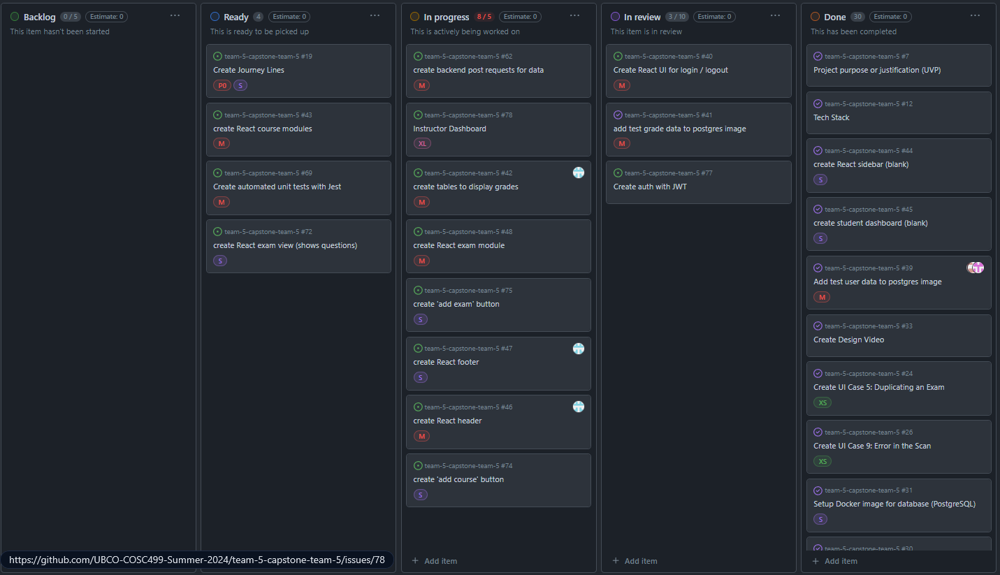
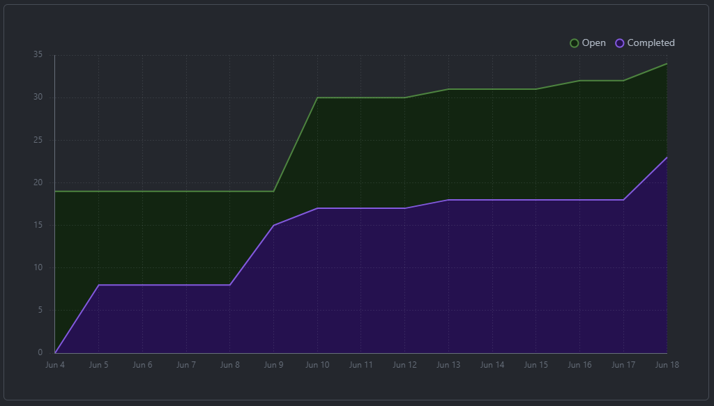
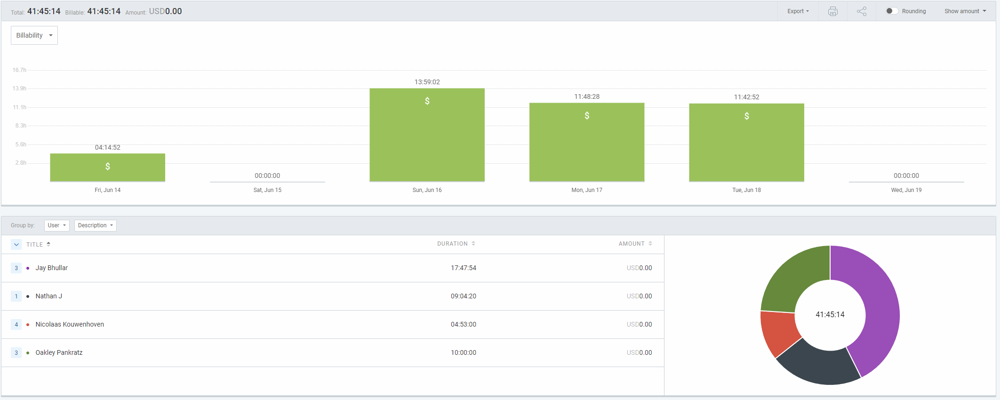
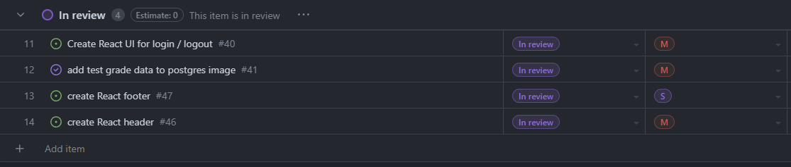
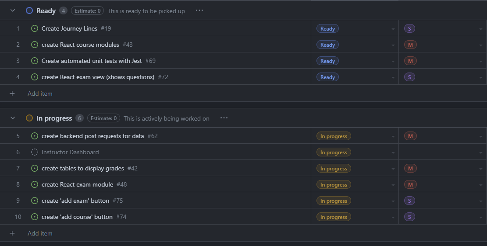

# Weekly Team Log

# Add new logs here

## Date Range:

- June 14 - June 18

## Features in the Project Plan Cycle:

- [Feature 1]
- [Feature 2]
- [Feature 3]
- [Feature 4]
- [Feature 5]

## Associated Tasks from Project Board:

| Task ID | Description        | Feature   | Assigned To | Status   |
| ------- | ------------------ | --------- | ----------- | -------- |
| [#ID]   | [Task Description] | [Feature] | [Assignee]  | [Status] |
| [#ID]   | [Task Description] | [Feature] | [Assignee]  | [Status] |

### Alternatively, include image of the project board with tasks and status:

## Tasks for Next Cycle:

| Task ID | Description        | Estimated Time (hrs) | Assigned To |
| ------- | ------------------ | -------------------- | ----------- |
| [#ID]   | [Task Description] | [Estimated Time]     | [Assignee]  |
| [#ID]   | [Task Description] | [Estimated Time]     | [Assignee]  |

### Alternatively, include image of the project board with tasks and status:

## Burn-up Chart (Velocity):

## Times for Team/Individual:

| Team Member | Logged Hours |
| ----------- | ------------ |
| [Name]      | [Hours]      |
| [Name]      | [Hours]      |
| [Name]      | [Hours]      |

## Completed Tasks:

- 

| Task ID | Description        | Completed By |
| ------- | ------------------ | ------------ |
| [#ID]   | [Task Description] | [Assignee]   |
| [#ID]   | [Task Description] | [Assignee]   |

## In Progress Tasks/ To do:

| Task ID | Description        | Assigned To |
| ------- | ------------------ | ----------- |
| [#ID]   | [Task Description] | [Assignee]  |
| [#ID]   | [Task Description] | [Assignee]  |

## Test Report / Testing Status:

N/A

## Overview:

The team focused on [Summary of work done]. The Kanban Board has been populated with user stories and tasks, milestones have been added, and the dashboard visuals creation has been completed. The next cycle will focus on [Tasks for the next cycle].