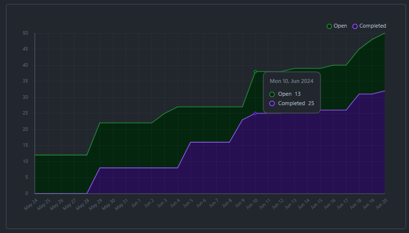
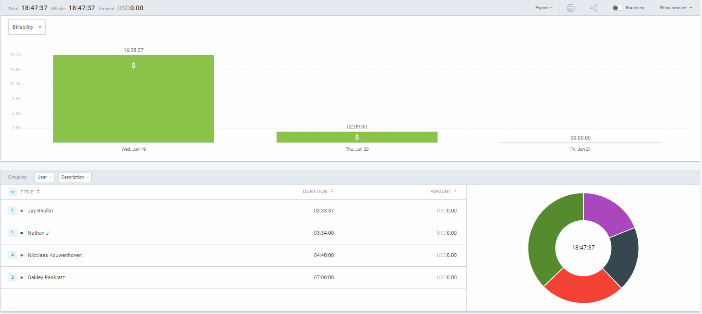
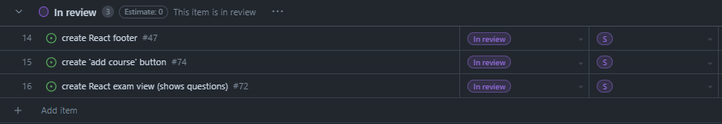
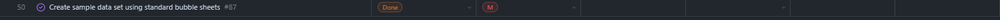
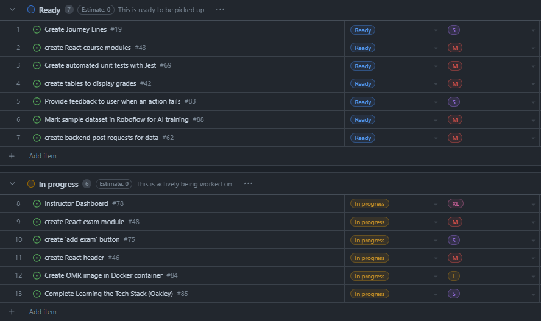

# Weekly Team Log

## Date Range:

- June 18 - June 21

## Features in the Project Plan Cycle:

- Finish authentication frontend and backend
- Create instructor buttons to add courses, exams and students
- Create instructor student view
- Create instructor exam view

## Associated Tasks from Project Board:

## Tasks for Next Cycle:

- Create instructor buttons to add exams and students
- Create instructor 'view students' table
- Create instructor 'view exams' table
- Get DroneCI running with backend tests written
- Write unit tests for existing code
- Get OMR image running
- Finish student view fully

## Burn-up Chart (Velocity):

## Times for Team/Individual:

| Team Member | Logged Hours |
| ----------- | ------------ |
| Nicolaas      | 4.5      |
| Oakley      | 7      |
| Nathan      | 3.5      |
| Jay         | 3.5 |

## Completed Tasks:

- 
- 

| Task ID | Description        | Completed By |
| ------- | ------------------ | ------------ |
| Create 'add course' button (#15)   | Created an 'add course' form that adds a course to the DB | Nic / Jay   |
| Dataset Creation (#50) | Printed and filled out bubble sheets to input into Roboflow for training | Nathan / Jay / Oakley |
| Create React footer (#14) | Created a footer in React to learn basics of tailwind and React | Oakley |
| Create exam view (#16) | Made a basic list of questions when an exam is clicked on (responses WIP) | Nic |

## In Progress Tasks/ To do:

| Task ID | Description        | Assigned To |
| ------- | ------------------ | ----------- |
| 8 | Instructor dashboard (Superissue) | Jay / Nic / Oakley
| 9 | create React exam module | Nic / Jay / Oakley |
| 10 | create 'add exam' button | Nic |
| 11 | create React header to learn tailwind / React | Oakley |
| 12 | create OMR image in Docker | Nathan |

## Test Report / Testing Status:

Tests have not been written

## Overview:

For Wednesday and Thursday, Oakley, Jay and Nathan printed and manually filled out bubble sheets all afternoon Wednesday, then scanned them and uploaded them to Google Drive where the team can access them for AI training.
Nic tied in the 'Add Course' button to the backend and made it add course data to the DB, as well as auto-enroll the instructor who adds the course.
Nic also created a simple exam view that shows all of the questions related to an exam when the exam is clicked on (functions like a button)

There is a lot planned for the following cycle in terms of getting caught up on missing work and practicing TDD correctly.
We plan to finally get connected with DroneCI, as well as finish up the student view and get the instructor view's UI more fleshed out. We plan to get backend automated tests written and also we plan to get fully caught up on unit testing so that TDD can be followed correctly. We plan to get the OMR image running without crashing, and we plan to refactor the database for more efficient routing and storage.