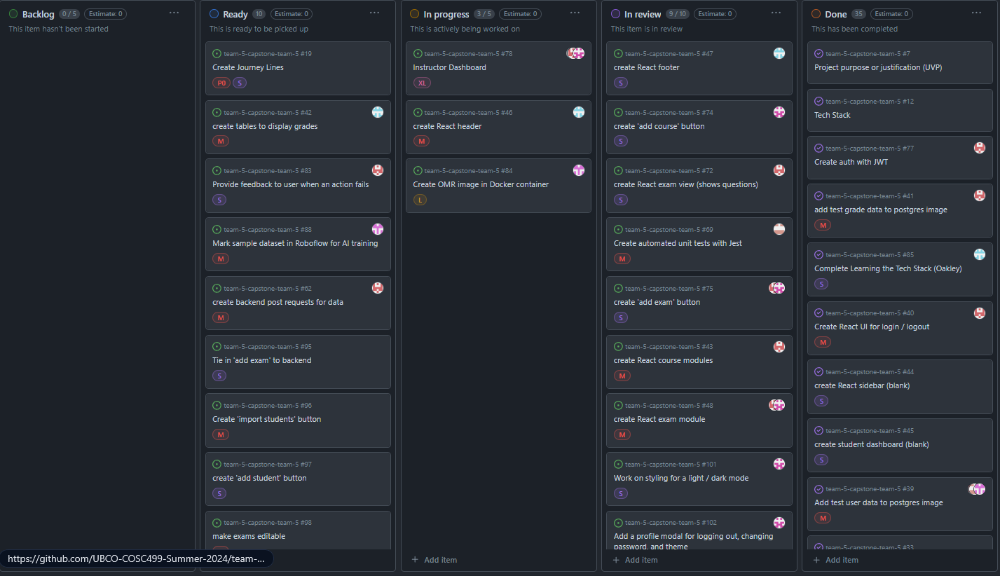
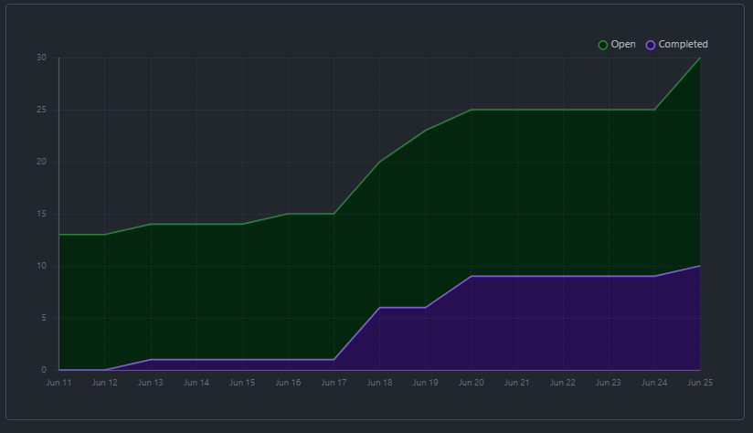
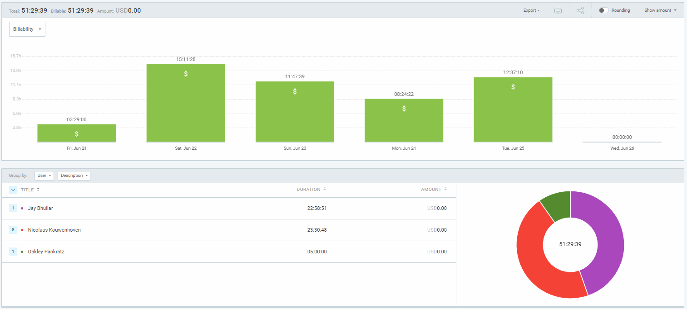
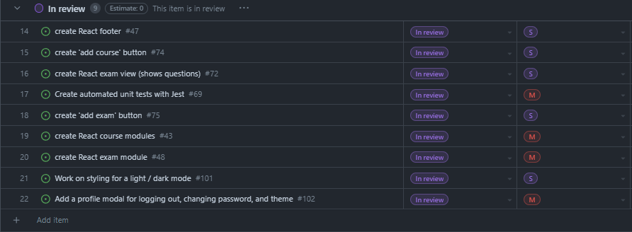
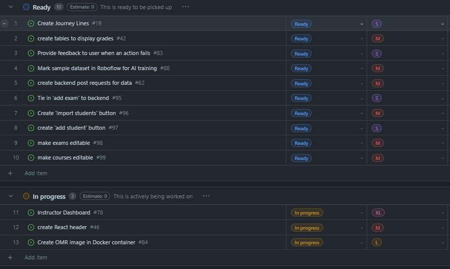
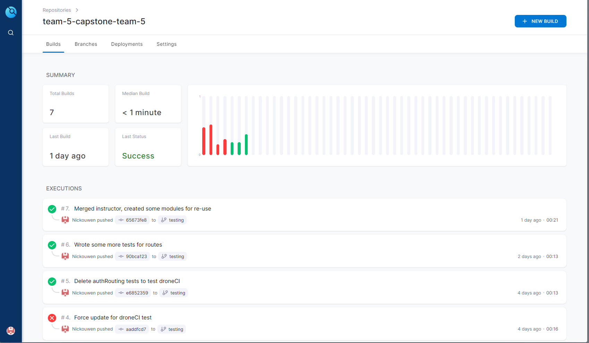

# Weekly Team Log

## Date Range:

- June 21- June 25

## Features in the Project Plan Cycle:

- Create instructor buttons to add exams and students
- Create instructor 'view students' table
- Create instructor 'view exams' table
- Get DroneCI running with backend tests written
- Write unit tests for existing code
- Get OMR image running
- Finish student view fully

## Associated Tasks from Project Board:

## Tasks for Next Cycle:

- Create button to upload students
- Tie in 'Add Exam' button to backend
- Get Python openCV container taking images in and spitting images out
- Organize frontend components so they are testable
- Write tests for frontend

## Burn-up Chart (Velocity):

## Times for Team/Individual:

| Team Member | Logged Hours |
| ----------- | ------------ |
| Nicolaas      | 4.5      |
| Oakley      | 7      |
| Nathan      | 3.5      |
| Jay         | 3.5 |

## Completed Tasks:

- 
- 

| Task ID | Description        | Completed By |
| ------- | ------------------ | ------------ |
| Create exam view (shows questions) #72   | Created an exam view that colours bubbles to show correct responses for students | Nic   |
| Create React modules #43 & #48 | Split some of our dynamic code into modules for testing | Nic / Jay |
| Work on styling for light/dark mode #101 | Created styles with Tailwind and a theme toggle | Jay |
| Add a profile modal | Made a profile modal with a button for changing password, toggling theme, and logging out | Jay |
| Create automated unit tests with Jest | Set up a testing branch with droneCI .drone.yml file for automated testing | Nic |

## In Progress Tasks/ To do:

| Task ID | Description        | Assigned To |
| ------- | ------------------ | ----------- |
| 11 | Instructor dashboard (Superissue) | Jay / Nic / Oakley
| 12 | create React header to learn tailwind / React | Oakley |
| 13 | create OMR image in Docker | Nathan / Nic |

## Test Report / Testing Status:

Testing has been set up, though only 15 tests are currently created and they are all on the backend.

## Overview:

This weekend, Jay worked a lot on the frontend UI with React, and Nic helped out here and there with making things tie into the backend, as well as getting the exam view part of the student view working.
Nic also set up Jest testing for the backend and DroneCI automated testing with a .drone.yml file.
Oakley worked on learning the tech stack by poking around the frontend code and made a few changes that Nic and Jay reviewed.

Nathan worked on getting YOLO working for the OMR side of things, and Nic worked on getting some understanding of the Python openCV library to extract information from the standard UBC 100-question sheets.
