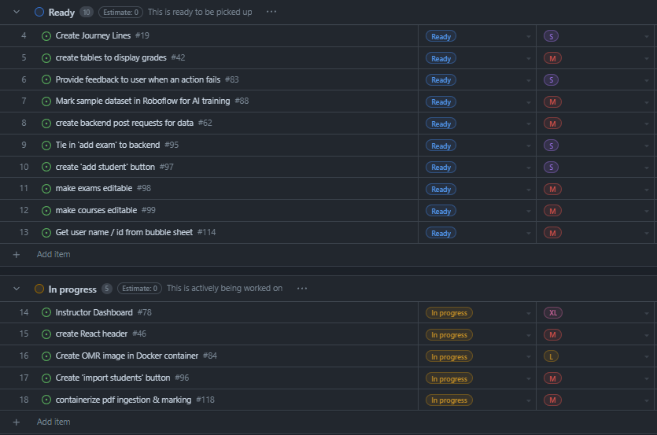

# Weekly Team Log

## Date Range:

- June 21- June 25

## Features in the Project Plan Cycle:

- Create button to upload students
- Tie in 'Add Exam' button to backend
- Get Python openCV container taking images in and spitting images out
- Organize frontend components so they are testable
- Write tests for frontend

## Associated Tasks from Project Board:

## Tasks for Next Cycle:

- Create button to upload students
- Tie in 'Add Exam' button to backend
- Get Python openCV container taking images in and spitting images out
- Organize frontend components so they are testable
- Write tests for frontend

## Burn-up Chart (Velocity):

## Times for Team/Individual:

| Team Member | Logged Hours |
| ----------- | ------------ |
| Nicolaas      | 2.5     |
| Oakley      | 3      |
| Nathan      | 0      |
| Jay         | 4.5 |

## Completed Tasks:

- 

| Task ID | Description        | Completed By |
| ------- | ------------------ | ------------ |

## In Progress Tasks/ To do:

| Task ID | Description        | Assigned To |
| ------- | ------------------ | ----------- |
| 14 | Instructor dashboard (Superissue) | Jay / Nic / Oakley
| 15 | create React header to learn tailwind / React | Oakley |
| 16 | create OMR image in Docker | Nathan / Nic |
| 17 | Create 'import students' button | Nic |
| 18 | Containerize pdf ingestion | Nic |

## Test Report / Testing Status:

Testing has been set up, though only 15 tests are currently created and they are all on the backend.

## Overview:

Since Wednesday, Jay and Oakley worked on some frontend work, adding in some of the UI elements related to displaying user information and editing modules on the instructor's end.

Oakley and Nic met to discuss some of the structure of the frontend and backend.

No major tasks were completed, though work was completed to progress towards task completion.