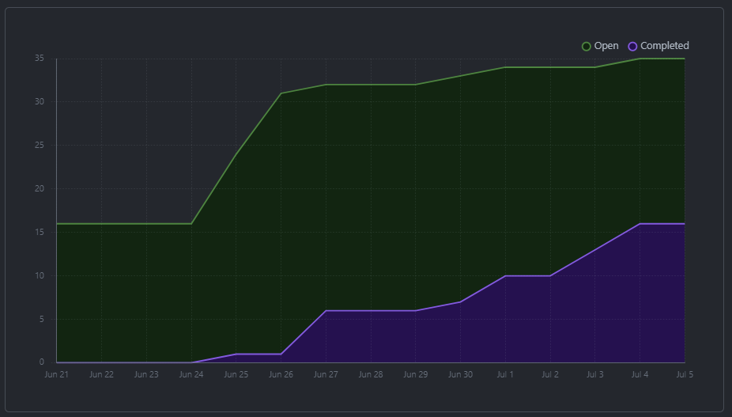
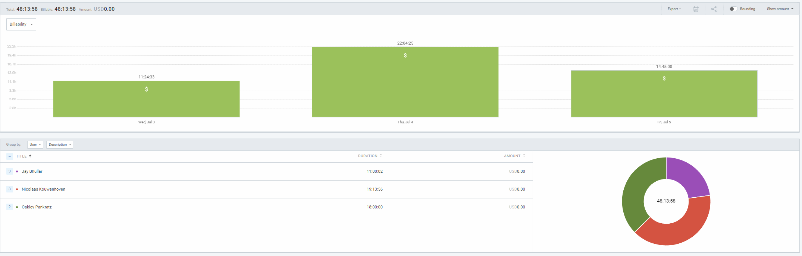
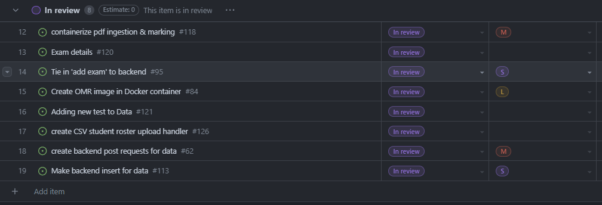
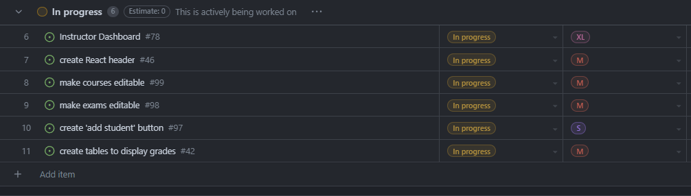

# Weekly Team Log

## Date Range:

- July 3 - July 5

## Features in the Project Plan Cycle:

- OMR tied into backend
- Buttons added for instructor to access OMR
- Students grades table worked on
- Frontend tests writted
- CSV parsing for student course registration
- MVP Presentation
- Made exam name editable, made exams deletable
- Made 'Add Test' button add a test
- Made change password page with backend tie-in

## Associated Tasks from Project Board:

## Tasks for Next Cycle:

- Make student responses editable by instructors
- Make exam information and questions editable by instructors
- Flag issues for instructor from issues with the scan
- Grade storage discussed for start on analysis

## Burn-up Chart (Velocity):

## Times for Team/Individual:

| Team Member | Logged Hours |
| ----------- | ------------ |
| Nicolaas      | 19     |
| Oakley      | 22 (worked past screenshot time) |
| Nathan      | 0 |
| Jay         | 13 |

## Completed Tasks:

- 

| Task ID | Description        | Completed By |
| ------- | ------------------ | ------------ |

## In Progress Tasks/ To do:

| Task ID | Description        | Assigned To |
| ------- | ------------------ | ----------- |
| 6 | Instructor dashboard (Superissue) | Jay / Nic / Oakley
| 8 | Make courses editable | Jay / Nic |
| 9 | Make exams editable | Jay / Oakley |
| 10 | Create 'add student' button | Nic |
| 11 | Create table to display grades | Oakley |

## Test Report / Testing Status:

Testing was worked on, but something is wrong with our DroneCI I think. It is saying we need a license?

## Overview:

Since Wednesday,
* Nic finished getting the OMR tied into the backend and database, created a CSV parsing function on the backend that takes in a CSV file upload from the frontend and inputs the student data into the database, and worked on some of the frontend integration with backend.
* Jay worked on UI and tied in the 'Add Exam' button to the backend, as well as showing the answer key to the instructor.
* Oakley worked on the frontend table to display user grade data to the instructors and went through a bunch of the codebase to get caught up on what needs to be completed.

* Collectively, we 3 worked on our MVP presentation for quite a long time.
