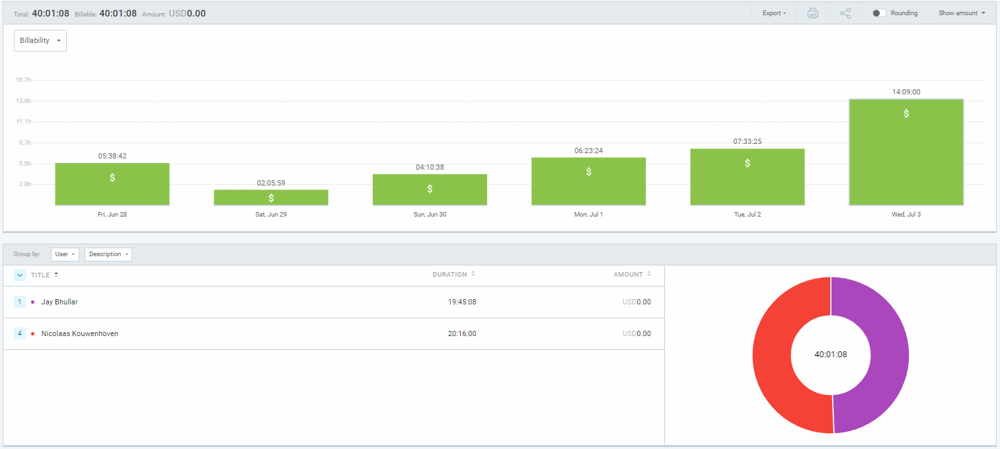
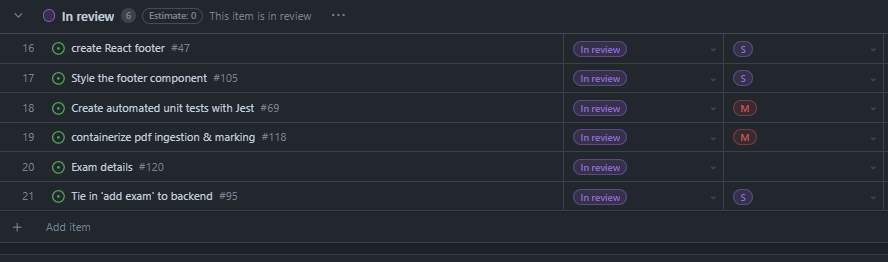
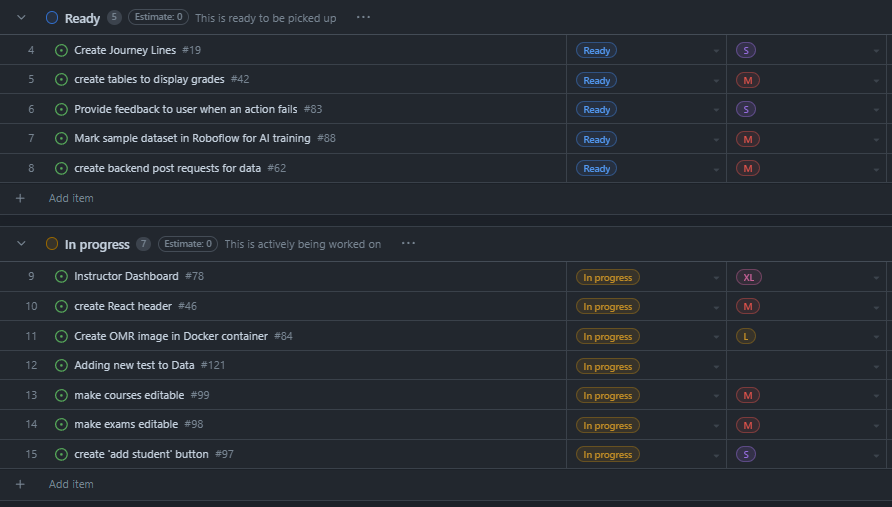

# Weekly Team Log

## Date Range:

- June 28 - July 3

## Features in the Project Plan Cycle:

- Create button to upload students
- Tie in 'Add Exam' button to backend
- Get Python openCV container taking images in and spitting images out
- Organize frontend components so they are testable
- Write tests for frontend

## Associated Tasks from Project Board:

## Tasks for Next Cycle:

- Create button to upload students
- Get openCV container tied into system
- Organize frontend components so they are testable
- Write tests for frontend

## Burn-up Chart (Velocity):

## Times for Team/Individual:

| Team Member | Logged Hours |
| ----------- | ------------ |
| Nicolaas      | 20.25     |
| Oakley      | Put in hours. Forgot to log them (12?)     |
| Nathan      | Put in hours. Forgot to log them (12?)    |
| Jay         | 19.75 |

## Completed Tasks:

- 

| Task ID | Description        | Completed By |
| ------- | ------------------ | ------------ |

## In Progress Tasks/ To do:

| Task ID | Description        | Assigned To |
| ------- | ------------------ | ----------- |
| 14 | Instructor dashboard (Superissue) | Jay / Nic / Oakley
| 15 | create React header to learn tailwind / React | Oakley |
| 16 | create OMR image in Docker | Nathan / Nic |
| 17 | Create 'import students' button | Nic |
| 18 | Containerize pdf ingestion | Nic |

## Test Report / Testing Status:

Testing has been set up, though only 15 tests are currently created and they are all on the backend. Same as previous week.

## Overview:

Since Friday, 
* Nic worked on getting an OMR image running using openCV in Python. This image is currently running when the system starts, and allows input of pdf files. It does analysis, but the output is not tied to the database yet. Nic also worked on helping Jay with some backend routing for creating new exams as an instructor.
* Jay developed front-end pages; Test desccription to show test information, implemented showing correct answers, editing tests, deleting tests, fixed the profile display to show email, and did minor UI tweaks.
