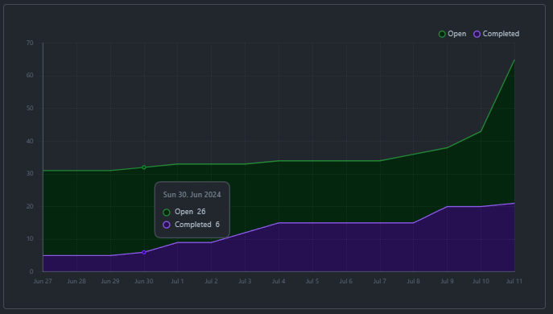
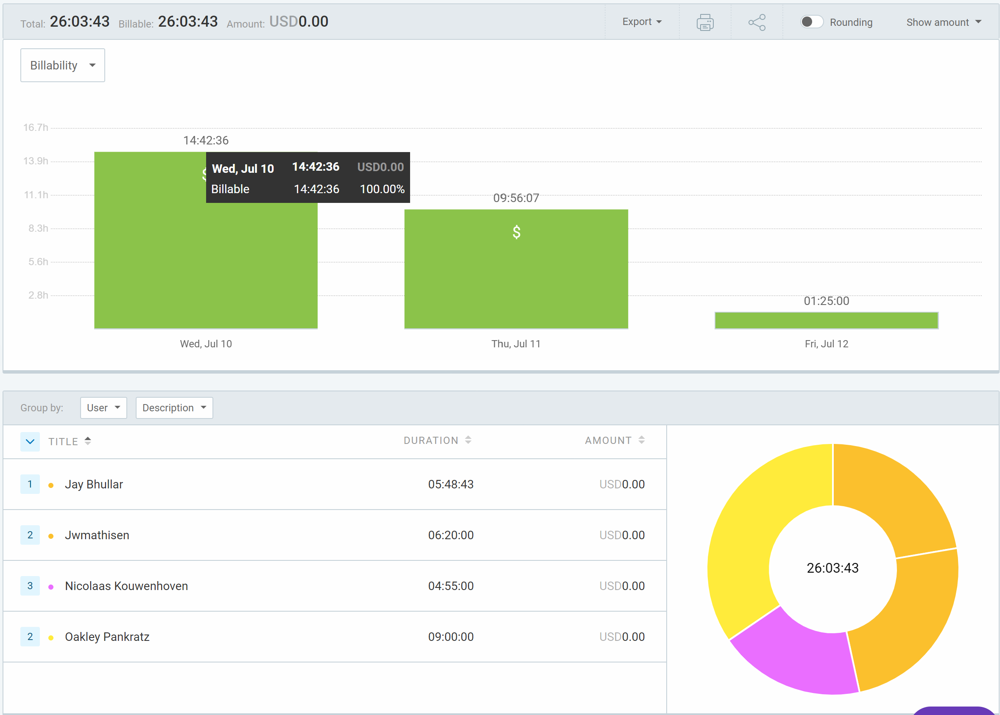
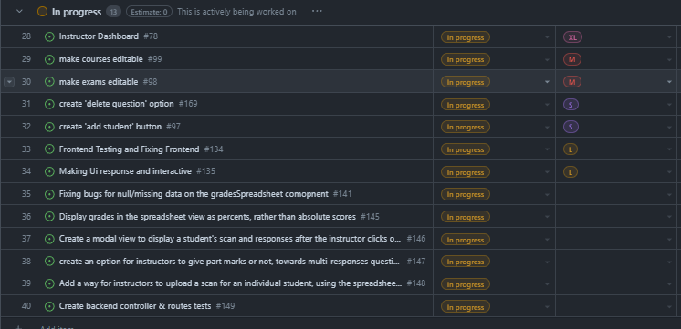

# Weekly Team Log

## Date Range:

- July 10 - July 12

## Features in the Project Plan Cycle:

- Make courses editable
- Make exam editable
- Create 'add student' button
- Create tables to display grades
- Frontend testing
- Backend testing

## Associated Tasks from Project Board:

## Tasks for Next Cycle:

- Backend testing
- Create 'add student' button
- Fix bugs with grades table
- Make exams editable

## Burn-up Chart (Velocity):

## Times for Team/Individual:

| Team Member | Logged Hours |
| ----------- | ------------ |
| Nicolaas      |  5    |
| Oakley      | 6 |
| Nathan      | 0 |
| Jay         | 6 |
| Jack | Not in clockify. Did do work (made PR) |

## Completed Tasks:

- 

| Task ID | Description        | Completed By |
| ------- | ------------------ | ------------ |

## In Progress Tasks/ To do:

## Test Report / Testing Status:

## Overview:

Since Wednesday,
- Oakley worked on the student grades spreadsheet. Fixing bugs and making it interactive
- Nic worked on backend testing and project management (kanban / logs)
- Jay worked on frontend testing and UI. He also added a 'toast' popup that can be modified to provide the user with popups.
- Jack worked on the admin view that will show statistics and allow for the creation of instructor accounts
