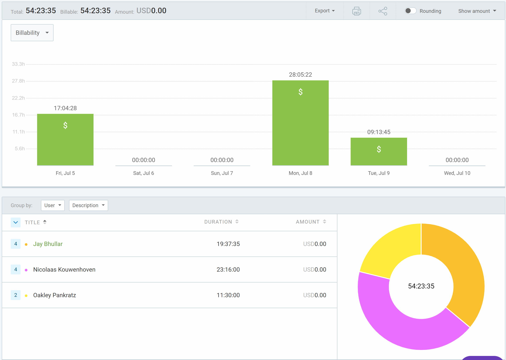
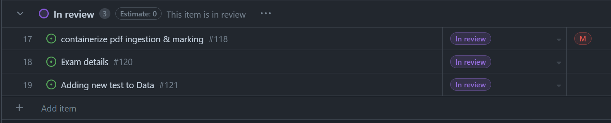
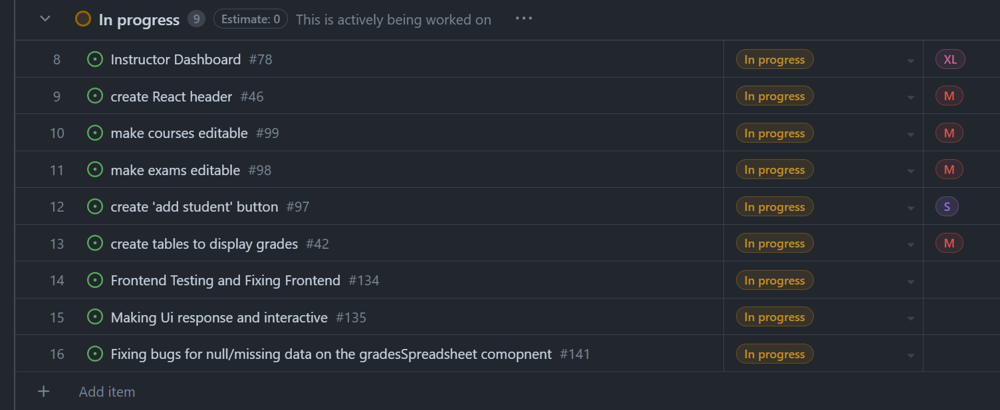

# Weekly Team Log

## Date Range:

- July 5 - July 10

## Features in the Project Plan Cycle:

- Make courses editable
- Make exam editable
- Create 'add student' button
- Create tables to display grades
- Frontend testing
- Backend testing

## Associated Tasks from Project Board:

## Tasks for Next Cycle:

- Backend testing
- Create 'add student' button
- Fix bugs with grades table
- Make exams editable

## Burn-up Chart (Velocity):

## Times for Team/Individual:

| Team Member | Logged Hours |
| ----------- | ------------ |
| Nicolaas      |  8.5    |
| Oakley      | 10 |
| Nathan      | 0 |
| Jay         | 18.75 |

## Completed Tasks:

- 

| Task ID | Description        | Completed By |
| ------- | ------------------ | ------------ |

## In Progress Tasks/ To do:

## Test Report / Testing Status:

Testing was worked on, but something is wrong with our DroneCI I think. It is saying we need a license?

## Overview:

Since Friday,
Oakley worked on making his spreadsheet interactive, which is requiring quite a lot of work.

Jay worked on front end testing and wrote ~100 tests for the frontend components to achieve adequate coverage

Nic worked on backend testing and mocking with Jest. This is partially complete
