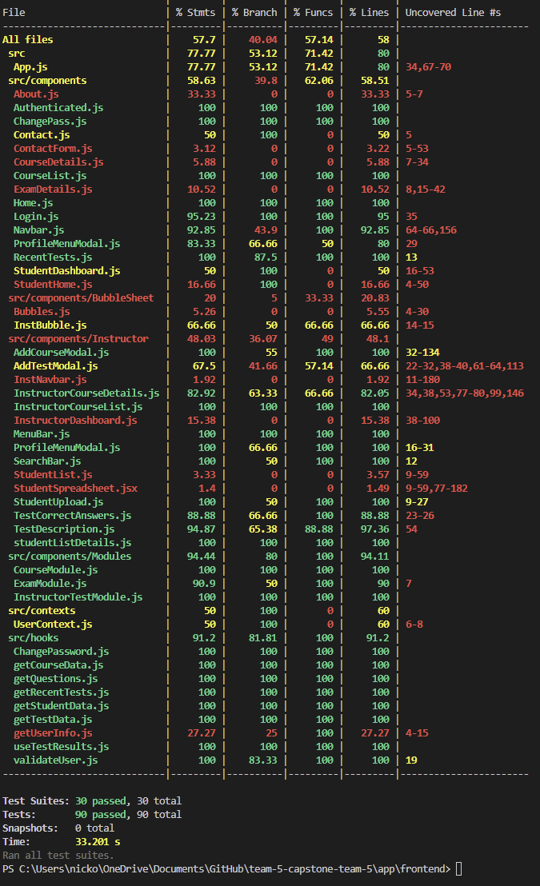

# Weekly Team Log

## Date Range:

- July 12 - July 17

## Features in the Project Plan Cycle:

- Make courses editable
- Make exam editable
- Create 'add student' button
- Add ability to handle 200-question exams in OMR
- Create tables to display grades
- Frontend testing
- Backend testing

## Associated Tasks from Project Board:

## Tasks for Next Cycle:

- Backend testing
- Create 'add student' button
- Fix bugs with grades table
- Make exams editable

## Burn-up Chart (Velocity):

## Times for Team/Individual:

| Team Member | Logged Hours |
| ----------- | ------------ |
| Nicolaas      |  12.5    |
| Oakley      | 25 |
| Nathan      | 0 |
| Jay         | 22 |
| Jack | 1.5 |

## Completed Tasks:

- 

| Task ID | Description        | Completed By |
| ------- | ------------------ | ------------ |

## In Progress Tasks/ To do:

## Test Report / Testing Status:

## Overview:

Since Wednesday,
- Oakley worked on the student grades spreadsheet. Fixing bugs and making it interactive
- Nic worked on some backend testing, creating a testing PR, and made the OMR capable of handling 200 question or 100 question exams (not tied into frontend yet)
- Jay worked on frontend UI
- Jack worked on the admin view that will show statistics and allow for the creation of instructor accounts
