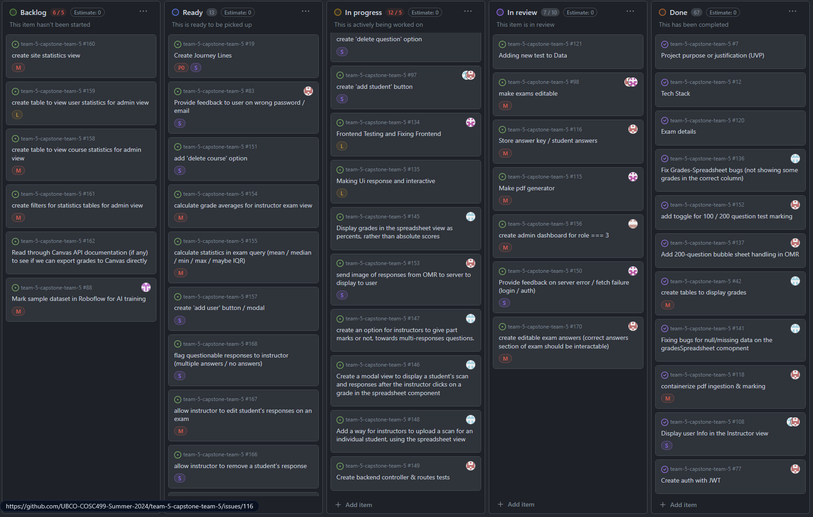
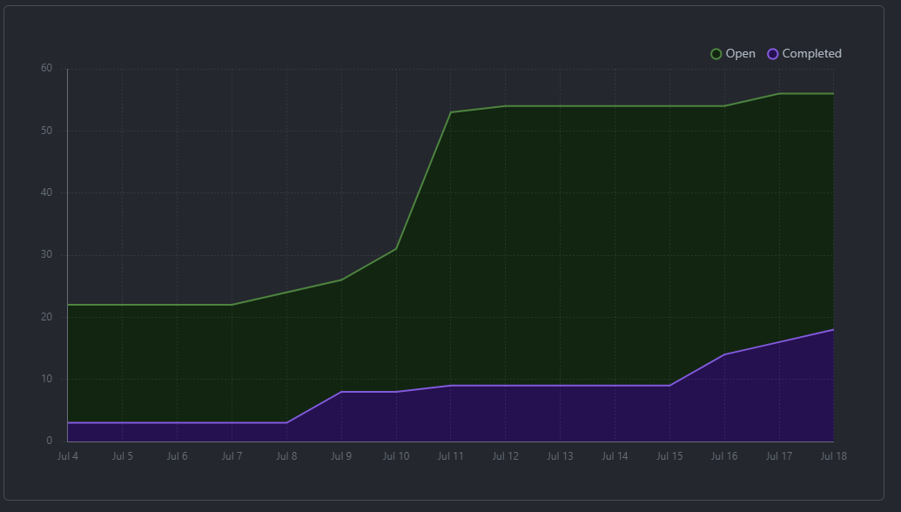
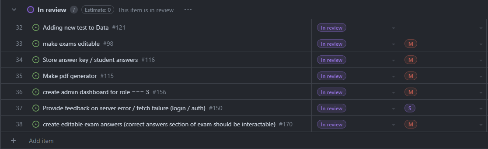
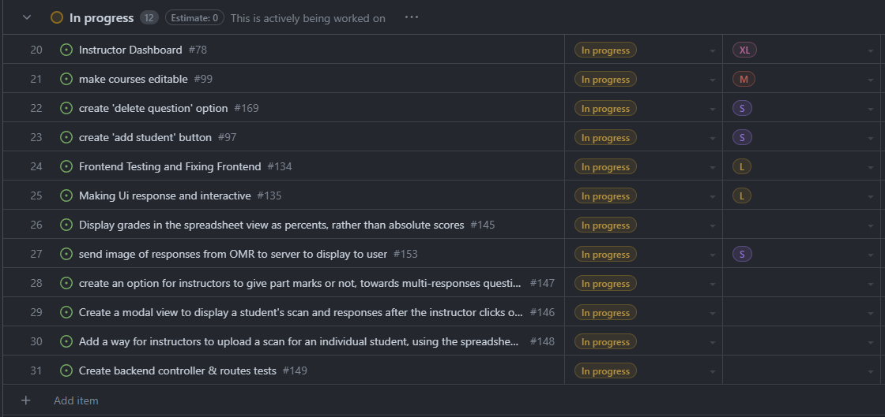

# Weekly Team Log

## Date Range:

- July 17 - July 19

## Features in the Project Plan Cycle:

- Backend testing
- Create 'add student' button
- Fix bugs with grades table
- Make exams editable

## Associated Tasks from Project Board:

## Tasks for Next Cycle:

- OMR scan viewing on frontend
- Grades table finished
- Admin view finished
- Create 'add student' button
- Make exams editable

## Burn-up Chart (Velocity):

## Times for Team/Individual:

| Team Member | Logged Hours |
| ----------- | ------------ |
| Nicolaas      |  9    |
| Oakley      | ?? Not logged in Clockify yet |
| Nathan      | 0 |
| Jay         | 5.5 |
| Jack | 2 |

## Completed Tasks:

- 

| Task ID | Description        | Completed By |
| ------- | ------------------ | ------------ |

## In Progress Tasks/ To do:

## Test Report / Testing Status:

Drone website was down when we went to screenshot it

## Overview:

Since Wednesday,
- Oakley worked on the student grades spreadsheet. Fixing bugs and making it interactive
- Nic worked on making each test's answer key editable with interactive bubbles, and also worked on getting the OMR to display the scanned sheets with answers circled (WIP), and helped Jay with the peer testing questionnaire
- Jay worked on making login provide information for failed login attempts, made an OMR sheet generator, and created the peer testing questionnaire
- Jack worked on the admin view that will show statistics and allow for the creation of instructor accounts
