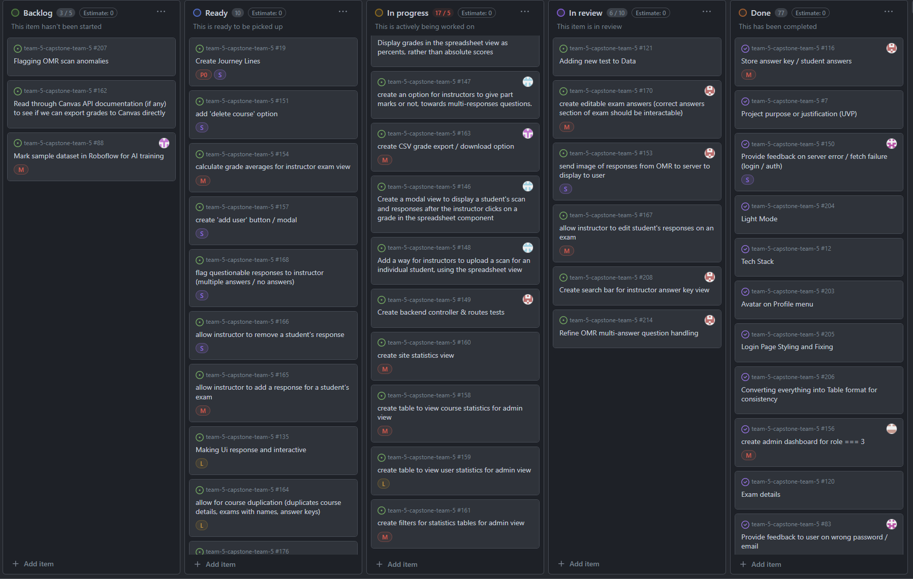
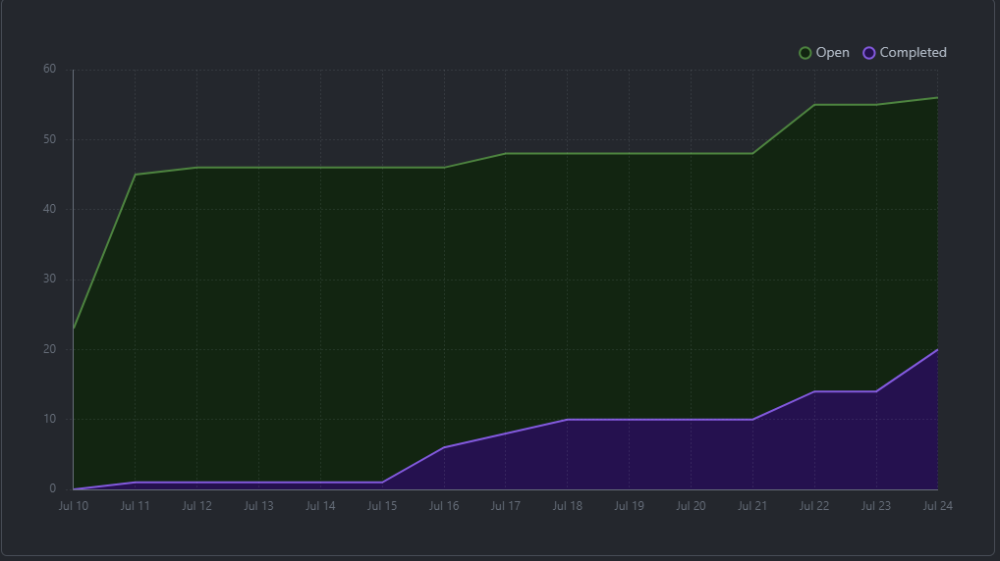
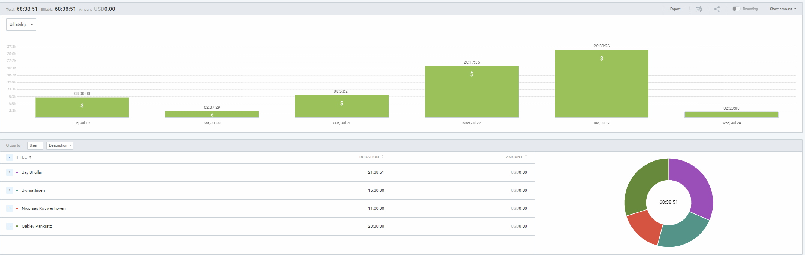
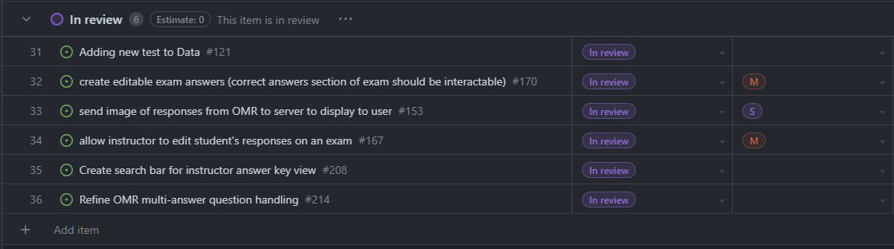
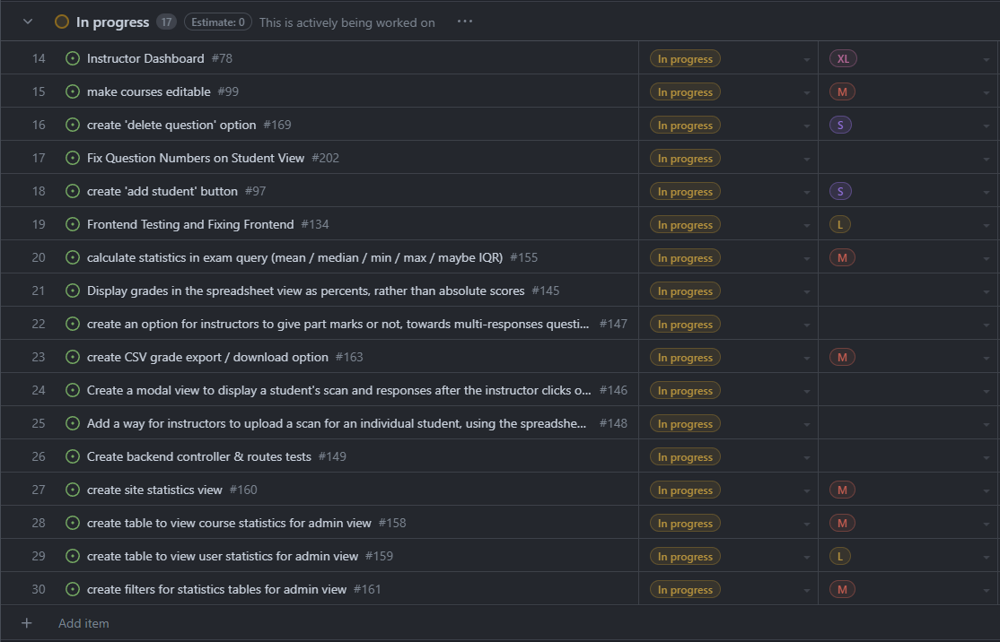
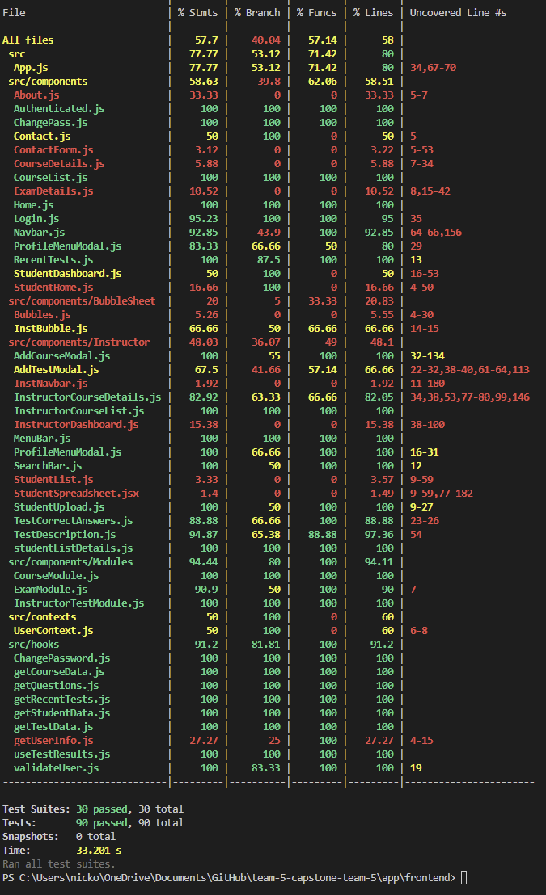
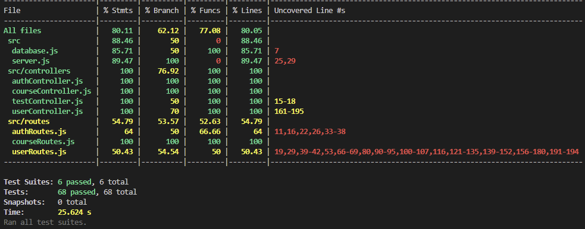

# Weekly Team Log

## Date Range:

- July 19 - July 24

## Features in the Project Plan Cycle:

- OMR scan viewing on frontend
- Grades table finished
- Admin view finished
- Create 'add student' button
- Make exams editable

## Associated Tasks from Project Board:

## Tasks for Next Cycle:

- Grades table finished
- Admin view finished
- Create 'add student' button
- Make exams editable (questions are, but not weights or exam info)

## Burn-up Chart (Velocity):

## Times for Team/Individual:

| Team Member | Logged Hours |
| ----------- | ------------ |
| Nicolaas      |  11    |
| Oakley      | 20.5 |
| Nathan      | ?? Did some work, not logged |
| Jay         | 21.5 |
| Jack | 15.5 |

## Completed Tasks:

- 

| Task ID | Description        | Completed By |
| ------- | ------------------ | ------------ |

## In Progress Tasks/ To do:

## Test Report / Testing Status:

## Overview:

Since Friday,
- Oakley added the ability to edit user's responses in his grades spreadsheet
- Nic worked on the OMR. He made it so the OMR handles multi-answer questions better and the scans now display on the frontend and save for students and instructors
- Jay worked on the styling of the frontend, to incorporate user feedback in the student's view
- Jack worked on the admin view that will show statistics and allow for the creation of instructor accounts
