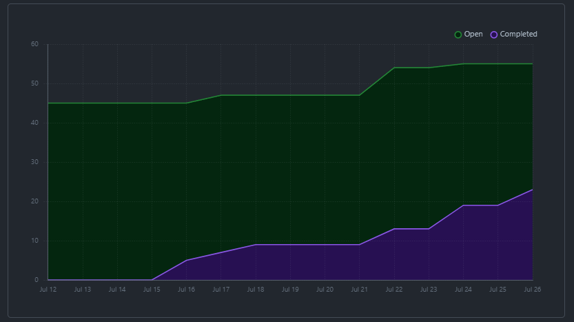
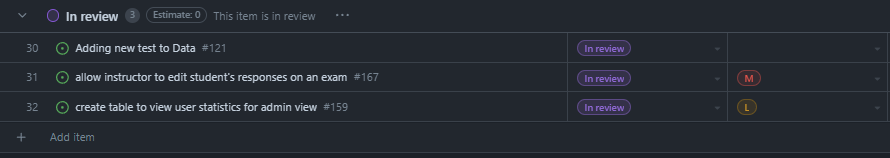
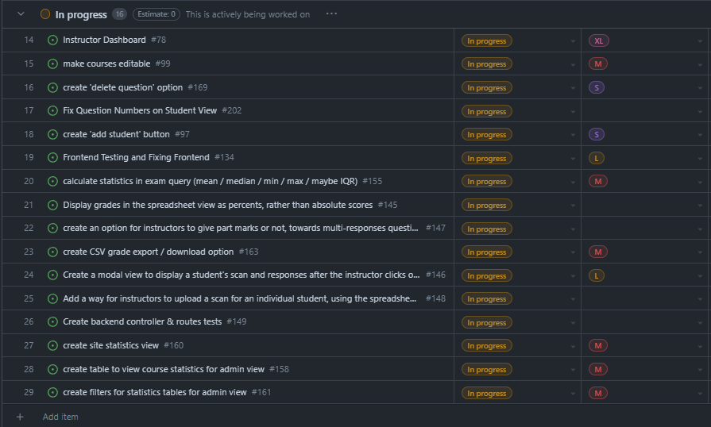

# Weekly Team Log

## Date Range:

- July 24 - July 26

## Features in the Project Plan Cycle:

- Grades table finished
- Admin view finished
- Create 'add student' button
- Make exams editable (questions are, but not weights or exam info)
- Make notification section for instructors

## Associated Tasks from Project Board:

## Tasks for Next Cycle:

- Grades table finished
- Admin view finished
- Create 'add student' button
- Make exams editable (questions are, but not weights or exam info)
- Make notification section for instructors

## Burn-up Chart (Velocity):

## Times for Team/Individual:

| Team Member | Logged Hours |
| ----------- | ------------ |
| Nicolaas      |  12    |
| Oakley      | Lots, not in Clockify |
| Nathan      | 5.25 |
| Jay         | 3 |
| Jack | 11 |

## Completed Tasks:

- 

| Task ID | Description        | Completed By |
| ------- | ------------------ | ------------ |

## In Progress Tasks/ To do:

## Test Report / Testing Status:

## Overview:

Since the last cycle,
- Oakley worked on displaying scans for each student in the instructor view in his grades table, where you are able to edit responses, as well as getting started on preparing the five-number summary for the instructor to view test statistics
- Nic worked on notification handling and flagging responses for instructors to check in the backend. This is yet to be fully implemented in the frontend.
- Jay worked on password recovery and signup, though it will require quite a big re-work of the user handling to do properly.
- Jack worked on the admin view that will show statistics and allow for the creation of instructor accounts
